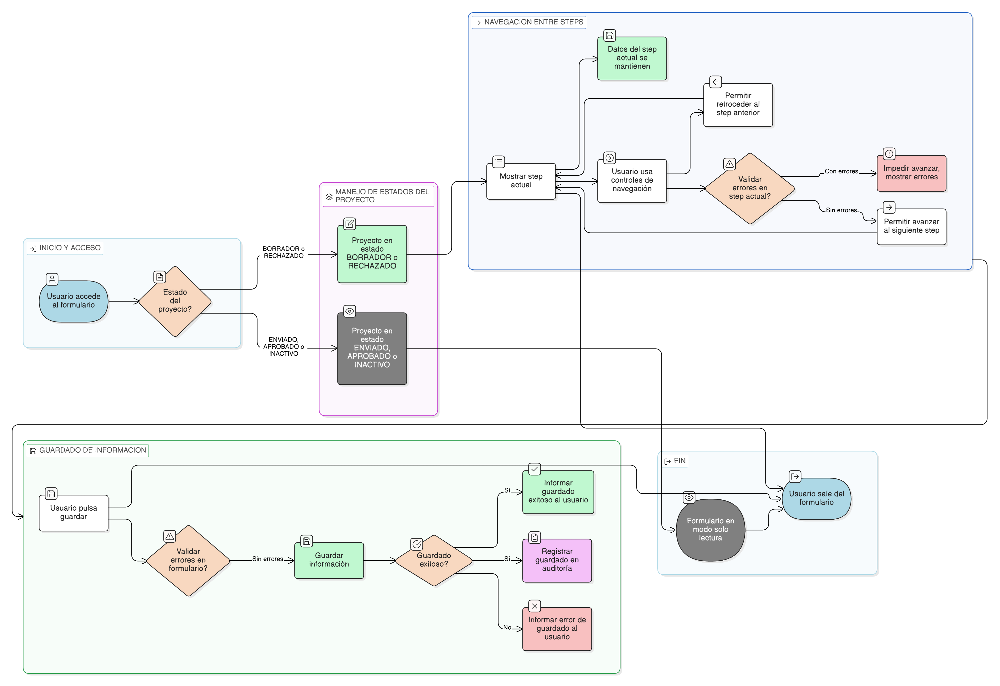

# HU-IDEAM-SNIF-REST-048

> **Identificador Historia de Usuario:** hu-ideam-snif-rest-048\
> **Nombre Historia de Usuario:** Control de navegación y guardado del formulario

> **Sistema de información:** Sistema Nacional de Información Forestal\
> **Módulo / subsistema:** Módulo de restauración – Aplicación de Gestión\
> **Validador temático(s):** Raymond Alexander Jiménez Arteaga

## DESCRIPCIÓN HISTORIA DE USUARIO

> **Como:** Registrador.\
> **Quiero:** controlar la navegación y el guardado del formulario de proyecto.\
> **Para:** evitar pérdida de información y garantizar un diligenciamiento completo y consistente.

## ALCANCE FUNCIONAL

- Control del avance y retroceso entre los steps del formulario.
- Guardado explícito de la información diligenciada.
- Prevención de pérdida de datos durante la navegación.
- Aplicación de reglas de guardado según el estado del proyecto.

## CRITERIOS DE ACEPTACIÓN

1. **Navegación entre steps**\
   1.1 El sistema permite navegar entre los steps del formulario únicamente mediante controles definidos.\
   1.2 El sistema permite retroceder a steps anteriores sin pérdida de información guardada.\
   1.3 El sistema impide avanzar a steps posteriores cuando existen errores de validación en el step actual.

2. **Guardado de la información**\
   2.1 El sistema permite guardar la información diligenciada de forma explícita.\
   2.2 El guardado solo se ejecuta cuando no existen errores de validación.\
   2.3 El sistema informa al usuario cuando el guardado se realiza correctamente.\
   2.4 El sistema informa al usuario cuando ocurre un error durante el guardado.

3. **Persistencia de datos**\
   3.1 La información guardada se conserva al navegar entre steps.\
   3.2 El sistema previene la pérdida de información diligenciada que no haya sido guardada.

4. **Aplicación por estado del proyecto**\
   4.1 El control de navegación y guardado aplica únicamente para proyectos en estado **BORRADOR** o **RECHAZADO**.\
   4.2 Cuando el proyecto se encuentra en estado **ENVIADO**, **APROBADO** o **INACTIVO**, el formulario se presenta en modo solo lectura y no permite guardado.

5. **Auditoría**\
   5.1 El sistema registra los guardados exitosos del formulario para efectos de auditoría.

## ROLES

- **Registrador**: Navega y guarda la información del formulario del proyecto.  
- **Administrador IDEAM**: Visualiza la información en modo solo lectura.  
- **Consulta / Invitado**: No interactúa con el formulario en la aplicación de Gestión.

## RESTRICCIONES Y LÍMITES

- El guardado del formulario es una acción explícita y no automática.  
- No se permite guardar información parcial que incumpla validaciones.  
- Esta historia de usuario no contempla guardado automático o borradores temporales.  
- La navegación y el guardado solo están disponibles desde la aplicación de Gestión.

## DIAGRAMA DE FLUJO DEL PROCESO

