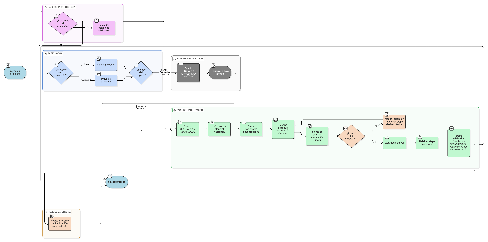

# HU-IDEAM-SNIF-REST-049

> **Identificador Historia de Usuario:** hu-ideam-snif-rest-049\
> **Nombre Historia de Usuario:** Habilitar pestañas posteriores al guardar proyecto

> **Sistema de información:** Sistema Nacional de Información Forestal\
> **Módulo / subsistema:** Módulo de restauración – Aplicación de Gestión\
> **Validador temático(s):** Raymond Alexander Jiménez Arteaga

## DESCRIPCIÓN HISTORIA DE USUARIO

> **Como:** Registrador.\
> **Quiero:** que las pestañas o steps posteriores del formulario se habiliten únicamente después de guardar el proyecto.\
> **Para:** garantizar un diligenciamiento ordenado y evitar registros incompletos o inconsistentes.

## ALCANCE FUNCIONAL

- Control de habilitación progresiva de los steps del formulario del proyecto.
- Dependencia directa entre el guardado del proyecto y la habilitación de los steps posteriores.
- Aplicación transversal de la regla durante la creación y edición del proyecto.

## CRITERIOS DE ACEPTACIÓN

1. **Habilitación inicial de steps**\
   1.1 Al iniciar la creación de un proyecto, únicamente el step **Información General** se encuentra habilitado.\
   1.2 Los steps posteriores se presentan deshabilitados hasta que la información general sea guardada correctamente.

2. **Condición de habilitación**\
   2.1 El sistema habilita los steps posteriores únicamente cuando el proyecto ha sido guardado sin errores de validación. Estos steps posteriores son:
   - Fuentes de financiamiento
   - Adjuntos
   - Áreas de restauración
      
   2.2 El guardado exitoso genera la habilitación inmediata de los steps posteriores.

3. **Comportamiento durante la edición**\
   3.1 En proyectos existentes en estado **BORRADOR** o **RECHAZADO**, los steps previamente guardados permanecen habilitados.\
   3.2 El sistema no habilita nuevos steps si existen errores de validación pendientes.

4. **Restricciones por estado**\
   4.1 Cuando el proyecto se encuentra en estado **ENVIADO**, **APROBADO** o **INACTIVO**, todos los steps se presentan en modo solo lectura.\
   4.2 No se permite habilitar steps adicionales en estos estados.

5. **Persistencia de la habilitación**\
   5.1 La habilitación de los steps se conserva al salir y volver a ingresar al formulario.\
   5.2 El sistema mantiene el estado de habilitación conforme al último guardado válido.

6. **Auditoría**\
   6.1 El sistema registra el guardado que habilita los steps posteriores para efectos de auditoría.

## ROLES

- **Registrador**: Diligencia el formulario y habilita progresivamente los steps al guardar la información.  
- **Administrador IDEAM**: Visualiza el formulario en modo solo lectura.  
- **Consulta / Invitado**: No interactúa con los steps del formulario.

## RESTRICCIONES Y LÍMITES

- Los steps posteriores no pueden habilitarse sin un guardado exitoso previo.  
- No se permite saltar el orden definido de diligenciamiento.  
- Esta historia de usuario no contempla la creación de nuevos steps.  
- La habilitación de steps solo aplica en la aplicación de Gestión.

## DIAGRAMA DE FLUJO DEL PROCESO

