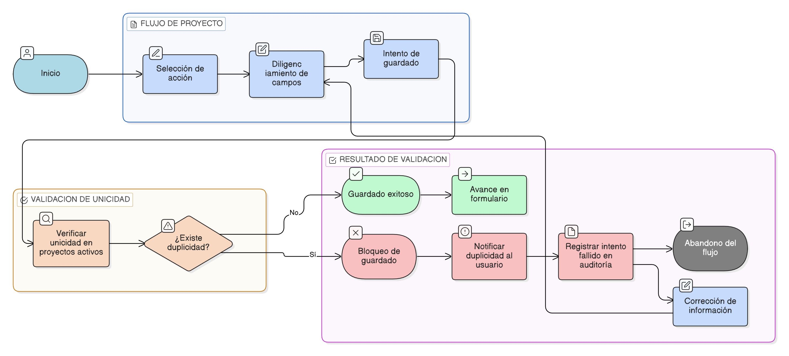

# HU-IDEAM-SNIF-REST-050

> **Identificador Historia de Usuario:** hu-ideam-snif-rest-050\
> **Nombre Historia de Usuario:** Unicidad del proyecto en el flujo de creación y edición

> **Sistema de información:** Sistema Nacional de Información Forestal\
> **Módulo / subsistema:** Módulo de restauración – Aplicación de Gestión\
> **Validador temático(s):** Raymond Alexander Jiménez Arteaga

## DESCRIPCIÓN HISTORIA DE USUARIO

> **Como:** sistema.\
> **Quiero:** validar la unicidad de los proyectos de restauración durante su creación y edición.\
> **Para:** evitar el registro de proyectos duplicados y garantizar la calidad, coherencia y confiabilidad del dato institucional.

## ALCANCE FUNCIONAL

- Validación automática de unicidad durante el diligenciamiento del formulario.
- Aplicación de la regla tanto en creación como en edición del proyecto.
- Bloqueo del guardado cuando se incumplen las reglas de unicidad.
- Aplicación transversal en los steps del formulario del proyecto.

## CRITERIOS DE ACEPTACIÓN

1. **Regla de unicidad del proyecto**\
   1.1 El sistema valida que no exista más de un proyecto activo con la misma combinación de los siguientes campos:
   - Nombre del proyecto  
   - Entidad responsable  
   - Tipo de proyecto  
   - Ubicación general  

2. **Momento de la validación**\
   2.1 La validación de unicidad se ejecuta al intentar guardar la información general del proyecto.\
   2.2 La validación de unicidad se ejecuta al intentar guardar cambios en un proyecto existente.

3. **Comportamiento ante duplicidad**\
   3.1 Cuando se detecta un proyecto que incumple la regla de unicidad, el sistema bloquea el guardado de la información.\
   3.2 El sistema informa al usuario que existe un posible proyecto duplicado.

4. **Alcance de la validación**\
   4.1 La validación de unicidad aplica sobre proyectos en estado **BORRADOR**, **ENVIADO** y **APROBADO**.\
   4.2 Los proyectos en estado **INACTIVO** no se consideran para la validación de unicidad.

5. **Persistencia de la regla**\
   5.1 La regla de unicidad es obligatoria y no puede ser deshabilitada.\
   5.2 La validación de unicidad se aplica independientemente del rol del usuario.

6. **Relación con el flujo del formulario**\
   6.1 El incumplimiento de la regla de unicidad impide la habilitación de steps posteriores del formulario.\
   6.2 La corrección de la información permite continuar con el flujo normal del formulario.

7. **Auditoría**\
   7.1 El sistema registra los intentos fallidos de guardado por incumplimiento de la regla de unicidad.

## ROLES

- **Sistema**: Ejecuta la validación de unicidad de forma automática.  
- **Registrador**: Crea y edita proyectos sujetos a la validación de unicidad.  
- **Administrador IDEAM**: Consulta proyectos con unicidad garantizada.

## RESTRICCIONES Y LÍMITES

- No se permite guardar proyectos que incumplan la regla de unicidad.  
- La validación de unicidad no genera la fusión automática de proyectos.  
- Esta historia de usuario no contempla la resolución manual de conflictos de duplicidad.  
- La regla de unicidad no aplica a proyectos desactivados (INACTIVO).

## DIAGRAMA DE FLUJO DEL PROCESO

