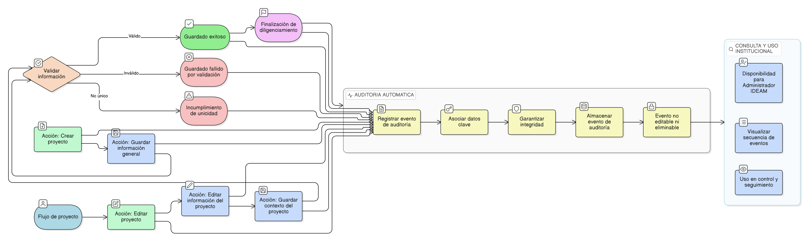

# HU-IDEAM-SNIF-REST-051

> **Identificador Historia de Usuario:** hu-ideam-snif-rest-051\
> **Nombre Historia de Usuario:** Auditoría del flujo de creación y edición de proyectos

> **Sistema de información:** Sistema Nacional de Información Forestal\
> **Módulo / subsistema:** Módulo de restauración – Aplicación de Gestión\
> **Validador temático(s):** Raymond Alexander Jiménez Arteaga

## DESCRIPCIÓN HISTORIA DE USUARIO

> **Como:** sistema.\
> **Quiero:** auditar de forma integral el flujo de creación y edición de proyectos de restauración.\
> **Para:** garantizar trazabilidad completa, control institucional y soporte a procesos de seguimiento y control.

## ALCANCE FUNCIONAL

- Auditoría específica del flujo de creación y edición del proyecto.
- Registro de eventos asociados a guardados, cambios y bloqueos por validación.
- Asociación inequívoca de los eventos auditados al proyecto y al usuario.
- Disponibilidad de la información para consulta institucional.

## CRITERIOS DE ACEPTACIÓN

1. **Eventos auditados del flujo**\
   1.1 El sistema registra eventos de auditoría durante el flujo de creación y edición del proyecto.\
   1.2 Los eventos auditados incluyen como mínimo:
   - Inicio de creación del proyecto  
   - Guardado de información general  
   - Guardado de contexto del proyecto  
   - Edición de información del proyecto  
   - Intentos fallidos de guardado por validaciones  
   - Incumplimiento de la regla de unicidad  
   - Finalización del diligenciamiento previo al envío a validación  

2. **Información registrada en la auditoría**\
   2.1 Cada evento auditado incluye como mínimo:
   - Identificador del proyecto  
   - Tipo de evento  
   - Usuario que ejecuta la acción  
   - Rol del usuario  
   - Fecha y hora del evento  

3. **Persistencia e integridad de la auditoría**\
   3.1 Los registros de auditoría se almacenan de forma persistente.\
   3.2 Los registros de auditoría no pueden ser editados ni eliminados.\
   3.3 El sistema garantiza la integridad de la información auditada.

4. **Relación con el flujo del formulario**\
   4.1 Los eventos de auditoría reflejan el orden real de las acciones ejecutadas en el flujo.\
   4.2 La auditoría permite reconstruir la secuencia de creación y edición del proyecto.

5. **Disponibilidad de la auditoría**\
   5.1 La información de auditoría del flujo está disponible para el rol Administrador IDEAM.\
   5.2 La auditoría puede ser utilizada como insumo para procesos de control y seguimiento institucional.

6. **Relación con auditoría general**\
   6.1 La auditoría del flujo complementa la auditoría general definida en la HU-036.\
   6.2 No se duplican registros; los eventos se relacionan mediante identificadores comunes.

## ROLES

- **Sistema**: Genera y registra automáticamente los eventos de auditoría del flujo.  
- **Administrador IDEAM**: Consulta la auditoría del flujo para seguimiento y control.  
- **Registrador**: Genera eventos de auditoría de forma indirecta al ejecutar acciones.  

## RESTRICCIONES Y LÍMITES

- La auditoría del flujo no puede ser deshabilitada.  
- No se permite la modificación ni eliminación de registros de auditoría.  
- Esta historia de usuario no contempla la exportación de la auditoría.  
- La auditoría no permite la reversión automática de acciones ejecutadas.

## DIAGRAMA DE FLUJO DEL PROCESO

