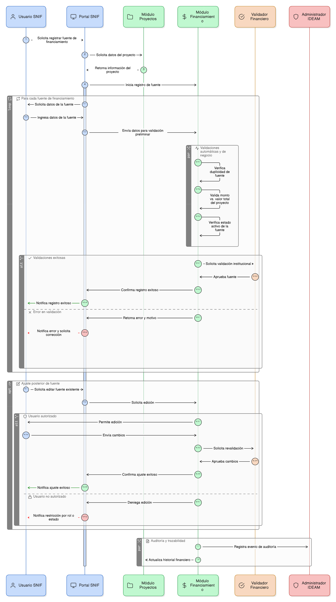

# Épica 005: Gestión de Fuentes de Financiamiento del Proyecto

## 1. Descripción general

Esta épica define la gestión estructurada de las fuentes de financiamiento asociadas a los proyectos de restauración registrados en el Sistema Nacional de Información Forestal (SNIF).

Las fuentes de financiamiento permiten documentar la sostenibilidad económica de los proyectos, garantizando consistencia financiera, trazabilidad institucional y control de acceso conforme a los lineamientos definidos por el IDEAM.

La administración de esta información se encuentra integrada al ciclo de vida del proyecto y su validación está alineada con los procesos institucionales del sistema.

---

## 2. Objetivo

Administrar de manera estructurada, trazable y validada las fuentes de financiación asociadas a los proyectos de restauración del SNIF, garantizando consistencia financiera, integridad de la información y control por roles conforme a los lineamientos del IDEAM.

---

## 3. Historias de usuario asociadas

- [**HU-IDEAM-SNIF-REST-080:** Asociar fuente de financiamiento a un proyecto](/historias_usuario/EP-IDEAM-SNIF-REST-005/HU-IDEAM-SNIF-REST-080.md)
- [**HU-IDEAM-SNIF-REST-081:** Validar valores monetarios y moneda](/historias_usuario/EP-IDEAM-SNIF-REST-005/HU-IDEAM-SNIF-REST-081.md)
- [**HU-IDEAM-SNIF-REST-082:** Consultar historial de fuentes de financiación](/historias_usuario/EP-IDEAM-SNIF-REST-005/HU-IDEAM-SNIF-REST-082.md)
- [**HU-IDEAM-SNIF-REST-083:** Editar información de una fuente de financiación](/historias_usuario/EP-IDEAM-SNIF-REST-005/HU-IDEAM-SNIF-REST-083.md)
- [**HU-IDEAM-SNIF-REST-084:** Activar o inactivar una fuente de financiación](/historias_usuario/EP-IDEAM-SNIF-REST-005/HU-IDEAM-SNIF-REST-084.md)
- [**HU-IDEAM-SNIF-REST-085:** Auditoría y trazabilidad de fuentes de financiamiento](/historias_usuario/EP-IDEAM-SNIF-REST-005/HU-IDEAM-SNIF-REST-085.md)
- [**HU-IDEAM-SNIF-REST-086:** Control de acceso por rol en fuentes de financiamiento](/historias_usuario/EP-IDEAM-SNIF-REST-005/HU-IDEAM-SNIF-REST-086.md)
- [**HU-IDEAM-SNIF-REST-087:** Eliminación lógica de una fuente de financiamiento](/historias_usuario/EP-IDEAM-SNIF-REST-005/HU-IDEAM-SNIF-REST-087.md)
- [**HU-IDEAM-SNIF-REST-088:** Validar coherencia financiera del proyecto](/historias_usuario/EP-IDEAM-SNIF-REST-005/HU-IDEAM-SNIF-REST-088.md)
- [**HU-IDEAM-SNIF-REST-089:** Control de acceso por estado del proyecto (fuentes)](/historias_usuario/EP-IDEAM-SNIF-REST-005/HU-IDEAM-SNIF-REST-089.md)

---

## 4. Riesgos

- Registro de fuentes duplicadas o inconsistentes.
- Incoherencia entre monto financiado y valor total del proyecto.
- Uso de fuentes inactivas en cálculos financieros.
- Pérdida de trazabilidad de ajustes financieros.
- Edición no autorizada según rol o estado del proyecto.

---

## 5. Diagrama de secuencia

---

## 6. Wireframes / mockups
