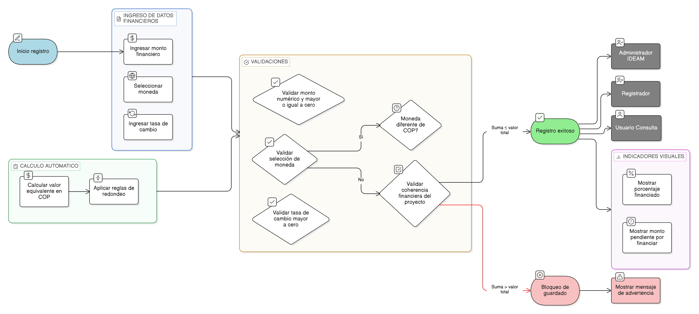

# HU-IDEAM-SNIF-REST-081

> **Identificador Historia de Usuario:** hu-ideam-snif-rest-081\
> **Nombre Historia de Usuario:** Validar valores monetarios y moneda en fuentes de financiamiento

> **Sistema de información:** Sistema Nacional de Información Forestal\
> **Módulo / subsistema:** Módulo de restauración\
> **Validador temático(s):** Raymond Alexander Jiménez Arteaga

## DESCRIPCIÓN HISTORIA DE USUARIO

> **Como:** usuario registrador.\
> **Quiero:** registrar montos financieros con validación de moneda y tasa de cambio.\
> **Para:** asegurar consistencia financiera y confiabilidad en la información económica del proyecto.

## CRITERIOS DE ACEPTACIÓN

1. **Validación de montos monetarios**  
   1.1 El monto registrado debe ser de tipo numérico.  
   1.2 El monto debe ser mayor o igual a cero.  

2. **Selección de moneda**  
   2.1 La moneda debe seleccionarse desde una tabla de dominio.  
   2.2 Si la moneda es diferente de COP, el sistema debe exigir el diligenciamiento de la tasa de cambio.

3. **Validación de tasa de cambio**  
   3.1 La tasa de cambio debe ser mayor que cero.  
   3.2 La tasa de cambio solo aplica cuando la moneda seleccionada es distinta de COP.

4. **Cálculo automático en COP**  
   4.1 El sistema debe calcular automáticamente el valor equivalente en COP.  
   4.2 El cálculo debe aplicar reglas de redondeo conforme a lineamientos financieros institucionales.

5. **Validación de coherencia financiera del proyecto**  
   5.1 La suma de las fuentes de financiamiento no debe superar el valor total del proyecto.  
   5.2 El sistema debe permitir sumatorias menores al valor total (financiación parcial).  
   5.3 Si la sumatoria supera el valor del proyecto, el sistema debe bloquear el guardado y mostrar un mensaje claro.

6. **Indicadores visuales**  
   6.1 El sistema debe mostrar de forma visual:  
   - Porcentaje financiado del proyecto.  
   - Monto pendiente por financiar.

## ROLES

- **Administrador IDEAM:** Puede visualizar y validar la información financiera registrada.
- **Registrador:** Puede registrar montos con validación de moneda y tasa de cambio.
- **Usuario Consulta:** Puede visualizar la información financiera asociada al proyecto.

## RESTRICCIONES Y LÍMITES

- No se permite guardar información financiera inconsistente.
- El sistema debe impedir el envío a validación si existen errores financieros.
- Las validaciones se realizan en tiempo real durante el diligenciamiento.

## DIAGRAMA DE FLUJO DEL PROCESO

