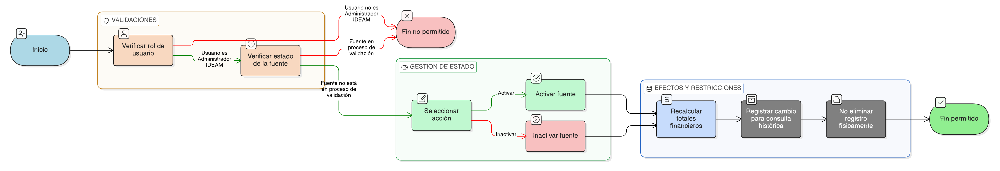

# HU-IDEAM-SNIF-REST-084

> **Identificador Historia de Usuario:** hu-ideam-snif-rest-084\
> **Nombre Historia de Usuario:** Activar o inactivar una fuente de financiamiento

> **Sistema de información:** Sistema Nacional de Información Forestal\
> **Módulo / subsistema:** Módulo de restauración\
> **Validador temático(s):** Raymond Alexander Jiménez Arteaga

## DESCRIPCIÓN HISTORIA DE USUARIO

> **Como:** administrador del sistema.\
> **Quiero:** activar o inactivar una fuente de financiamiento asociada a un proyecto.\
> **Para:** gestionar su vigencia sin eliminar la información histórica y garantizar control institucional.

## CRITERIOS DE ACEPTACIÓN

1. **Gestión de estado de la fuente**  
   1.1 El sistema debe permitir cambiar el estado de una fuente de financiamiento entre **activo** e **inactivo**.  
   1.2 La acción debe realizarse desde la opción de validación definida en las épicas 7 y 8.

2. **Reglas de inactivación**  
   2.1 La inactivación no debe eliminar físicamente el registro.  
   2.2 Un registro inactivado no debe incluirse en las sumatorias financieras activas del proyecto.  
   2.3 El registro inactivado debe permanecer visible únicamente para fines de consulta histórica.

3. **Restricciones por estado**  
   3.1 No se debe permitir activar o inactivar una fuente que se encuentre en proceso de validación.  

4. **Efectos sobre el proyecto**  
   4.1 Al activar o inactivar una fuente, el sistema debe recalcular automáticamente los totales financieros del proyecto.

## ROLES

- **Administrador IDEAM:** Puede activar o inactivar fuentes de financiamiento.
- **Registrador:** No puede realizar esta acción.
- **Usuario Consulta:** No puede realizar esta acción.

## RESTRICCIONES Y LÍMITES

- No se permite la eliminación física de fuentes de financiamiento.
- El control de estado se realiza únicamente mediante borrado lógico.
- La acción está restringida por rol y por estado del registro.

## DIAGRAMA DE FLUJO DEL PROCESO

