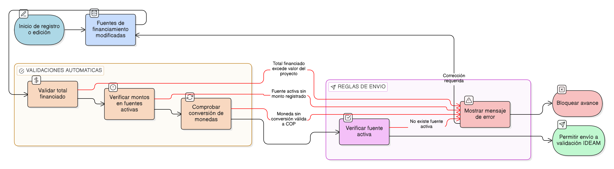

# HU-IDEAM-SNIF-REST-088

> **Identificador Historia de Usuario:** hu-ideam-snif-rest-088\
> **Nombre Historia de Usuario:** Validar coherencia financiera del proyecto

> **Sistema de información:** Sistema Nacional de Información Forestal\
> **Módulo / subsistema:** Módulo de restauración\
> **Validador temático(s):** Raymond Alexander Jiménez Arteaga

## DESCRIPCIÓN HISTORIA DE USUARIO

> **Como:** sistema.\
> **Quiero:** validar la coherencia entre las fuentes de financiamiento y el valor total del proyecto.\
> **Para:** evitar inconsistencias financieras antes de permitir el envío del proyecto a validación IDEAM.

## CRITERIOS DE ACEPTACIÓN

1. **Validaciones automáticas de coherencia financiera**  
   1.1 El sistema debe validar que el total financiado sea menor o igual al valor total del proyecto.  
   1.2 No deben existir fuentes de financiamiento activas sin monto registrado.  
   1.3 Todas las monedas asociadas a las fuentes deben contar con una conversión válida a COP.

2. **Condiciones para envío a validación**  
   2.1 El sistema no debe permitir enviar el proyecto a validación IDEAM si no existe al menos una fuente de financiamiento activa.  
   2.2 Si alguna validación falla, el sistema debe mostrar un mensaje claro indicando el motivo del bloqueo.

3. **Ejecución de la validación**  
   3.1 La validación debe ejecutarse automáticamente antes del cambio de estado del proyecto.  
   3.2 Las reglas de validación deben aplicarse en tiempo real ante cualquier modificación de las fuentes de financiamiento.

## ROLES

- **Administrador IDEAM:** Puede visualizar y validar la información financiera del proyecto.
- **Registrador:** Debe cumplir las validaciones financieras para enviar el proyecto a validación.
- **Usuario Consulta:** Puede visualizar la información financiera validada.

## RESTRICCIONES Y LÍMITES

- No se permite avanzar en el flujo de validación con inconsistencias financieras.
- Las validaciones son obligatorias y no configurables por el usuario.
- La coherencia financiera es requisito previo para la validación institucional.

## DIAGRAMA DE FLUJO DEL PROCESO

