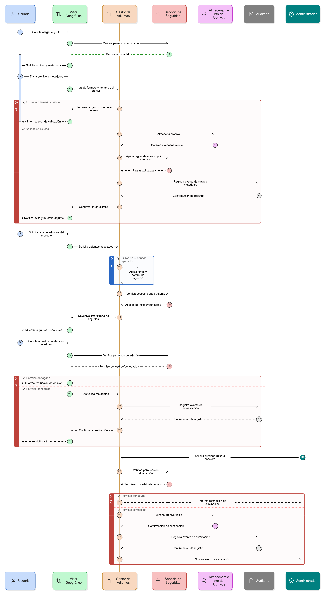

# Épica 006: Gestión de Adjuntos del Proyecto

## 1. Descripción general

Esta épica define la gestión de documentos adjuntos asociados a los proyectos de restauración del SNIF, incluyendo la carga, consulta, actualización de metadatos, control de vigencia, validaciones técnicas y trazabilidad de operaciones.

Los adjuntos se gestionan con controles de integridad referencial, reglas de seguridad documental y restricciones por rol y estado del proyecto, garantizando una experiencia clara y control institucional conforme a lineamientos del IDEAM.

---

## 2. Objetivo

Permitir la carga, consulta, actualización, control de vigencia y trazabilidad de documentos asociados a los proyectos de restauración del SNIF, garantizando integridad referencial, seguridad documental, cumplimiento normativo y una experiencia de usuario clara dentro del visor geográfico.

---

## 3. Historias de usuario asociadas

- [**HU-IDEAM-SNIF-REST-090:** Cargar adjuntos a un proyecto](EP-IDEAM-SNIF-REST-006/HU-IDEAM-SNIF-REST-090.md)
- [**HU-IDEAM-SNIF-REST-091:** Validar tamaño máximo del archivo](EP-IDEAM-SNIF-REST-006/HU-IDEAM-SNIF-REST-091.md)
- [**HU-IDEAM-SNIF-REST-092:** Validar formato del archivo adjunto](EP-IDEAM-SNIF-REST-006/HU-IDEAM-SNIF-REST-092.md)
- [**HU-IDEAM-SNIF-REST-093:** Listar adjuntos asociados a un proyecto](EP-IDEAM-SNIF-REST-006/HU-IDEAM-SNIF-REST-093.md)
- [**HU-IDEAM-SNIF-REST-094:** Descargar adjuntos](EP-IDEAM-SNIF-REST-006/HU-IDEAM-SNIF-REST-094.md)
- [**HU-IDEAM-SNIF-REST-095:** Editar descripción del adjunto](EP-IDEAM-SNIF-REST-006/HU-IDEAM-SNIF-REST-095.md)
- [**HU-IDEAM-SNIF-REST-096:** Actualizar fecha de modificación del adjunto](EP-IDEAM-SNIF-REST-006/HU-IDEAM-SNIF-REST-096.md)
- [**HU-IDEAM-SNIF-REST-097:** Activar o inactivar adjuntos (borrado lógico)](EP-IDEAM-SNIF-REST-006/HU-IDEAM-SNIF-REST-097.md)
- [**HU-IDEAM-SNIF-REST-098:** Validar existencia del registro relacionado](EP-IDEAM-SNIF-REST-006/HU-IDEAM-SNIF-REST-098.md)
- [**HU-IDEAM-SNIF-REST-099:** Restringir tipos de relación del adjunto](EP-IDEAM-SNIF-REST-006/HU-IDEAM-SNIF-REST-099.md)
- [**HU-IDEAM-SNIF-REST-100:** Trazabilidad por esquema relacionado](EP-IDEAM-SNIF-REST-006/HU-IDEAM-SNIF-REST-100.md)
- [**HU-IDEAM-SNIF-REST-101:** Control de unicidad de adjuntos (cuando aplica)](EP-IDEAM-SNIF-REST-006/HU-IDEAM-SNIF-REST-101.md)
- [**HU-IDEAM-SNIF-REST-102:** Auditoría y trazabilidad de adjuntos](EP-IDEAM-SNIF-REST-006/HU-IDEAM-SNIF-REST-102.md)
- [**HU-IDEAM-SNIF-REST-103:** Control de acceso por rol (adjuntos)](EP-IDEAM-SNIF-REST-006/HU-IDEAM-SNIF-REST-103.md)
- [**HU-IDEAM-SNIF-REST-104:** Visualizar adjuntos según estado del proyecto](EP-IDEAM-SNIF-REST-006/HU-IDEAM-SNIF-REST-104.md)
- [**HU-IDEAM-SNIF-REST-105:** Clasificar adjuntos por tipo documental](EP-IDEAM-SNIF-REST-006/HU-IDEAM-SNIF-REST-105.md)

---

## 4. Riesgos

- Carga de archivos con formatos no autorizados o riesgos de seguridad documental.
- Consumo excesivo de almacenamiento por archivos fuera de límites.
- Adjuntos huérfanos por referencias inválidas.
- Duplicidad innecesaria de documentos.
- Exposición de adjuntos no validados a roles no autorizados.
- Pérdida de trazabilidad en cambios y descargas.

---

## 5. Diagrama de secuencia

---

## 6. Wireframes / mockups