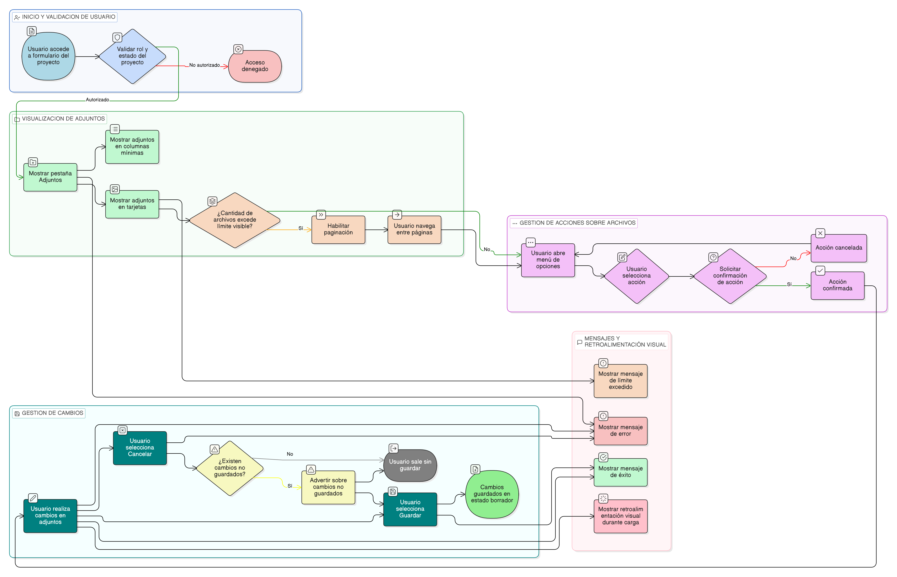

# HU-IDEAM-SNIF-REST-093

> **Identificador Historia de Usuario:** hu-ideam-snif-rest-093\
> **Nombre Historia de Usuario:** Listar adjuntos asociados a un proyecto

> **Sistema de información:** Sistema Nacional de Información Forestal\
> **Módulo / subsistema:** Módulo de restauración\
> **Validador temático(s):** Raymond Alexander Jiménez Arteaga

## DESCRIPCIÓN HISTORIA DE USUARIO

> **Como:** usuario autorizado.\
> **Quiero:** visualizar los adjuntos asociados a un proyecto.\
> **Para:** conocer la evidencia disponible y gestionar su consulta.

## CRITERIOS DE ACEPTACIÓN

1. **Ubicación del listado**  
   1.1 El listado debe presentarse en la pestaña Adjuntos del formulario del proyecto.

2. **Visualización tipo tarjetas y columnas mínimas**  
   2.1 El sistema debe mostrar un listado visual tipo tarjetas con: nombre, tipo (icono) y tamaño.  
   2.2 Adicionalmente, el sistema debe permitir ver columnas mínimas:  
   - Nombre original
   - Descripción
   - Tipo
   - Tamaño
   - Fecha de carga
   - Acciones

3. **Paginación**  
   3.1 Si la cantidad de archivos supera el límite visible, el sistema debe habilitar paginación.  
   3.2 El usuario debe identificar claramente la página actual y navegar entre páginas.

4. **Menú de acciones y confirmación**  
   4.1 Cada archivo debe contar con un menú de opciones (tres puntos).  
   4.2 Cualquier acción sobre el archivo debe solicitar confirmación.

5. **Guardar / cancelar y cambios no guardados**  
   5.1 El usuario debe poder guardar cambios mediante “Guardar”, dejando el registro en BORRADOR.  
   5.2 El usuario debe poder salir sin guardar mediante “Cancelar”.  
   5.3 El sistema debe advertir si existen cambios no guardados al intentar salir.

6. **Mensajes y retroalimentación visual**  
   6.1 El sistema debe mostrar mensajes claros de carga exitosa, errores, y límites excedidos.  
   6.2 El usuario debe recibir retroalimentación visual durante el proceso de carga.

## ROLES

- **Administrador IDEAM:** Puede visualizar los adjuntos de un proyecto.
- **Registrador:** Puede visualizar los adjuntos de un proyecto de su entidad.
- **Usuario Consulta:** No puede realizar esta acción.

## RESTRICCIONES Y LÍMITES

- La visualización y acciones dependen del rol y estado del proyecto.
- Se deben mostrar mensajes claros ante errores y límites.

## DIAGRAMA DE FLUJO DEL PROCESO

