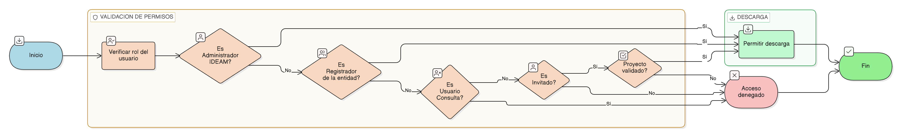

# HU-IDEAM-SNIF-REST-094

> **Identificador Historia de Usuario:** hu-ideam-snif-rest-094\
> **Nombre Historia de Usuario:** Descargar adjuntos

> **Sistema de información:** Sistema Nacional de Información Forestal\
> **Módulo / subsistema:** Módulo de restauración\
> **Validador temático(s):** Raymond Alexander Jiménez Arteaga

## DESCRIPCIÓN HISTORIA DE USUARIO

> **Como:** usuario autorizado.\
> **Quiero:** descargar un adjunto asociado a un proyecto.\
> **Para:** revisar su contenido y soportar procesos técnicos o administrativos.

## CRITERIOS DE ACEPTACIÓN

1. **Permisos antes de descarga**  
   1.1 El sistema debe validar permisos del usuario antes de permitir la descarga.

2. **Regla para usuarios invitados**  
   2.1 Los usuarios invitados solo pueden descargar adjuntos de proyectos validados.

## ROLES

- **Administrador IDEAM:** Puede descargar adjuntos de un proyecto.
- **Registrador:** Puede descargar adjuntos de un proyecto de su entidad.
- **Usuario Consulta:** No puede realizar esta acción.

## RESTRICCIONES Y LÍMITES

- Control de permisos obligatorio antes de descarga.
- Restricción especial para usuarios invitados.

## DIAGRAMA DE FLUJO DEL PROCESO

