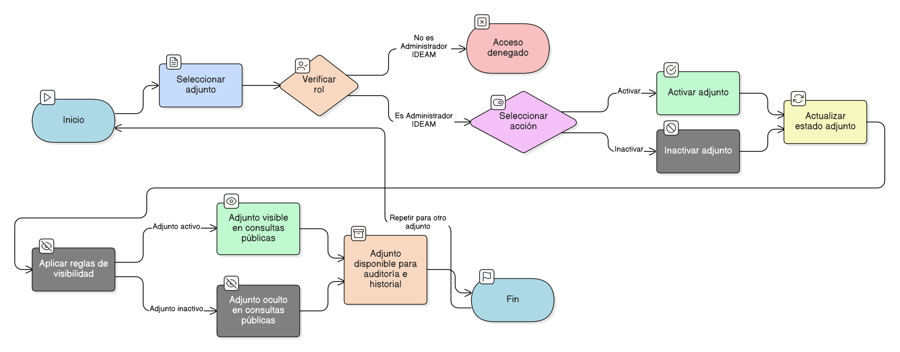

# HU-IDEAM-SNIF-REST-097

> **Identificador Historia de Usuario:** hu-ideam-snif-rest-097\
> **Nombre Historia de Usuario:** Activar o inactivar adjuntos (borrado lógico)

> **Sistema de información:** Sistema Nacional de Información Forestal\
> **Módulo / subsistema:** Módulo de restauración\
> **Validador temático(s):** Raymond Alexander Jiménez Arteaga

## DESCRIPCIÓN HISTORIA DE USUARIO

> **Como:** administrador del sistema.\
> **Quiero:** activar o inactivar adjuntos asociados a un proyecto.\
> **Para:** controlar su vigencia sin eliminar información histórica.

## CRITERIOS DE ACEPTACIÓN

1. **Borrado lógico**  
   1.1 El sistema no debe permitir eliminación física de adjuntos.

2. **Reglas de visibilidad**  
   2.1 Los adjuntos inactivos no deben ser visibles en consultas públicas.  
   2.2 Los adjuntos inactivos deben permanecer disponibles para auditoría e historial.

## ROLES

- **Administrador IDEAM:** Puede activar o inactivar adjuntos.
- **Registrador:** No puede realizar esta acción.
- **Usuario Consulta:** No puede realizar esta acción.

## RESTRICCIONES Y LÍMITES

- No se permite eliminación física.
- Control restringido por rol.

## DIAGRAMA DE FLUJO DEL PROCESO

