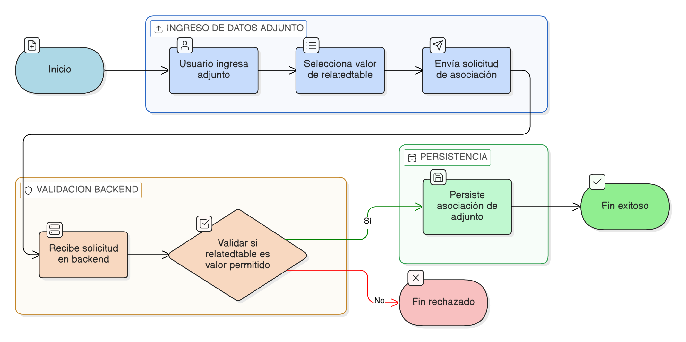

# HU-IDEAM-SNIF-REST-099

> **Identificador Historia de Usuario:** hu-ideam-snif-rest-099\
> **Nombre Historia de Usuario:** Restringir tipos de relación del adjunto

> **Sistema de información:** Sistema Nacional de Información Forestal\
> **Módulo / subsistema:** Módulo de restauración\
> **Validador temático(s):** Raymond Alexander Jiménez Arteaga

## DESCRIPCIÓN HISTORIA DE USUARIO

> **Como:** sistema.\
> **Quiero:** restringir los valores permitidos de `relatedtable`.\
> **Para:** permitir solo asociaciones válidas y controladas.

## CRITERIOS DE ACEPTACIÓN

1. **Valores predefinidos**  
   1.1 El campo `relatedtable` solo debe admitir valores predefinidos por el sistema.

2. **Validación obligatoria**  
   2.1 La validación debe realizarse obligatoriamente en backend.

## ROLES

- **Administrador IDEAM:** Aplica regla del sistema.
- **Registrador:** Aplica regla del sistema.
- **Usuario Consulta:** No aplica.

## RESTRICCIONES Y LÍMITES

- No se permite persistir relaciones no autorizadas.

## DIAGRAMA DE FLUJO DEL PROCESO

