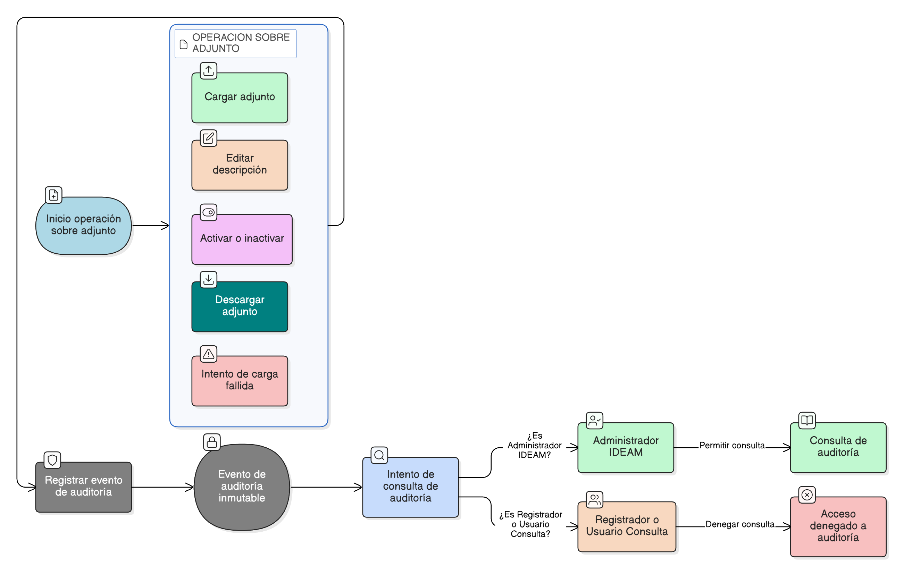

# HU-IDEAM-SNIF-REST-102

> **Identificador Historia de Usuario:** hu-ideam-snif-rest-102\
> **Nombre Historia de Usuario:** Auditoría y trazabilidad de adjuntos

> **Sistema de información:** Sistema Nacional de Información Forestal\
> **Módulo / subsistema:** Módulo de restauración\
> **Validador temático(s):** Raymond Alexander Jiménez Arteaga

## DESCRIPCIÓN HISTORIA DE USUARIO

> **Como:** sistema.\
> **Quiero:** auditar todas las operaciones realizadas sobre adjuntos.\
> **Para:** garantizar control institucional, trazabilidad y seguimiento de eventos.

## CRITERIOS DE ACEPTACIÓN

1. **Eventos auditados**  
   1.1 El sistema debe registrar como mínimo:  
   - Carga de adjunto  
   - Edición de descripción  
   - Activación / inactivación  
   - Descarga  
   - Intentos fallidos de carga

## ROLES

- **Administrador IDEAM:** Puede consultar auditoría conforme a permisos institucionales.
- **Registrador:** No puede consultar auditoría.
- **Usuario Consulta:** No puede consultar auditoría.

## RESTRICCIONES Y LÍMITES

- Los eventos de auditoría son inmutables.

## DIAGRAMA DE FLUJO DEL PROCESO

