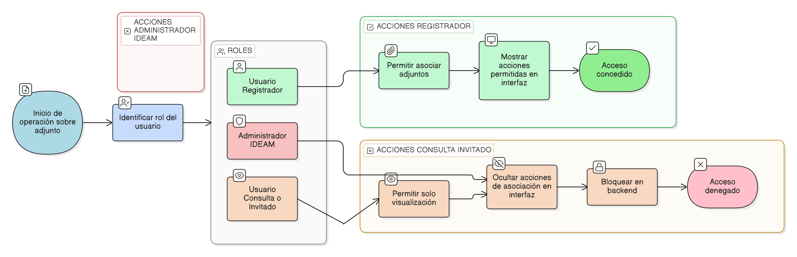

# HU-IDEAM-SNIF-REST-103

> **Identificador Historia de Usuario:** hu-ideam-snif-rest-103\
> **Nombre Historia de Usuario:** Control de acceso por rol (adjuntos)

> **Sistema de información:** Sistema Nacional de Información Forestal\
> **Módulo / subsistema:** Módulo de restauración\
> **Validador temático(s):** Raymond Alexander Jiménez Arteaga

## DESCRIPCIÓN HISTORIA DE USUARIO

> **Como:** sistema.\
> **Quiero:** restringir las operaciones CRUD sobre adjuntos según el rol del usuario.\
> **Para:** garantizar seguridad y gobernanza del dato.

## CRITERIOS DE ACEPTACIÓN

1. **Reglas por rol**  
   1.1 Usuario consulta / invitado: no puede asociar adjuntos; puede ver datos según permisos.  
   1.2 Usuario registrador: puede acceder y asociar adjuntos al proyecto.  
   1.3 Administrador IDEAM: no puede asociar adjuntos.

## ROLES

- **Administrador IDEAM:** No puede asociar adjuntos.
- **Registrador:** Puede asociar adjuntos.
- **Usuario Consulta:** No puede asociar adjuntos.

## RESTRICCIONES Y LÍMITES

- Las acciones no permitidas no deben mostrarse en la interfaz y deben bloquearse en backend.

## DIAGRAMA DE FLUJO DEL PROCESO

