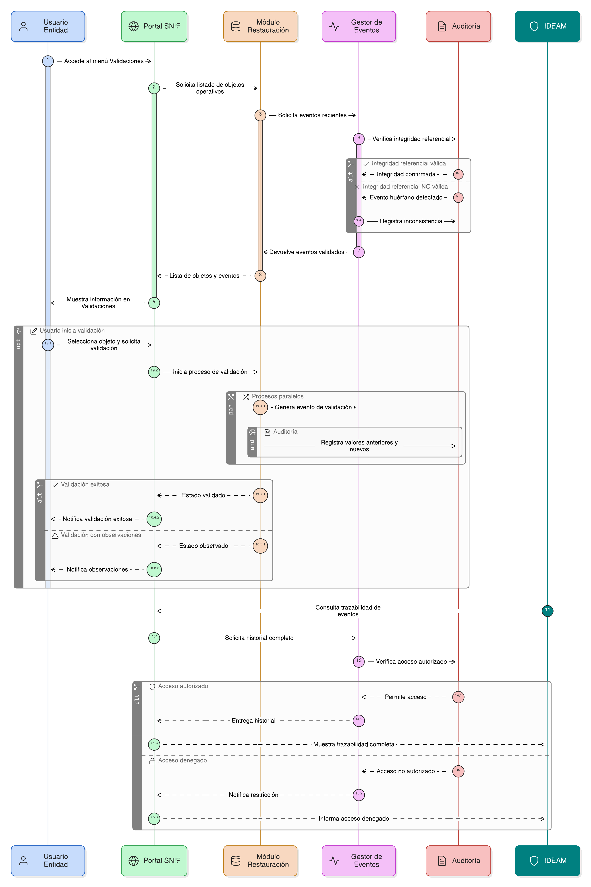

# Épica 007: Gestión de Eventos y Actuaciones de Validación del SNIF

## 1. Descripción general

Esta épica define la gestión, centralización y administración de los eventos generados automáticamente por operaciones de creación, modificación y validación de información operativa del módulo de restauración del SNIF (proyectos, adjuntos, fuentes de financiación, áreas de restauración, entre otros).

El propósito es garantizar trazabilidad completa, control institucional, integridad referencial entre objetos y soporte a los procesos de validación y observación por parte de entidades e IDEAM, accesible desde el menú de navegación **Validaciones**.

---

## 2. Objetivo

Gestionar, centralizar y administrar los eventos generados automáticamente por las operaciones de creación, modificación y validación de información operativa del módulo de restauración del SNIF (proyectos, adjuntos, fuentes de financiación, áreas de restauración, entre otros), garantizando trazabilidad completa, control institucional, integridad referencial entre objetos, y soporte a los procesos de validación y observación por parte de entidades e IDEAM, accesible desde el menú de navegación Validaciones.

---

## 3. Historias de usuario asociadas

- [**HU-IDEAM-SNIF-REST-106:** Registro automático de eventos](/historias_usuario/EP-IDEAM-SNIF-REST-007/HU-IDEAM-SNIF-REST-106.md)
- [**HU-IDEAM-SNIF-REST-107:** Clasificación del tipo de afectación del evento](/historias_usuario/EP-IDEAM-SNIF-REST-007/HU-IDEAM-SNIF-REST-107.md)
- [**HU-IDEAM-SNIF-REST-108:** Gestión del flujo de estados del evento](/historias_usuario/EP-IDEAM-SNIF-REST-007/HU-IDEAM-SNIF-REST-108.md)
- [**HU-IDEAM-SNIF-REST-109:** Visualización de eventos desde el menú Validaciones](/historias_usuario/EP-IDEAM-SNIF-REST-007/HU-IDEAM-SNIF-REST-109.md)

---

## 4. Riesgos

- Generación de eventos huérfanos por ausencia de integridad referencial.
- Duplicación de eventos por operaciones transaccionales no controladas.
- Falta de trazabilidad completa (valores anteriores/nuevos) en auditoría.
- Acceso no autorizado a eventos o a funciones de validación.
- Inconsistencias entre estados de eventos y estados del objeto operativo relacionado.

---

## 5. Diagrama de secuencia

---

## 6. Wireframes / mockups