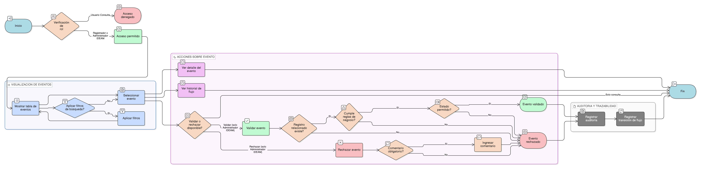

# HU-IDEAM-SNIF-REST-109

> **Identificador Historia de Usuario:** hu-ideam-snif-rest-109\
> **Nombre Historia de Usuario:** Visualización de eventos desde el menú Validaciones

> **Sistema de información:** Sistema Nacional de Información Forestal\
> **Módulo / subsistema:** Módulo de restauración\
> **Validador temático(s):** Raymond Alexander Jiménez Arteaga

## DESCRIPCIÓN HISTORIA DE USUARIO

> **Como:** usuario validador o administrador.\
> **Quiero:** acceder a los eventos desde el menú Validaciones.\
> **Para:** revisar, validar y auditar los cambios realizados en el sistema.

## CRITERIOS DE ACEPTACIÓN

1. **Acceso desde menú Validaciones**  
   1.1 El sistema debe disponer de un menú de navegación “Validaciones” para acceder a los eventos.  

2. **Vista principal de eventos**  
   2.1 La vista principal debe mostrar una tabla (data table) de eventos con:  
   - Fecha  
   - Usuario  
   - Tipo de afectación  
   - Objeto afectado  
   - Proyecto asociado  
   - Estado actual  

3. **Filtros de búsqueda**  
   3.1 La tabla debe permitir filtrar por:  
   - Tipo de objeto  
   - Tipo de afectación  
   - Estado  
   - Usuario  
   - Rango de fechas  
   - Proyecto  

4. **Acciones disponibles**  
   4.1 Cada evento debe permitir acciones mínimas:  
   - Ver detalle del evento  
   - Ver historial de flujo (comentarios)  
   
   4.2 La acción de validar / rechazar debe habilitarse únicamente según rol.

5. **Integridad referencial obligatoria**  
   5.1 Todo evento debe referenciar un objeto existente.  
   5.2 Todo evento debe referenciar un proyecto cuando aplique.  
   5.3 No se permiten eventos huérfanos.  
   5.4 Si existe un objeto relacionado (ej. adjunto), el evento debe registrar tanto el objeto como el proyecto al que pertenece.

6. **Validaciones de negocio**  
   6.1 No se debe permitir validar un evento si el registro relacionado no existe.  
   6.2 El comentario debe ser obligatorio en rechazos.  
   6.3 Los estados permitidos deben definirse por dominio controlado.  
   6.4 Un evento no puede volver a un estado inicial.

7. **Auditoría y trazabilidad**  
   7.1 El evento debe registrar: quién creó/modificó, cuándo, qué cambió, dónde (tabla/esquema), valor anterior y valor nuevo.  
   7.2 El flujo debe registrar: cada transición, usuario responsable y comentarios.

8. **Control de duplicidad por operación transaccional**  
   8.1 No se debe permitir duplicar eventos generados por la misma operación transaccional (controlado por backend).  
   8.2 Cada evento es único por su identificador (uuid).

## ROLES

- **Administrador IDEAM:** Puede acceder al menú Validaciones y realizar acciones de validación/rechazo conforme a permisos.
- **Registrador:** Puede acceder al menú Validaciones para consultar eventos, ver detalle e historial de flujo.
- **Usuario Consulta:** No puede acceder al menú Validaciones.

## RESTRICCIONES Y LÍMITES

- No se permiten eventos huérfanos.
- Validación bloqueada si el objeto relacionado no existe.
- La acción de validar/rechazar depende del rol.

## DIAGRAMA DE FLUJO DEL PROCESO

