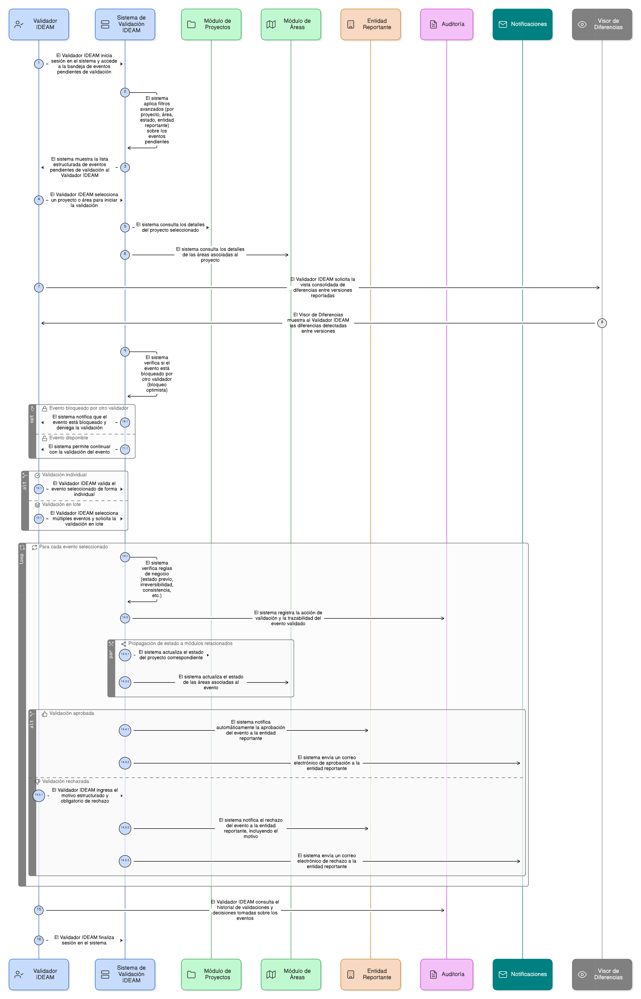

# Épica 008: Sistema de Validación IDEAM

## 1. Descripción general

Esta épica tiene como objetivo habilitar el **Sistema Institucional de Validación IDEAM** del SNIF, encargado de revisar, validar o rechazar la información reportada por las entidades responsables sobre **proyectos y áreas de restauración ecológica**, garantizando la calidad, coherencia y confiabilidad del dato a nivel nacional.

La épica define un **flujo centralizado y especializado de validación**, operado exclusivamente por el rol **Validador IDEAM**, que permite la gestión eficiente de eventos pendientes de validación mediante mecanismos de **filtrado avanzado, visualización estructurada, validación individual y validación en lote**, asegurando trazabilidad completa de cada decisión institucional.

El Sistema de Validación IDEAM incorpora reglas estrictas de negocio que gobiernan el proceso de validación, tales como:
- validación únicamente sobre información previamente enviada por las entidades,
- control formal de estados IDEAM,
- irreversibilidad de validaciones aprobadas,
- gestión estructurada de rechazos con motivos obligatorios,
- propagación controlada de estados entre proyectos y áreas,
- bloqueo optimista para evitar validaciones simultáneas.

Como capacidades transversales, la épica incluye **auditoría exhaustiva de cada evento de validación**, **notificaciones automáticas a las entidades reportantes** y **herramientas de apoyo a la decisión**, como la visualización consolidada de diferencias, fortaleciendo la gobernanza institucional del dato.

Las funcionalidades se integran de forma coherente con las épicas de **Gestión de Proyectos**, **Gestión de Áreas** y el **Visor Geográfico**, manteniendo una separación clara entre los procesos de **registro**, **validación institucional** y **consulta**, y garantizando que únicamente información validada por el IDEAM sea publicada y utilizada para análisis y seguimiento.

En conjunto, esta épica constituye el **núcleo del control de calidad institucional del IDEAM** dentro del SNIF, habilitando un proceso de validación robusto, trazable y escalable.

---

## 2. Objetivo

Permitir al **IDEAM**, a través de un sistema centralizado de validación, **revisar, validar o rechazar proyectos y áreas de restauración ecológica** reportados por las entidades, mediante un flujo institucional controlado que soporte filtrado eficiente de eventos, validación individual y masiva, gestión estructurada de rechazos, control de concurrencia, notificaciones automáticas y auditoría completa, garantizando la **calidad del dato**, la **trazabilidad institucional** y la **gobernanza del proceso de validación en el SNIF**.

---

## 3. Principio clave de diseño

El proceso de validación IDEAM **no se implementa como validaciones aisladas por cada tipo de entidad o formulario**.

El sistema dispone de una **única funcionalidad central de “Sistema de Validación IDEAM”**, desde la cual:

- Se listan y gestionan todos los eventos pendientes de validación.
- Se agrupan eventos por proyecto y área de restauración.
- Se aplican validaciones individuales o en lote.
- Se gestionan rechazos mediante motivos estructurados y obligatorios.
- Se controlan conflictos de concurrencia mediante bloqueo optimista.
- Se garantiza la trazabilidad completa de cada decisión de validación.
- Se notifican automáticamente los resultados a las entidades reportantes.

Este principio garantiza una solución **institucional, consistente y escalable**, evitando duplicidad de flujos, reduciendo errores de validación y fortaleciendo la gobernanza del dato validado por el IDEAM.

---

## 4. Historias de usuario asociadas

- [**HU-IDEAM-SNIF-REST-110:** Filtrado y consulta de eventos pendientes](EP-IDEAM-SNIF-REST-008/HU-IDEAM-SNIF-REST-110.md)
- [**HU-IDEAM-SNIF-REST-111:** Visualización agrupada de proyectos y áreas](EP-IDEAM-SNIF-REST-008/HU-IDEAM-SNIF-REST-111.md)
- [**HU-IDEAM-SNIF-REST-112:** Selección múltiple para validación en lote](EP-IDEAM-SNIF-REST-008/HU-IDEAM-SNIF-REST-112.md)
- [**HU-IDEAM-SNIF-REST-113:** Validación individual de proyecto](EP-IDEAM-SNIF-REST-008/HU-IDEAM-SNIF-REST-113.md)
- [**HU-IDEAM-SNIF-REST-114:** Validación individual de área de restauración](EP-IDEAM-SNIF-REST-008/HU-IDEAM-SNIF-REST-114.md)
- [**HU-IDEAM-SNIF-REST-115:** Modal de rechazo con motivo obligatorio](EP-IDEAM-SNIF-REST-008/HU-IDEAM-SNIF-REST-115.md)
- [**HU-IDEAM-SNIF-REST-116:** Bloqueo optimista de validación](EP-IDEAM-SNIF-REST-008/HU-IDEAM-SNIF-REST-116.md)
- [**HU-IDEAM-SNIF-REST-117:** Notificación automática a la entidad](EP-IDEAM-SNIF-REST-008/HU-IDEAM-SNIF-REST-117.md)
- [**HU-IDEAM-SNIF-REST-118:** Vista de diferencias consolidada](EP-IDEAM-SNIF-REST-008/HU-IDEAM-SNIF-REST-118.md)

---

## 5. Riesgos

- Sobrecarga operativa del rol Validador IDEAM en periodos de alta demanda de validación.
- Conflictos de concurrencia si el bloqueo optimista no se gestiona correctamente.
- Rechazos poco claros que generen reprocesos innecesarios por parte de las entidades.
- Errores en validaciones en lote con impacto sobre múltiples proyectos o áreas.
- Dependencia crítica de esta épica para la publicación y uso institucional de la información.
- Impactos en el desempeño del sistema por grandes volúmenes de eventos pendientes.
- Fallas en las notificaciones automáticas que afecten la retroalimentación oportuna.
- Necesidad de ajustes ante cambios normativos o institucionales en los criterios de validación.

---

## 5. Diagrama de secuencia

---

## 6. Wireframes / mockups
