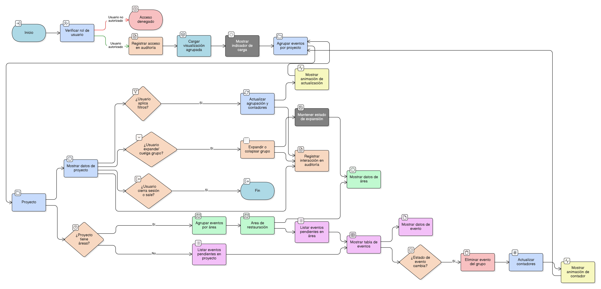

# HU-IDEAM-SNIF-REST-111

> **Identificador Historia de Usuario:** hu-ideam-snif-rest-111\
> **Nombre Historia de Usuario:** Visualización agrupada de proyectos y áreas en eventos de validación IDEAM

> **Sistema de información:** Sistema Nacional de Información Forestal\
> **Módulo / subsistema:** Módulo de restauración – Sistema de Validación IDEAM\
> **Validador temático(s):** Raymond Alexander Jiménez Arteaga

## DESCRIPCIÓN HISTORIA DE USUARIO

> **Como:** usuario Validador IDEAM o Administrador IDEAM.\
> **Quiero:** visualizar los eventos pendientes de validación agrupados por proyecto y por área de restauración.\
> **Para:** analizar de forma estructurada los cambios reportados y facilitar la toma de decisiones durante el proceso de validación.

## CRITERIOS DE ACEPTACIÓN

1. **Acceso a la visualización agrupada**  
   1.1 La visualización agrupada debe estar disponible únicamente para los roles Validador IDEAM y Administrador IDEAM.  
   1.2 Los usuarios sin permisos no deben visualizar la opción de agrupación.

2. **Estructura de agrupación**  
   2.1 El sistema debe agrupar los eventos pendientes por **Proyecto de restauración**.  
   2.2 Dentro de cada proyecto, los eventos deben agruparse por **Área de restauración**, cuando aplique.  
   2.3 Los eventos que no estén asociados a un área específica deben mostrarse directamente bajo el proyecto correspondiente.

3. **Información visible por agrupación**  
   3.1 Cada grupo de proyecto debe mostrar como mínimo:
   - Identificador del proyecto  
   - Nombre del proyecto  
   - Estado
   - Entidad responsable  
   - Fecha última actualización
   - Cantidad total de eventos pendientes asociados  
   3.2 Cada grupo de área debe mostrar como mínimo:
   - Identificador del área  
   - Tipo de área  
   - Superficie
   - Eventos
   - Cantidad de eventos pendientes asociados  

4. **Listado de eventos dentro del grupo**  
   4.1 Dentro de cada grupo, el sistema debe listar los eventos pendientes en formato data table.  
   4.2 Cada evento debe mostrar como mínimo:
   - Identificador del evento  
   - Tipo de objeto afectado  
   - Tipo de operación  
   - Fecha de generación  
   - Estado del evento  

5. **Expansión y colapso de grupos**  
   5.1 Los grupos de proyectos deben presentarse inicialmente colapsados.  
   5.2 El usuario debe poder expandir o colapsar proyectos y áreas de forma individual.  
   5.3 El sistema debe mantener el estado de expansión durante la sesión del usuario.

6. **Comportamiento dinámico del agrupamiento**  
   6.1 La agrupación debe actualizarse automáticamente al aplicar filtros definidos en la [HU-IDEAM-SNIF-REST-110](HU-IDEAM-SNIF-REST-111.md).  
   6.2 Al cambiar el estado de un evento por validación o rechazo, el evento debe desaparecer del grupo correspondiente.  
   6.3 Los contadores de eventos por proyecto y área deben actualizarse automáticamente.

7. **Indicadores visuales y UX verificable**  
   7.1 El sistema debe mostrar un **indicador visual de carga** mientras se construye o actualiza la agrupación.  
   7.2 La actualización de contadores por proyecto y área debe realizarse con **animación suave**.  
   7.3 La jerarquía Proyecto → Área → Evento debe ser visualmente clara y consistente.

8. **Diseño responsive**  
   8.1 La visualización agrupada debe adaptarse a dispositivos móviles.  
   8.2 En vista móvil, los grupos de proyectos y áreas deben presentarse en modo **colapsable** por defecto.  

9. **Integridad referencial obligatoria**  
   9.1 Todo evento mostrado debe estar asociado a un proyecto existente.  
   9.2 Cuando aplique, el evento debe estar asociado a un área existente del proyecto.  
   9.3 No se deben mostrar eventos huérfanos ni con referencias inconsistentes.

10. **Auditoría de la visualización**  
    10.1 El sistema debe registrar en auditoría el acceso a la vista agrupada de eventos.  
    10.2 El sistema debe registrar las interacciones relevantes de consulta sobre los grupos.

## ROLES

- **Validador IDEAM:** Visualiza eventos agrupados por proyecto y área para su validación.  
- **Administrador IDEAM:** Visualiza eventos agrupados con fines de control y auditoría.  
- **Registrador:** No tiene acceso al Sistema de Validación IDEAM.  
- **Usuario Consulta:** No tiene acceso al Sistema de Validación IDEAM.

## RESTRICCIONES Y LÍMITES

- La visualización agrupada es exclusivamente de consulta.  
- No se permite modificar eventos desde la vista agrupada.  
- Solo se visualizan eventos pendientes o en proceso de validación IDEAM.  
- La agrupación no altera la información ni el estado de los eventos.

## DIAGRAMA DE FLUJO DEL PROCESO

