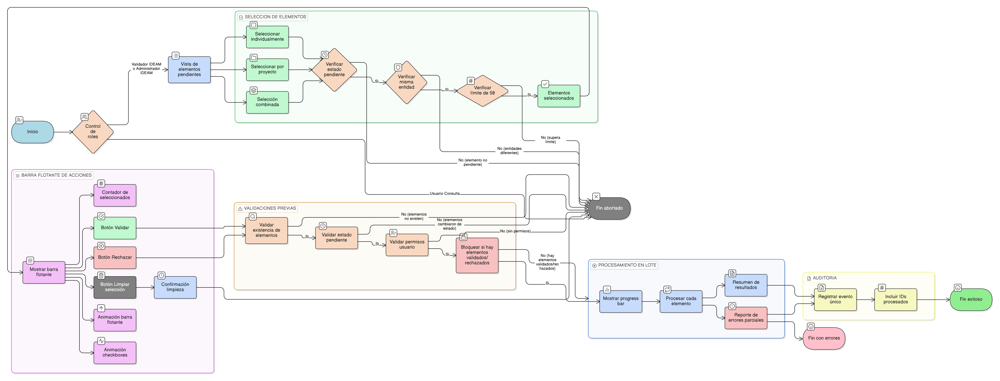

# HU-IDEAM-SNIF-REST-112

> **Identificador Historia de Usuario:** hu-ideam-snif-rest-112\
> **Nombre Historia de Usuario:** Selección múltiple para validación en lote

> **Sistema de información:** Sistema Nacional de Información Forestal\
> **Módulo / subsistema:** Módulo de restauración – Sistema de Validación IDEAM\
> **Validador temático(s):** Raymond Alexander Jiménez Arteaga

## DESCRIPCIÓN HISTORIA DE USUARIO

> **Como:** Validador IDEAM.\
> **Quiero:** seleccionar múltiples proyectos y/o áreas mediante checkboxes.\
> **Para:** validar varios elementos a la vez y agilizar mi trabajo de validación institucional.

## CRITERIOS DE ACEPTACIÓN

1. **Disponibilidad de selección múltiple**  
   1.1 Cada proyecto y cada área de restauración deben presentar un checkbox de selección.  
   1.2 Los checkboxes solo deben estar habilitados cuando el elemento tenga estado_validacion_ideam = **Pendiente**.  
   1.3 Los elementos que no estén en estado Pendiente no deben ser seleccionables.

2. **Selección por proyecto**  
   2.1 El sistema debe disponer de la opción **“Seleccionar todas las pendientes”** a nivel de proyecto.  
   2.2 Al seleccionar un proyecto, el sistema debe auto-seleccionar todas las áreas pendientes asociadas a dicho proyecto.  
   2.3 Al desmarcar el proyecto, todas sus áreas deben desmarcarse automáticamente.

3. **Selección combinada**  
   3.1 El sistema debe permitir seleccionar simultáneamente proyectos y áreas en una misma operación de validación en lote.  
   3.2 La selección combinada no debe alterar la jerarquía proyecto–área.

4. **Barra flotante de acciones**  
   4.1 Cuando exista al menos un elemento seleccionado, el sistema debe mostrar una **barra flotante de acciones**.  
   4.2 La barra flotante debe mostrar como mínimo:
   - Contador de elementos seleccionados  
   - Botón **Validar**  
   - Botón **Rechazar**  
   - Botón **Limpiar selección**  

5. **Comportamiento UX de la selección**  
   5.1 Los checkboxes deben presentar animación visual al marcar y desmarcar.  
   5.2 La barra flotante debe aparecer desde la parte inferior de la pantalla con animación **slide-up**.  
   5.3 Al limpiar la selección, el sistema debe mostrar confirmación visual de la acción.

6. **Validaciones de negocio de la selección**  
   6.1 Solo se deben permitir selecciones de elementos con estado_validacion_ideam = **Pendiente**.  
   6.2 No se debe permitir seleccionar elementos pertenecientes a **entidades diferentes** en una misma operación.  
   6.3 El sistema debe permitir seleccionar **máximo 50 elementos** en una sola operación de validación en lote.  
   6.4 Al cambiar la entidad en el filtro, el sistema debe limpiar automáticamente la selección activa.

7. **Validaciones funcionales previas al procesamiento**  
   7.1 Antes de procesar la validación en lote, el sistema debe validar que todos los elementos seleccionados existen.  
   7.2 El sistema debe validar que todos los elementos seleccionados continúan en estado Pendiente.  
   7.3 El sistema debe validar que el usuario tenga permisos sobre la entidad asociada a los elementos seleccionados.  
   7.4 El sistema debe bloquear la operación si alguno de los elementos ya fue validado o rechazado.

8. **Ejecución de validación o rechazo en lote**  
   8.1 Al ejecutar la validación o rechazo en lote, el sistema debe mostrar un **progress bar** con contador de avance.  
   8.2 El sistema debe procesar los elementos de forma individual dentro de la operación en lote.  
   8.3 Al finalizar el proceso, el sistema debe presentar un **resumen de resultados** que incluya:
   - Cantidad de éxitos  
   - Cantidad de fallos  
   - Motivos técnicos de los fallos, cuando existan  

9. **Gestión de errores parciales**  
   9.1 Si la operación en lote presenta errores parciales, el sistema debe mostrar un **reporte detallado** de los elementos fallidos.  
   9.2 Los elementos exitosos deben conservar su nuevo estado independientemente de los fallos.

10. **Control por roles**  
    10.1 El rol **Validador IDEAM** puede seleccionar y validar en lote elementos dentro de los límites definidos.  
    10.2 El rol **Administrador IDEAM** puede realizar selección múltiple y adicionalmente tiene la opción de reasignar validador.  
    10.3 El rol **Consulta** no puede acceder a la funcionalidad de selección múltiple.

11. **Auditoría de la validación en lote**  
    11.1 El sistema debe registrar la validación en lote como un **evento único de auditoría**.  
    11.2 El evento de auditoría debe incluir la lista de identificadores (IDs) de todos los elementos procesados.

## ROLES

- **Validador IDEAM:** Selecciona y valida proyectos y áreas en lote.  
- **Administrador IDEAM:** Selecciona, valida en lote y puede reasignar validador.  
- **Usuario Consulta:** No accede a la funcionalidad de validación en lote.

## RESTRICCIONES Y LÍMITES

- Máximo 50 elementos por operación de validación en lote.  
- No se permiten selecciones cruzadas entre entidades diferentes.  
- No se pueden incluir elementos no pendientes en la selección.  
- La validación en lote no puede ejecutarse sin pasar todas las validaciones previas.

## RESTRICCIONES Y LÍMITES

- La visualización agrupada es exclusivamente de consulta.  
- No se permite modificar eventos desde la vista agrupada.  
- Solo se visualizan eventos pendientes o en proceso de validación IDEAM.  
- La agrupación no altera la información ni el estado de los eventos.

## DIAGRAMA DE FLUJO DEL PROCESO

