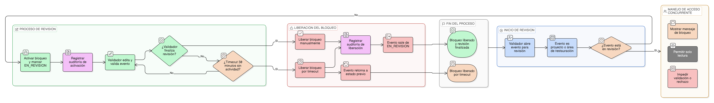

# HU-IDEAM-SNIF-REST-116

> **Identificador Historia de Usuario:** hu-ideam-snif-rest-116\
> **Nombre Historia de Usuario:** Bloqueo optimista de validación

> **Sistema de información:** Sistema Nacional de Información Forestal\
> **Módulo / subsistema:** Módulo de restauración – Sistema de Validación IDEAM\
> **Validador temático(s):** Raymond Alexander Jiménez Arteaga

## DESCRIPCIÓN HISTORIA DE USUARIO

> **Como:** sistema.\
> **Quiero:** bloquear temporalmente un evento cuando un validador lo está revisando.\
> **Para:** evitar validaciones simultáneas y conflictos durante el proceso de validación IDEAM.

## CRITERIOS DE ACEPTACIÓN

1. **Activación del bloqueo al abrir un evento**  
   1.1 Al momento en que un validador abre un evento para revisión, el sistema debe marcar automáticamente el evento con estado **EN_REVISION**.  
   1.2 El bloqueo debe activarse tanto para proyectos como para áreas de restauración.

2. **Comportamiento ante acceso concurrente**  
   2.1 Si otro usuario intenta acceder a un evento que se encuentra en estado **EN_REVISION**, el sistema debe impedir la edición o validación del evento.  
   2.2 El sistema debe mostrar un mensaje informativo indicando:  
   *“Este evento está siendo revisado por [usuario]”*.

3. **Alcance del bloqueo**  
   3.1 El bloqueo optimista aplica únicamente durante el proceso de revisión del evento.  
   3.2 El bloqueo no debe afectar la visualización en modo solo lectura del evento.

4. **Liberación del bloqueo**  
   4.1 El bloqueo debe liberarse automáticamente cuando el validador finaliza la validación o rechazo del evento.  
   4.2 Al liberarse el bloqueo, el evento debe abandonar el estado **EN_REVISION** y transicionar al estado correspondiente.

5. **Timeout automático**  
   5.1 El sistema debe liberar automáticamente el bloqueo si no se detecta actividad durante un período máximo de **30 minutos**.  
   5.2 Al cumplirse el timeout, el evento debe regresar a su estado previo a la revisión.  
   5.3 El sistema debe permitir que otro validador retome la revisión una vez liberado el bloqueo.

6. **UX verificable del bloqueo**  
   6.1 El mensaje de bloqueo debe ser visible de forma inmediata al intentar acceder al evento.  
   6.2 El mensaje debe identificar claramente al usuario que mantiene el bloqueo activo.  
   6.3 El sistema debe impedir acciones de validación o rechazo mientras el bloqueo esté activo.

7. **Auditoría del bloqueo**  
   7.1 El sistema debe registrar en auditoría la activación del bloqueo del evento.  
   7.2 El registro debe incluir:
   - Identificador del evento  
   - Usuario que inicia la revisión  
   - Timestamp de inicio del bloqueo  
   - Timestamp de liberación (automática o manual)

## ROLES

- **Sistema:** Gestiona automáticamente el bloqueo y liberación de eventos.  
- **Validador IDEAM:** Inicia la revisión y activa el bloqueo del evento.  
- **Administrador IDEAM:** Visualiza eventos bloqueados y su estado.  
- **Usuario Consulta:** No accede al Sistema de Validación IDEAM.

## RESTRICCIONES Y LÍMITES

- El bloqueo es temporal y no permanente.  
- El bloqueo no impide la visualización en modo solo lectura.  
- No se permite validar o rechazar un evento bloqueado por otro usuario.  
- El tiempo máximo de bloqueo es de **30 minutos**.

## DIAGRAMA DE FLUJO DEL PROCESO

