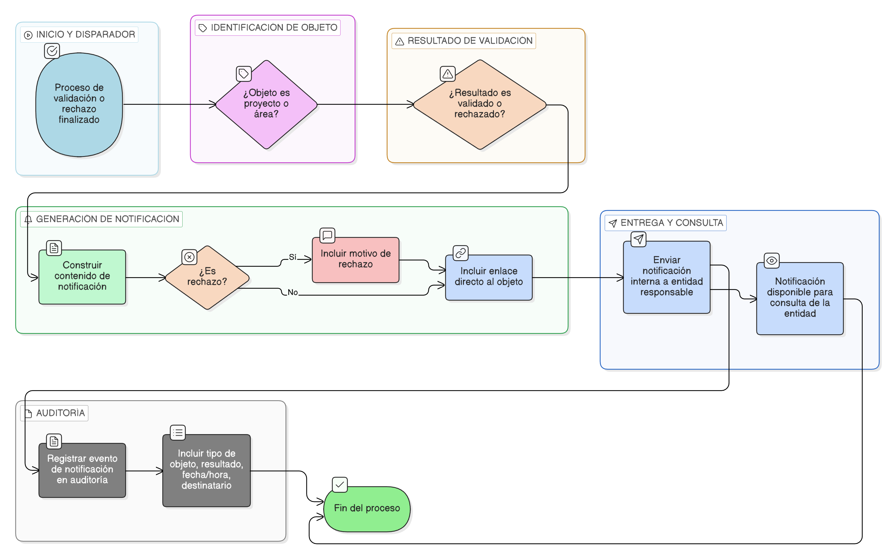

# HU-IDEAM-SNIF-REST-117

> **Identificador Historia de Usuario:** hu-ideam-snif-rest-117\
> **Nombre Historia de Usuario:** Notificación automática a la entidad

> **Sistema de información:** Sistema Nacional de Información Forestal\
> **Módulo / subsistema:** Módulo de restauración – Sistema de Validación IDEAM\
> **Validador temático(s):** Raymond Alexander Jiménez Arteaga

## DESCRIPCIÓN HISTORIA DE USUARIO

> **Como:** sistema.\
> **Quiero:** notificar automáticamente a la entidad responsable cuando un proyecto o un área de restauración es validado o rechazado.\
> **Para:** garantizar retroalimentación oportuna y permitir la corrección o seguimiento de la información.

## CRITERIOS DE ACEPTACIÓN

1. **Disparadores de notificación**  
   1.1 El sistema debe generar una notificación cuando un **proyecto** sea validado por IDEAM.  
   1.2 El sistema debe generar una notificación cuando un **proyecto** sea rechazado por IDEAM.  
   1.3 El sistema debe generar una notificación cuando un **área de restauración** sea validada por IDEAM.  
   1.4 El sistema debe generar una notificación cuando un **área de restauración** sea rechazada por IDEAM.

2. **Canales de notificación**  
   2.1 El sistema debe enviar la notificación a través de **notificación interna** del SNIF.  
   2.2 El envío por **correo electrónico** debe considerarse como un canal **opcional a futuro** y no es obligatorio en esta historia de usuario.

3. **Contenido mínimo de la notificación**  
   3.1 Toda notificación debe incluir como mínimo:
   - Resultado del proceso (Validado / Rechazado)  
   - Motivo del rechazo, cuando aplique  
   - Enlace directo al proyecto o área correspondiente  

4. **Comportamiento de la notificación**  
   4.1 La notificación debe generarse automáticamente una vez finalizado el proceso de validación o rechazo.  
   4.2 La notificación debe estar disponible para consulta por parte de la entidad responsable.  
   4.3 El enlace incluido en la notificación debe dirigir directamente al objeto validado o rechazado.

5. **Consistencia con el resultado de validación**  
   5.1 El contenido de la notificación debe reflejar fielmente el resultado final del proceso de validación.  
   5.2 En caso de rechazo, el motivo enviado debe corresponder exactamente al registrado por el validador IDEAM.

6. **Auditoría de notificaciones**  
   6.1 El sistema debe registrar en auditoría la generación de cada notificación.  
   6.2 El registro de auditoría debe incluir:
   - Tipo de objeto notificado (proyecto o área)  
   - Resultado de la validación  
   - Fecha y hora de envío  
   - Entidad destinataria  

## ROLES

- **Sistema:** Genera y envía automáticamente las notificaciones.  
- **Entidad responsable:** Recibe y consulta las notificaciones asociadas a sus proyectos y áreas.  
- **Validador IDEAM:** Genera indirectamente la notificación al validar o rechazar.  
- **Administrador IDEAM:** Consulta notificaciones para fines de control y auditoría.

## RESTRICCIONES Y LÍMITES

- La notificación se genera únicamente tras una validación o rechazo exitoso.  
- No se permite el envío manual de notificaciones desde esta funcionalidad.  
- El canal de correo electrónico no es obligatorio en esta historia de usuario.  
- El sistema no modifica estados como resultado del envío de la notificación.

## DIAGRAMA DE FLUJO DEL PROCESO

