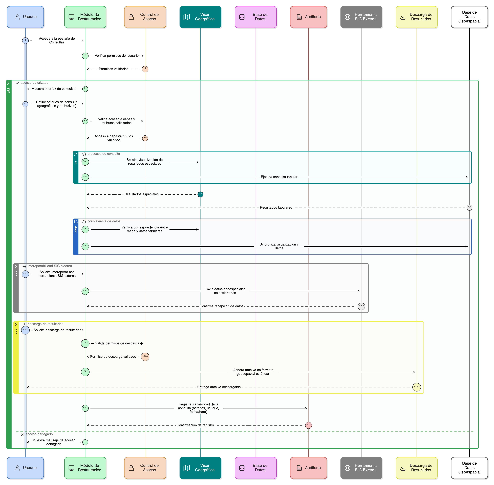

# Épica 009: Pestaña de Consultas del módulo de restauración del SNIF

## 1. Descripción general

Esta épica define la implementación de la pestaña de **Consultas** del módulo de restauración del SNIF, orientada a permitir a los usuarios realizar consultas geográficas y atributivas sobre la información registrada en el sistema (proyectos, áreas de restauración, acciones, adjuntos y demás elementos operativos).

La pestaña de Consultas soporta procesos de:

- Análisis espacial y verificación técnica.
- Seguimiento institucional.
- Interoperabilidad con herramientas SIG externas.
- Consulta pública controlada según el perfil de acceso.

El módulo garantiza consistencia entre los datos tabulares y la visualización cartográfica, control de acceso por roles, trazabilidad de las consultas realizadas y descarga controlada de resultados en formatos geoespaciales estándar.

La pestaña de Consultas es **estrictamente de solo lectura**, no permite modificar información operativa ni estados de validación.

## 2. Objetivo

Permitir a los usuarios del módulo de restauración del SNIF realizar consultas geográficas y atributivas sobre la información registrada, garantizando:

- Consistencia entre mapa, datos y formularios.
- Control de acceso por rol sobre capas, atributos y funcionalidades.
- Trazabilidad y auditoría de las consultas realizadas.
- Descarga controlada de resultados según permisos.
- Estabilidad y rendimiento del visor geográfico y la base geoespacial.

## 3. Historias de usuario asociadas

- [**HU-IDEAM-SNIF-REST-119:** Consulta atributiva de información geográfica](EP-IDEAM-SNIF-REST-009/HU-IDEAM-SNIF-REST-119.md)
- [**HU-IDEAM-SNIF-REST-120:** Consulta espacial mediante dibujo en el mapa](EP-IDEAM-SNIF-REST-009/HU-IDEAM-SNIF-REST-120.md)
- [**HU-IDEAM-SNIF-REST-121:** Consulta geográfica por coordenadas](EP-IDEAM-SNIF-REST-009/HU-IDEAM-SNIF-REST-121.md)
- [**HU-IDEAM-SNIF-REST-122:** Consulta mediante carga de capa geográfica](EP-IDEAM-SNIF-REST-009/HU-IDEAM-SNIF-REST-122.md)
- [**HU-IDEAM-SNIF-REST-123:** Visualización integrada de resultados](EP-IDEAM-SNIF-REST-009/HU-IDEAM-SNIF-REST-123.md)
- [**HU-IDEAM-SNIF-REST-124:** Visualización del detalle de un elemento consultado](EP-IDEAM-SNIF-REST-009/HU-IDEAM-SNIF-REST-124.md)
- [**HU-IDEAM-SNIF-REST-125:** Descarga de resultados de consultas](EP-IDEAM-SNIF-REST-009/HU-IDEAM-SNIF-REST-125.md)
- [**HU-IDEAM-SNIF-REST-126:** Reinicio de consultas](EP-IDEAM-SNIF-REST-009/HU-IDEAM-SNIF-REST-126.md)
- [**HU-IDEAM-SNIF-REST-127:** Control de rendimiento de consultas](EP-IDEAM-SNIF-REST-009/HU-IDEAM-SNIF-REST-127.md)
- [**HU-IDEAM-SNIF-REST-128:** Consulta pública controlada](EP-IDEAM-SNIF-REST-009/HU-IDEAM-SNIF-REST-128.md)

## 4. Riesgos

- Inconsistencias entre los resultados visualizados en el mapa y los datos tabulares.
- Ejecución de consultas sin criterios mínimos que afecten el rendimiento del sistema.
- Acceso no autorizado a capas, atributos o funcionalidades según el rol del usuario.
- Descarga de información sensible sin validación de permisos.
- Consultas espaciales complejas que impacten la estabilidad del visor geográfico.
- Falta de trazabilidad de las consultas realizadas por los usuarios.
- Uso indebido de capas externas cargadas temporalmente.

## 5. Diagrama de secuencia

## 6. Wireframes / mockups
