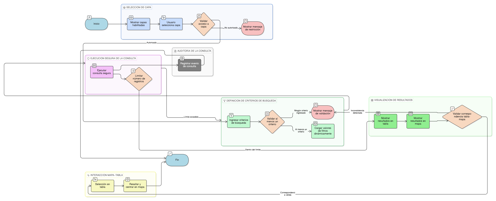

# HU-IDEAM-SNIF-REST-119

> **Identificador Historia de Usuario:** hu-ideam-snif-rest-119\
> **Nombre Historia de Usuario:** Consulta atributiva de información geográfica

> **Sistema de información:** Sistema Nacional de Información Forestal\
> **Módulo / subsistema:** Módulo de restauración\
> **Validador temático(s):** Raymond Alexander Jiménez Arteaga

## DESCRIPCIÓN HISTORIA DE USUARIO

> **Como:** usuario del módulo de restauración.\
> **Quiero:** realizar consultas sobre una capa geográfica utilizando filtros basados en atributos.\
> **Para:** identificar y analizar elementos de restauración que cumplan criterios definidos.

## CRITERIOS DE ACEPTACIÓN

1. **Selección de capa para consulta**\
   1.1 El usuario debe poder seleccionar únicamente capas habilitadas para consulta según su rol.\
   1.2 No se deben mostrar capas restringidas para el perfil del usuario.

2. **Definición de criterios de búsqueda**\
   2.1 El sistema debe exigir el ingreso de al menos un criterio de búsqueda antes de ejecutar la consulta.\
   2.2 Los valores de los filtros deben cargarse dinámicamente desde el catálogo del sistema.

3. **Ejecución segura de la consulta**\
   3.1 La consulta debe ejecutarse mediante SQL parametrizado o un servicio REST seguro.\
   3.2 El sistema debe limitar el número máximo de registros retornados por consulta.

4. **Visualización de resultados**\
   4.1 Los resultados deben visualizarse simultáneamente en una tabla de atributos y en el mapa.\
   4.2 Los registros mostrados en la tabla deben corresponder exactamente a las geometrías visualizadas en el mapa.

5. **Interacción mapa–tabla**\
   5.1 La selección de un registro en la tabla debe resaltar y centrar el elemento correspondiente en el mapa.

6. **Mensajes y validaciones de usuario**\
   6.1 El sistema debe mostrar mensajes claros cuando no se cumplan las validaciones definidas.

7. **Auditoría de la consulta**\
   7.1 El sistema debe registrar el evento de consulta indicando usuario, fecha, capa consultada y tipo de consulta.

## ROLES

- **Administrador IDEAM**: Puede realizar consultas sobre una capa geográfica utilizando filtros basados en atributos.
- **Registrador**: Puede realizar consultas sobre una capa geográfica utilizando filtros basados en atributos.
- **Consulta**: Puede realizar consultas sobre una capa geográfica utilizando filtros basados en atributos.

## RESTRICCIONES Y LÍMITES

- La funcionalidad es exclusivamente de consulta (solo lectura).
- No se permite creación, actualización ni eliminación de información operativa.
- El número de registros retornados por consulta debe estar limitado por configuración del sistema.
- Solo se exponen atributos permitidos según el rol del usuario.

## DIAGRAMA DE FLUJO DEL PROCESO

