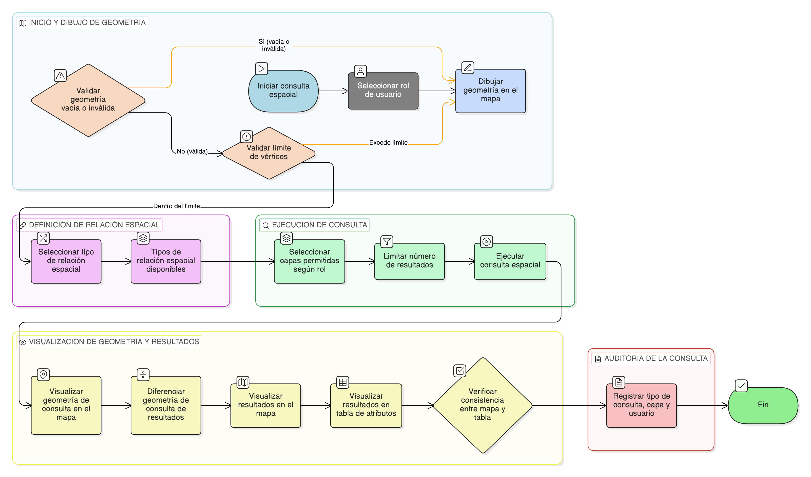

# HU-IDEAM-SNIF-REST-120

> **Identificador Historia de Usuario:** hu-ideam-snif-rest-120\
> **Nombre Historia de Usuario:** Consulta espacial mediante dibujo en el mapa

> **Sistema de información:** Sistema Nacional de Información Forestal\
> **Módulo / subsistema:** Módulo de restauración\
> **Validador temático(s):** Raymond Alexander Jiménez Arteaga

## DESCRIPCIÓN HISTORIA DE USUARIO

> **Como:** usuario del módulo de restauración.\
> **Quiero:** dibujar geometrías sobre el mapa.\
> **Para:** consultar elementos que mantengan una relación espacial con el área dibujada.

## CRITERIOS DE ACEPTACIÓN

1. **Dibujo de geometría de consulta**\
   1.1 El sistema debe permitir al usuario dibujar una geometría directamente sobre el mapa.\
   1.2 La geometría dibujada no debe ser vacía ni inválida.\
   1.3 Se debe establecer un límite máximo de vértices para las geometrías dibujadas por razones de rendimiento.

2. **Definición de relación espacial**\
   2.1 El usuario debe seleccionar el tipo de relación espacial a aplicar.\
   2.2 Los tipos de relación espacial disponibles deben incluir: intersecta, contiene, contenido en y cercano.

3. **Ejecución de la consulta espacial**\
   3.1 El sistema debe limitar el número máximo de resultados retornados por consulta.\
   3.2 Solo se deben consultar capas permitidas para el rol del usuario.

4. **Visualización de la geometría de consulta**\
   4.1 La geometría utilizada para la consulta debe visualizarse claramente en el mapa.\
   4.2 La geometría de consulta debe diferenciarse gráficamente de los resultados.

5. **Visualización de resultados**\
   5.1 Los resultados de la consulta deben visualizarse tanto en el mapa como en una tabla de atributos.\
   5.2 Los resultados mostrados en el mapa y en la tabla deben ser consistentes entre sí.

6. **Auditoría de la consulta**\
   6.1 El sistema debe registrar el tipo de consulta espacial realizada, la capa consultada y el usuario que la ejecutó.

## ROLES

- **Administrador IDEAM**: Puede dibujar geometrías sobre el mapa para hacer una consulta espacial.
- **Registrador**: Puede dibujar geometrías sobre el mapa para hacer una consulta espacial.
- **Consulta**: Puede dibujar geometrías sobre el mapa para hacer una consulta espacial.

## RESTRICCIONES Y LÍMITES

- La funcionalidad es exclusivamente de consulta (solo lectura).
- No se permite modificación de información operativa ni de estados.
- Solo se consultan capas habilitadas según el rol del usuario.
- El rendimiento de la consulta debe estar protegido mediante límites de vértices y resultados.

## DIAGRAMA DE FLUJO DEL PROCESO

