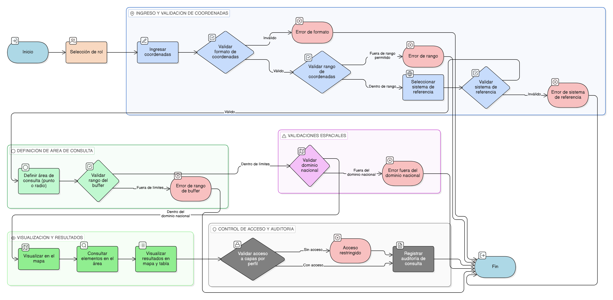

# HU-IDEAM-SNIF-REST-121

> **Identificador Historia de Usuario:** hu-ideam-snif-rest-121\
> **Nombre Historia de Usuario:** Consulta geográfica por coordenadas

> **Sistema de información:** Sistema Nacional de Información Forestal\
> **Módulo / subsistema:** Módulo de restauración\
> **Validador temático(s):** Raymond Alexander Jiménez Arteaga

## DESCRIPCIÓN HISTORIA DE USUARIO

> **Como:** usuario del módulo de restauración.\
> **Quiero:** ingresar coordenadas geográficas o proyectadas.\
> **Para:** consultar elementos ubicados en un punto o dentro de un radio definido.

## CRITERIOS DE ACEPTACIÓN

1. **Ingreso de coordenadas**\
   1.1 El sistema debe permitir el ingreso de coordenadas geográficas o proyectadas.\
   1.2 El formato de las coordenadas ingresadas debe ser validado por el sistema.\
   1.3 Las coordenadas deben encontrarse dentro de los rangos permitidos.

2. **Sistema de referencia espacial**\
   2.1 El usuario debe seleccionar el sistema de referencia de las coordenadas ingresadas.\
   2.2 El sistema debe validar que el sistema de referencia seleccionado sea válido.

3. **Definición de área de consulta**\
   3.1 El sistema debe permitir definir un punto de consulta o un radio de búsqueda.\
   3.2 El rango del buffer debe estar controlado según los límites permitidos por el sistema.

4. **Validaciones espaciales**\
   4.1 El sistema debe rechazar coordenadas que se encuentren fuera del dominio nacional.

5. **Visualización en el mapa**\
   5.1 El punto o buffer ingresado debe reflejarse de manera inmediata en el mapa.

6. **Resultados de la consulta**\
   6.1 Los resultados listados deben corresponder exactamente al área consultada.\
   6.2 Los resultados deben visualizarse tanto en el mapa como en una tabla de atributos.

7. **Control por roles**\
   7.1 El acceso a las capas consultadas debe estar restringido según el perfil del usuario.

8. **Auditoría de la consulta**\
   8.1 El sistema debe registrar la consulta indicando las coordenadas ingresadas, el usuario y la fecha.

## ROLES

- **Administrador IDEAM**: Puede realizar una consulta basada en una coordenada.
- **Registrador**: Puede realizar una consulta basada en una coordenada.
- **Consulta**: Puede realizar una consulta basada en una coordenada.

## RESTRICCIONES Y LÍMITES

- La funcionalidad es exclusivamente de consulta (solo lectura).
- No se permite modificación de información operativa.
- Las coordenadas fuera del dominio nacional deben ser rechazadas.
- El rango del buffer debe estar limitado por configuración del sistema.

## DIAGRAMA DE FLUJO DEL PROCESO

