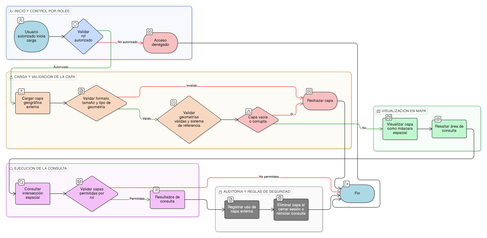

# HU-IDEAM-SNIF-REST-122

> **Identificador Historia de Usuario:** hu-ideam-snif-rest-122\
> **Nombre Historia de Usuario:** Consulta mediante carga de capa geográfica

> **Sistema de información:** Sistema Nacional de Información Forestal\
> **Módulo / subsistema:** Módulo de restauración\
> **Validador temático(s):** Raymond Alexander Jiménez Arteaga

## DESCRIPCIÓN HISTORIA DE USUARIO

> **Como:** usuario del módulo de restauración.\
> **Quiero:** cargar una capa geográfica externa.\
> **Para:** usarla como delimitador espacial en una consulta.

## CRITERIOS DE ACEPTACIÓN

1. **Carga de capa geográfica externa**\
   1.1 El sistema debe permitir la carga de una capa geográfica externa para uso temporal en la consulta.\
   1.2 La capa cargada no debe persistirse en el sistema.

2. **Validaciones de la capa cargada**\
   2.1 El sistema debe validar el formato, tamaño y tipo de geometría de la capa cargada.\
   2.2 El sistema debe validar que la capa contenga geometrías válidas y un sistema de referencia definido.\
   2.3 El sistema debe rechazar capas vacías o corruptas.

3. **Visualización de la capa de consulta**\
   3.1 La capa cargada debe visualizarse en el mapa como una máscara espacial.\
   3.2 El área de consulta debe resaltarse visualmente.

4. **Ejecución de la consulta**\
   4.1 Los resultados de la consulta deben corresponder a la intersección espacial definida por la capa cargada.\
   4.2 Solo se deben consultar capas permitidas según el rol del usuario.

5. **Control por roles**\
   5.1 La funcionalidad debe estar disponible únicamente para roles autorizados.

6. **Auditoría de uso**\
   6.1 El sistema debe registrar el uso de la capa externa indicando usuario, fecha y formato.

7. **Reglas de seguridad**\
   7.1 La capa cargada no debe persistirse.\
   7.2 La capa cargada no debe asociarse a eventos.\
   7.3 La capa cargada debe eliminarse al cerrar sesión o reiniciar la consulta.

## ROLES

- **Administrador IDEAM**: Puede cargar una capa geográfica externa para usarla como delimitador espacial en una consulta.
- **Registrador**: Puede cargar una capa geográfica externa para usarla como delimitador espacial en una consulta.
- **Consulta**: Puede cargar una capa geográfica externa para usarla como delimitador espacial en una consulta.

## RESTRICCIONES Y LÍMITES

- La capa geográfica cargada es de uso temporal y no se persiste.
- No se permite modificación de información operativa.
- Solo se permiten capas con geometrías válidas y sistema de referencia definido.
- La consulta es exclusivamente de solo lectura.

## DIAGRAMA DE FLUJO DEL PROCESO

