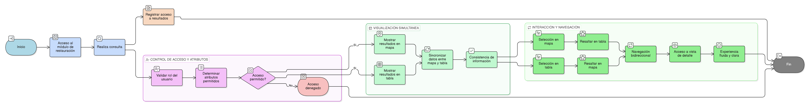

# HU-IDEAM-SNIF-REST-123

> **Identificador Historia de Usuario:** hu-ideam-snif-rest-123\
> **Nombre Historia de Usuario:** Visualización integrada de resultados

> **Sistema de información:** Sistema Nacional de Información Forestal\
> **Módulo / subsistema:** Módulo de restauración\
> **Validador temático(s):** Raymond Alexander Jiménez Arteaga

## DESCRIPCIÓN HISTORIA DE USUARIO

> **Como:** usuario del módulo de restauración.\
> **Quiero:** visualizar los resultados de una consulta en mapa y tabla.\
> **Para:** analizar la información de manera integrada.

## CRITERIOS DE ACEPTACIÓN

1. **Visualización simultánea de resultados**\
   1.1 Los resultados de una consulta deben visualizarse de forma simultánea en el mapa y en una tabla de atributos.

2. **Consistencia de la información**\
   2.1 La información mostrada en el mapa y en la tabla debe ser consistente de manera obligatoria.

3. **Navegación integrada**\
   3.1 El sistema debe permitir la navegación bidireccional entre mapa, tabla y vista de detalle.

4. **Interacción mapa–tabla**\
   4.1 La selección de un elemento en el mapa debe reflejarse en la tabla de atributos.\
   4.2 La selección de un registro en la tabla debe resaltar el elemento correspondiente en el mapa.

5. **Control por roles**\
   5.1 La visualización de atributos debe estar limitada a los campos permitidos según el rol del usuario.

6. **Experiencia de usuario**\
   6.1 La interacción entre mapa y tabla debe ser fluida y sincronizada.\
   6.2 Las opciones de selección y enfoque deben ser claras para el usuario.

7. **Auditoría de acceso**\
   7.1 El sistema debe registrar el acceso a los resultados de la consulta.

## ROLES

- **Administrador IDEAM**: Puede visualizar los resultados de una consulta en mapa y tabla.
- **Registrador**: Puede visualizar los resultados de una consulta en mapa y tabla.
- **Consulta**: Puede visualizar los resultados de una consulta en mapa y tabla.

## RESTRICCIONES Y LÍMITES

- La funcionalidad es exclusivamente de consulta (solo lectura).
- No se permite la modificación de información operativa.
- Solo se muestran atributos permitidos según el perfil del usuario.

## DIAGRAMA DE FLUJO DEL PROCESO

