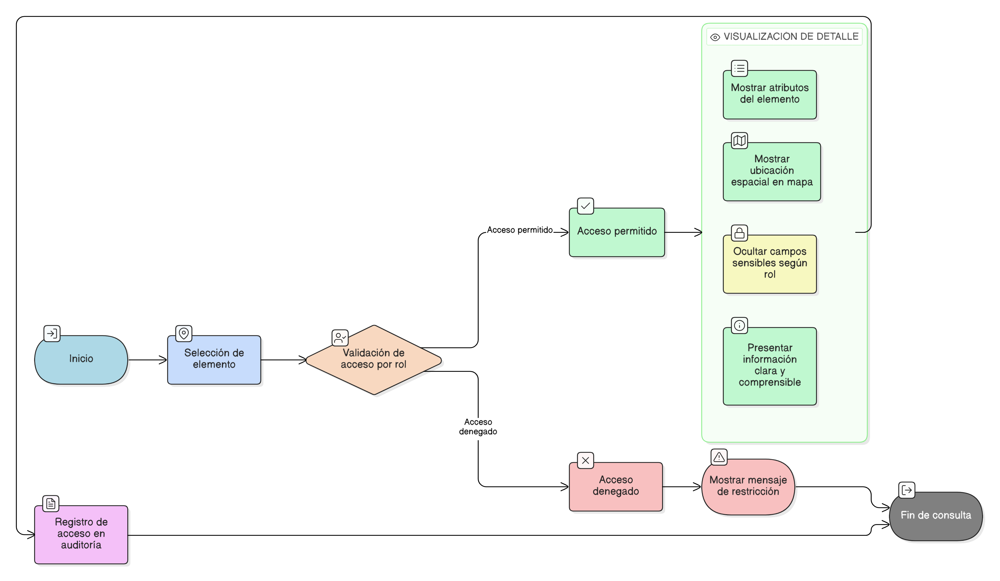

# HU-IDEAM-SNIF-REST-124

> **Identificador Historia de Usuario:** hu-ideam-snif-rest-124\
> **Nombre Historia de Usuario:** Visualización del detalle de un elemento consultado

> **Sistema de información:** Sistema Nacional de Información Forestal\
> **Módulo / subsistema:** Módulo de restauración\
> **Validador temático(s):** Raymond Alexander Jiménez Arteaga

## DESCRIPCIÓN HISTORIA DE USUARIO

> **Como:** usuario del módulo de restauración.\
> **Quiero:** acceder al detalle de un elemento.\
> **Para:** revisar su información completa y ubicación espacial.

## CRITERIOS DE ACEPTACIÓN

1. **Acceso al detalle del elemento**\
   1.1 El sistema debe permitir el acceso al detalle de un elemento seleccionado desde el mapa o la tabla de resultados.

2. **Consistencia del detalle**\
   2.1 La información del detalle debe corresponder exactamente al elemento seleccionado.

3. **Visualización de información**\
   3.1 El detalle debe mostrar los atributos disponibles del elemento.\
   3.2 La ubicación espacial del elemento debe visualizarse en el mapa.

4. **Control por roles**\
   4.1 El acceso al detalle debe estar condicionado por el rol del usuario.\
   4.2 Los campos sensibles deben restringirse según el perfil del usuario.

5. **Experiencia de usuario**\
   5.1 La vista de detalle debe presentar la información de forma clara y comprensible.

6. **Auditoría de acceso**\
   6.1 El sistema debe registrar el acceso al detalle del elemento consultado.

## ROLES

- **Administrador IDEAM**: Puede acceder al detalle de información de un elemento.
- **Registrador**: Puede acceder al detalle de información de un elemento.
- **Consulta**: Puede acceder al detalle de información de un elemento.

## RESTRICCIONES Y LÍMITES

- La funcionalidad es exclusivamente de consulta (solo lectura).
- No se permite modificación de información operativa.
- Los campos sensibles deben ocultarse según el rol del usuario.

## DIAGRAMA DE FLUJO DEL PROCESO

