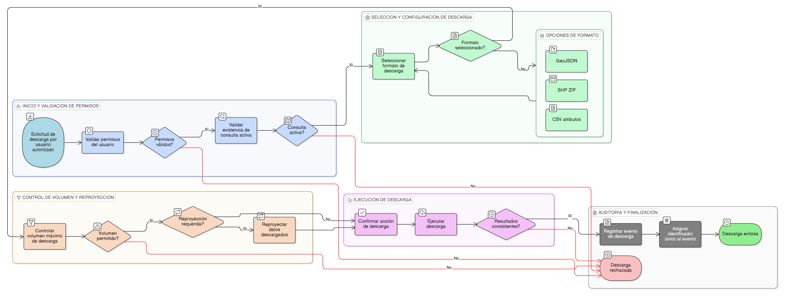

# HU-IDEAM-SNIF-REST-125

> **Identificador Historia de Usuario:** hu-ideam-snif-rest-125\
> **Nombre Historia de Usuario:** Descarga de resultados de consultas

> **Sistema de información:** Sistema Nacional de Información Forestal\
> **Módulo / subsistema:** Módulo de restauración\
> **Validador temático(s):** Raymond Alexander Jiménez Arteaga

## DESCRIPCIÓN HISTORIA DE USUARIO

> **Como:** usuario autorizado del módulo de restauración.\
> **Quiero:** descargar los resultados de una consulta.\
> **Para:** utilizarlos en herramientas SIG y análisis externos.

## CRITERIOS DE ACEPTACIÓN

1. **Disponibilidad de la descarga**\
   1.1 El sistema debe habilitar la opción de descarga únicamente para usuarios autorizados.\
   1.2 La descarga debe estar asociada a una consulta previamente ejecutada.

2. **Selección de formato**\
   2.1 El usuario debe poder seleccionar el formato de descarga.\
   2.2 Los formatos disponibles deben incluir:
   - GeoJSON
   - SHP (ZIP)
   - CSV (atributos)

3. **Control de volumen y reproyección**\
   3.1 El sistema debe controlar el volumen máximo de información descargable.\
   3.2 El sistema debe permitir la reproyección de los datos descargados según configuración.

4. **Consistencia de los resultados**\
   4.1 La información descargada debe corresponder exactamente a los resultados visualizados en el mapa y la tabla.

5. **Validación de permisos**\
   5.1 El sistema debe validar los permisos del usuario antes de ejecutar la descarga.

6. **Experiencia de usuario**\
   6.1 El proceso de descarga debe presentar una selección clara de formato y una confirmación de la acción.

7. **Auditoría de la descarga**\
   7.1 El sistema debe registrar el evento de descarga indicando usuario, capa, formato y fecha.\
   7.2 El evento de descarga debe contar con un identificador único.

## ROLES

- **Administrador IDEAM**: Puede descargar los resultados de una consulta.
- **Registrador**: Puede descargar los resultados de una consulta con restricciones.
- **Consulta**: Puede descargar los resultados de una consulta con restricciones.

## RESTRICCIONES Y LÍMITES

- La funcionalidad es exclusivamente de consulta (solo lectura).
- La descarga está sujeta a control de volumen y permisos.
- Solo se descargan los resultados correspondientes a la consulta activa.
- No se permite descarga masiva fuera de los límites definidos por el sistema.

## DIAGRAMA DE FLUJO DEL PROCESO

