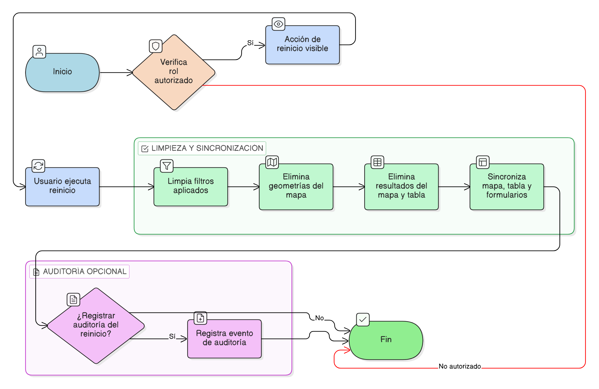

# HU-IDEAM-SNIF-REST-126

> **Identificador Historia de Usuario:** hu-ideam-snif-rest-126\
> **Nombre Historia de Usuario:** Reinicio de consultas

> **Sistema de información:** Sistema Nacional de Información Forestal\
> **Módulo / subsistema:** Módulo de restauración\
> **Validador temático(s):** Raymond Alexander Jiménez Arteaga

## DESCRIPCIÓN HISTORIA DE USUARIO

> **Como:** usuario del módulo de restauración.\
> **Quiero:** reiniciar una consulta.\
> **Para:** limpiar filtros, geometrías y resultados.

## CRITERIOS DE ACEPTACIÓN

1. **Reinicio de la consulta activa**\
   1.1 El sistema debe permitir reiniciar la consulta activa mediante una acción explícita de interfaz.

2. **Limpieza del estado de la consulta**\
   2.1 Al reiniciar la consulta, el sistema debe limpiar completamente los filtros aplicados.\
   2.2 Las geometrías utilizadas para la consulta deben eliminarse del mapa.\
   2.3 Los resultados mostrados en el mapa y en la tabla deben eliminarse.

3. **Sincronización de componentes**\
   3.1 El mapa, la tabla de resultados y los formularios deben quedar sincronizados y vacíos tras el reinicio.

4. **Disponibilidad por roles**\
   4.1 La funcionalidad de reinicio de consultas debe estar disponible para todos los roles con acceso al módulo.

5. **Experiencia de usuario**\
   5.1 El botón o acción de reinicio debe ser visible y ejecutarse de forma inmediata.

6. **Auditoría del reinicio**\
   6.1 El sistema puede registrar opcionalmente el reinicio de la sesión de consulta.

## ROLES

- **Administrador IDEAM**: Puede reiniciar una consulta.
- **Registrador**: Puede reiniciar una consulta.
- **Consulta**: Puede reiniciar una consulta.

## RESTRICCIONES Y LÍMITES

- El reinicio de la consulta es una acción de interfaz y no modifica información operativa.
- No se persiste información asociada a la consulta reiniciada.
- La funcionalidad es independiente del tipo de consulta ejecutada previamente.

## DIAGRAMA DE FLUJO DEL PROCESO

