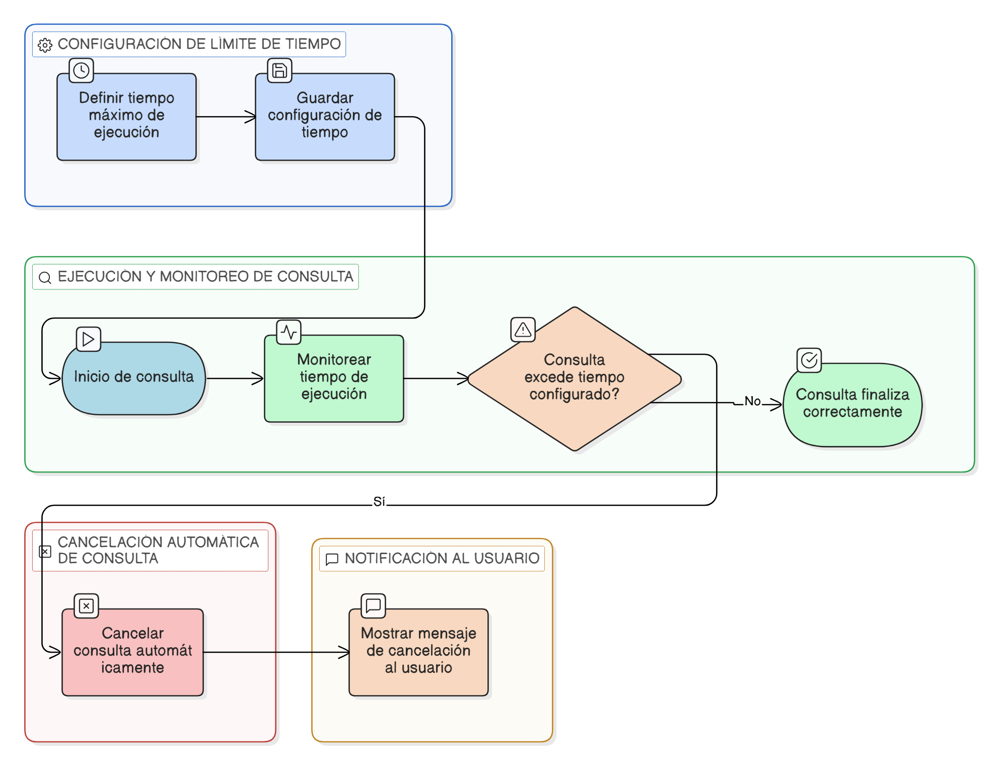

# HU-IDEAM-SNIF-REST-127

> **Identificador Historia de Usuario:** hu-ideam-snif-rest-127\
> **Nombre Historia de Usuario:** Control de rendimiento de consultas

> **Sistema de información:** Sistema Nacional de Información Forestal\
> **Módulo / subsistema:** Módulo de restauración\
> **Validador temático(s):** Raymond Alexander Jiménez Arteaga

## DESCRIPCIÓN HISTORIA DE USUARIO

> **Como:** sistema.\
> **Quiero:** limitar y monitorear el tiempo de ejecución de consultas.\
> **Para:** garantizar estabilidad del visor y la base geoespacial.

## CRITERIOS DE ACEPTACIÓN

1. **Límite de tiempo de ejecución**\
   1.1 El sistema debe contar con un tiempo máximo de ejecución configurable para las consultas.\
   1.2 Las consultas que superen el tiempo configurado deben cancelarse automáticamente.

2. **Monitoreo de consultas**\
   2.1 El sistema debe monitorear el tiempo de ejecución de cada consulta realizada.

3. **Cancelación automática**\
   3.1 Las consultas consideradas pesadas deben cancelarse de forma automática al superar los límites definidos.

4. **Notificación al usuario**\
   4.1 El sistema debe mostrar un mensaje claro al usuario cuando una consulta sea cancelada por tiempo de ejecución.

## ROLES

- **Administrador IDEAM**: No aplica interacción directa.
- **Registrador**: No aplica interacción directa.
- **Consulta**: No aplica interacción directa.

## RESTRICCIONES Y LÍMITES

- Los tiempos de ejecución deben ser configurables por el sistema.
- La cancelación de consultas es automática y no depende de acciones del usuario.
- La funcionalidad aplica a todos los tipos de consulta del módulo.

## DIAGRAMA DE FLUJO DEL PROCESO

