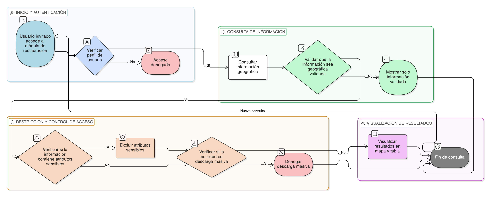

# HU-IDEAM-SNIF-REST-128

> **Identificador Historia de Usuario:** hu-ideam-snif-rest-128\
> **Nombre Historia de Usuario:** Consulta pública controlada

> **Sistema de información:** Sistema Nacional de Información Forestal\
> **Módulo / subsistema:** Módulo de restauración\
> **Validador temático(s):** Raymond Alexander Jiménez Arteaga

## DESCRIPCIÓN HISTORIA DE USUARIO

> **Como:** usuario invitado.\
> **Quiero:** consultar información geográfica validada.\
> **Para:** conocer avances de restauración sin acceder a datos sensibles.

## CRITERIOS DE ACEPTACIÓN

1. **Disponibilidad de información pública**\
   1.1 El sistema debe permitir la consulta únicamente de información geográfica validada.\
   1.2 La información expuesta debe corresponder a datos generalizados cuando aplique.

2. **Restricción de acceso a datos sensibles**\
   2.1 No se deben exponer atributos considerados sensibles para el perfil Consulta.

3. **Control de descarga**\
   3.1 No se debe permitir la descarga masiva de información para el perfil Consulta.

4. **Visualización de resultados**\
   4.1 Los resultados de la consulta deben visualizarse en el mapa y en la tabla de atributos.\
   4.2 La información visualizada debe corresponder exactamente a los datos validados.

5. **Control por perfil**\
   5.1 La funcionalidad debe estar disponible únicamente para el perfil Consulta bajo las restricciones definidas.

## ROLES

- **Administrador IDEAM**: No aplica.
- **Registrador**: No aplica.
- **Consulta**: Puede consultar información geográfica validada bajo restricciones.

## RESTRICCIONES Y LÍMITES

- Solo se permite la consulta de información validada.
- No se permite la descarga masiva de información.
- No se exponen atributos sensibles.
- La funcionalidad es exclusivamente de consulta (solo lectura).

## DIAGRAMA DE FLUJO DEL PROCESO

