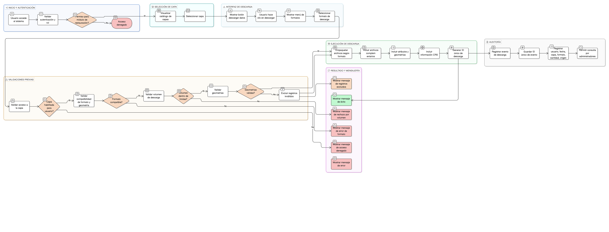

# HU-IDEAM-SNIF-REST-129

> **Identificador Historia de Usuario:** hu-ideam-snif-rest-129\
> **Nombre Historia de Usuario:** Descargar capas desde el catálogo

> **Sistema de información:** Sistema Nacional de Información Forestal\
> **Módulo / subsistema:** Módulo de restauración – SNIF (SIG)\
> **Validador temático(s):** Raymond Alexander Jiménez Arteaga

## DESCRIPCIÓN HISTORIA DE USUARIO

> **Como:** usuario autorizado del módulo de restauración.\
> **Quiero:** descargar una capa geográfica desde el catálogo.\
> **Para:** utilizar sus datos en herramientas SIG externas.

## CRITERIOS DE ACEPTACIÓN

1. **Formato permitido**  
   1.1 El sistema permite la descarga en formatos geoespaciales estándar:  
   - Shapefile (.shp).  
   - GeoJSON (.geojson).  
   - KML (.kml).  
   - GeoPackage (.gpkg).  
   1.2 El formato se selecciona mediante un menú desplegable claro en la interfaz.  
   1.3 La descarga incluye todos los archivos complementarios requeridos por el formato (ej. .shx, .dbf, .prj para Shapefile).

2. **Volumen máximo**  
   2.1 El sistema valida que la capa no exceda el límite máximo de descarga establecido (ej. 10.000 registros o 10 MB).  
   2.2 Si se supera el límite, se muestra un mensaje claro indicando el motivo del rechazo.  
   2.3 No se permite la descarga parcial o fragmentada de capas que excedan el límite.

3. **Geometrías válidas**  
   3.1 El sistema valida que las geometrías sean válidas antes de la descarga.  
   3.2 Se excluyen automáticamente registros con geometrías vacías o nulas.  
   3.3 El sistema informa al usuario si algún registro fue excluido por geometría inválida.

4. **Integridad referencial**  
   4.1 La descarga corresponde exactamente a la capa seleccionada en el catálogo.  
   4.2 Todos los atributos y geometrías de la capa se incluyen en la descarga.  
   4.3 La información de sistema de referencia espacial (CRS) se incluye obligatoriamente en todos los archivos.

5. **Control por roles**  
   5.1 El sistema valida el rol del usuario antes de habilitar la descarga.  
   5.2 Solo se permite descargar capas habilitadas para el rol del usuario.  
   5.3 Usuarios sin permisos no visualizan la opción de descarga.  
   5.4 Los intentos de descarga no autorizados son rechazados con código de error apropiado (403 Forbidden).

6. **UX esperado**  
   6.1 El botón "Descargar datos" se muestra visible en el detalle de la capa.  
   6.2 Al hacer clic, se despliega un modal o menú con las opciones de formato.  
   6.3 El sistema muestra mensajes claros de:  
   - Éxito de descarga.  
   - Error en descarga.  
   - Exceso de límites.  
   6.4 El proceso es sencillo, predecible y coherente.

7. **Auditoría**  
   7.1 Toda descarga se registra obligatoriamente en REGISTROS DEL SISTEMA, incluyendo:  
   - Usuario.  
   - Fecha y hora.  
   - Capa descargada.  
   - Origen de la descarga: "catálogo".  
   - Formato de salida seleccionado.  
   - Cantidad de registros exportados.  
   7.2 Los registros son consultables por administradores.

8. **Unicidad**  
   8.1 Cada evento de descarga cuenta con un identificador único de transacción (ID único del evento de descarga).  
   8.2 El identificador se almacena en los registros del sistema para trazabilidad.

## ROLES

| Rol | Alcance |
|-----|---------|
| **Administrador IDEAM** | Puede descargar capas geográficas |
| **Registrador** | Puede descargar capas geográficas |
| **Consulta** | Puede descargar capas geográficas |

## RESTRICCIONES Y LÍMITES

- Límite máximo de descarga: 10.000 registros o 10 MB (el que se alcance primero).
- Solo se permite descargar capas completas, no fragmentos.
- Los formatos de salida están limitados a los estándar geoespaciales definidos.
- La reproyección se realiza obligatoriamente a EPSG:4326.
- No se permite modificar los datos durante la descarga.
- El proceso de descarga no debe comprometer el desempeño del sistema.
- Las descargas simultáneas por usuario están sujetas a límites de concurrencia.

## VALIDACIONES FUNCIONALES

**Validación de formato:**
- Verificar compatibilidad entre formato de salida y tipo de geometría.
- Truncar automáticamente nombres de campo para Shapefile (máx. 10 caracteres).
- Incluir metadatos obligatorios según formato.

**Validación de geometría:**
- Verificar geometrías válidas según estándar OGC.
- Excluir registros con geometrías vacías o nulas.
- Informar registros excluidos al usuario.

**Validación de volumen:**
- Verificar límites antes de iniciar descarga.
- Rechazar descarga si se exceden límites.
- Proporcionar mensaje informativo con el motivo del rechazo.

## VALIDACIONES DE NEGOCIO

**Control de permisos:**
- Validar rol del usuario antes de mostrar opción de descarga.
- Validar acceso a la capa específica según perfil.
- Registrar intentos de acceso no autorizado.

**Integridad de datos:**
- Verificar que la capa seleccionada existe y está disponible.
- Garantizar que los datos descargados corresponden exactamente a la capa del catálogo.
- Incluir información completa de CRS en todos los archivos.

**Auditoría:**
- Registrar obligatoriamente cada evento de descarga.
- Incluir información completa de trazabilidad.
- Garantizar persistencia de registros de auditoría.

## DIAGRAMA DE FLUJO DEL PROCESO

