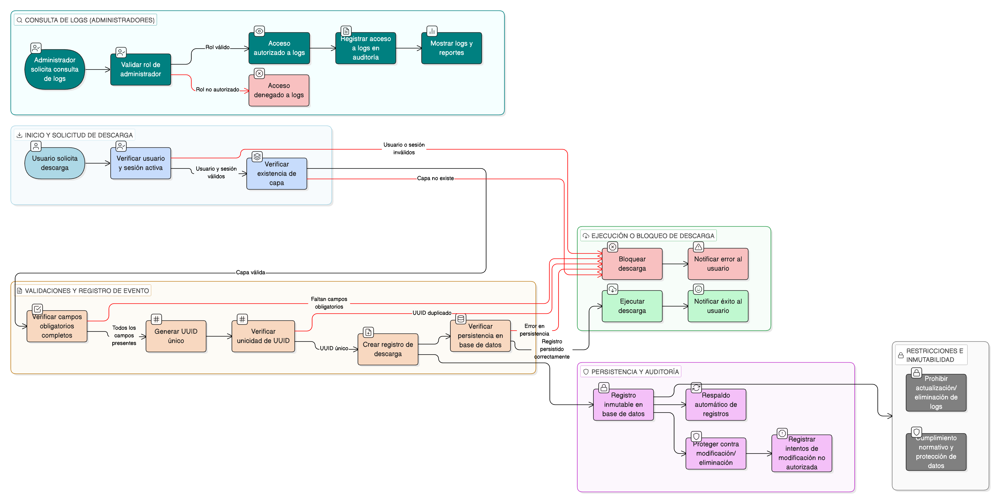

# HU-IDEAM-SNIF-REST-133

> **Identificador Historia de Usuario:** hu-ideam-snif-rest-133\
> **Nombre Historia de Usuario:** Registrar descargas para auditoría

> **Sistema de información:** Sistema Nacional de Información Forestal\
> **Módulo / subsistema:** Módulo de restauración – SNIF (SIG)\
> **Validador temático(s):** Raymond Alexander Jiménez Arteaga

## DESCRIPCIÓN HISTORIA DE USUARIO

> **Como:** sistema.\
> **Quiero:** que todas las descargas queden registradas.\
> **Para:** asegurar trazabilidad y control del uso de la información.

## CRITERIOS DE ACEPTACIÓN

1. **Obligatoriedad del registro**  
   1.1 Toda descarga ejecutada en el sistema se registra obligatoriamente en REGISTROS DEL SISTEMA.  
   1.2 No se permite completar una descarga sin su correspondiente registro.  
   1.3 El registro se crea inmediatamente antes de iniciar la descarga y se actualiza al completarse o fallar.  
   1.4 Si falla el registro, la descarga no se ejecuta.

2. **Campos obligatorios del log**  
   2.1 Cada registro de descarga incluye obligatoriamente:  
   - **ID único de transacción:** Identificador único del evento de descarga (UUID).  
   - **Usuario:** Identificación completa del usuario que ejecutó la descarga.  
   - **Fecha y hora:** Timestamp exacto de inicio y finalización de la descarga.  
   - **Capa descargada:** Identificador y nombre de la capa o dataset descargado.  
   - **Origen de la descarga:** Contexto desde donde se inició (catálogo, consulta atributiva, consulta espacial, visor).  
   - **Tipo de consulta:** Especificación del tipo de consulta asociada (si aplica).  
   - **Criterios aplicados:** Filtros atributivos, criterios espaciales o contexto de selección.  
   - **Formato de salida:** Formato seleccionado para la descarga (Shapefile, GeoJSON, KML, GeoPackage).  
   - **Cantidad de registros:** Número exacto de registros exportados.  
   - **Tamaño del archivo:** Tamaño en bytes del archivo generado.  
   - **Estado de la operación:** Éxito, error, cancelado.  
   - **CRS origen y CRS destino:** Sistemas de referencia espacial involucrados.  
   - **Dirección IP:** IP desde la cual se realizó la solicitud.  
   - **Rol del usuario:** Perfil con el que se ejecutó la descarga (Administrador, Registrador, Consulta).  
   2.2 Ningún campo obligatorio puede quedar vacío o nulo.

3. **Integridad referencial log–usuario–capa**  
   3.1 El registro está vinculado de forma referencial con:  
   - La tabla de usuarios (usuario que ejecutó la descarga).  
   - El catálogo de capas (capa descargada).  
   - La sesión activa del usuario.  
   3.2 Las relaciones son consistentes y verificables.  
   3.3 No se permiten registros huérfanos (sin usuario o capa válida).

4. **Control por roles – acceso a logs**  
   4.1 Solo usuarios con rol "Administrador IDEAM" pueden acceder a los registros de descarga.  
   4.2 Los usuarios "Registrador" y "Consulta" no tienen visibilidad de los logs.  
   4.3 Los logs son consultables mediante una interfaz de administración dedicada.  
   4.4 El acceso a logs también queda registrado en auditoría.

5. **Transparencia para el usuario final**  
   5.1 El proceso de registro es completamente transparente para el usuario final.  
   5.2 El usuario no percibe demora ni interacción adicional por el registro.  
   5.3 El registro no interrumpe ni afecta la experiencia de descarga.  
   5.4 El usuario solo es informado en caso de error en el registro que impida la descarga.

6. **Auditoría como eje central**  
   6.1 El registro de descargas es el mecanismo principal de auditoría de uso de información geográfica.  
   6.2 Los registros permiten:  
   - Trazabilidad completa de cada descarga.  
   - Análisis de patrones de uso por usuario, capa, formato, origen.  
   - Detección de comportamientos anómalos o excesivos.  
   - Cumplimiento de políticas institucionales y normativas.  
   6.3 Los registros son inmutables: no se permite modificar ni eliminar registros de auditoría.

7. **Persistencia y disponibilidad**  
   7.1 Los registros de descarga se almacenan de forma persistente en la base de datos del sistema.  
   7.2 Los registros están disponibles para consulta por tiempo indefinido.  
   7.3 Se implementa respaldo automático periódico de los registros de auditoría.  
   7.4 Los registros cuentan con mecanismos de protección contra pérdida o corrupción.

8. **Unicidad del registro**  
   8.1 Cada evento de descarga tiene un identificador único de transacción (UUID v4 o superior).  
   8.2 No existen dos registros con el mismo identificador único.  
   8.3 El identificador se genera al momento de iniciar la descarga y permanece asociado a todo el ciclo de vida del evento.  
   8.4 El identificador único permite rastrear y correlacionar el evento completo de descarga.

## ROLES

| Rol | Alcance |
|-----|---------|
| **Sistema** | Ejecuta el registro automático de todas las descargas |
| **Administrador IDEAM** | Puede consultar y analizar los registros de descarga |

## RESTRICCIONES Y LÍMITES

- Los registros de auditoría son inmutables: no se permite modificación ni eliminación.
- Solo usuarios con rol "Administrador IDEAM" pueden acceder a los logs.
- El registro es obligatorio para todas las descargas, sin excepciones.
- Si falla el registro, la descarga no se ejecuta.
- Los registros se conservan indefinidamente para cumplimiento normativo.
- El acceso a logs también queda registrado en auditoría.
- Los registros deben cumplir con normativas de protección de datos personales.

## VALIDACIONES FUNCIONALES

**Validación de obligatoriedad:**
- Verificar que todos los campos obligatorios estén presentes antes de crear el registro.
- Rechazar la creación de registros incompletos.
- Impedir la descarga si no se puede crear el registro.

**Validación de integridad referencial:**
- Verificar que el usuario existe y está activo.
- Verificar que la capa existe en el catálogo.
- Verificar que la sesión es válida y activa.
- Validar relaciones de clave foránea con otras tablas.

**Validación de unicidad:**
- Generar identificador único (UUID) para cada registro.
- Verificar que el UUID generado no exista previamente.
- Garantizar unicidad a nivel de base de datos (constraint unique).

**Validación de formato:**
- Verificar formato correcto de timestamp (ISO 8601).
- Validar formato de dirección IP (IPv4 o IPv6).
- Verificar que valores numéricos (cantidad registros, tamaño archivo) sean positivos.
- Validar que valores enum (estado, formato, origen) sean válidos.

**Validación de persistencia:**
- Verificar que el registro se almacene correctamente en la base de datos.
- Confirmar commit de transacción exitoso.
- Validar disponibilidad del registro para consulta inmediatamente después de su creación.

## VALIDACIONES DE NEGOCIO

**Control de acceso:**
- Validar rol del usuario antes de permitir acceso a logs.
- Registrar cada acceso a logs en auditoría secundaria.
- Implementar autenticación y autorización robustas para acceso a logs.

**Trazabilidad completa:**
- Garantizar que cada descarga tenga su registro correspondiente.
- Vincular registro con sesión y contexto completo del usuario.
- Permitir rastreo end-to-end del evento de descarga.
- Correlacionar registros con eventos del sistema relacionados.

**Inmutabilidad:**
- Implementar controles que impidan modificación de registros existentes.
- Prohibir eliminación de registros de auditoría.
- Proteger tabla de logs contra operaciones UPDATE y DELETE no autorizadas.
- Registrar cualquier intento de modificación no autorizada.

**Análisis y reportes:**
- Permitir consultas y filtros sobre registros de descarga.
- Habilitar generación de reportes estadísticos de uso.
- Facilitar detección de patrones anómalos o excesivos.
- Soportar análisis de cumplimiento de políticas institucionales.

**Cumplimiento normativo:**
- Asegurar que los registros cumplan con normativas de protección de datos.
- Incluir solo información necesaria para auditoría.
- Implementar controles de acceso estrictos a información sensible.
- Garantizar respaldo y recuperación de registros de auditoría.

**Transparencia operativa:**
- Garantizar que el registro no afecte la experiencia del usuario.
- Ejecutar registro de forma asíncrona si es necesario para no impactar desempeño.
- Informar al usuario solo en caso de error que impida la descarga.
- Mantener proceso de registro invisible y automático.

**CRUD específico:**
- **Create (C):** Registro obligatorio de cada evento de descarga.
- **Read (R):** Consulta de logs exclusivamente por administradores.
- No aplica Update ni Delete (inmutabilidad de logs).

## DIAGRAMA DE FLUJO DEL PROCESO

