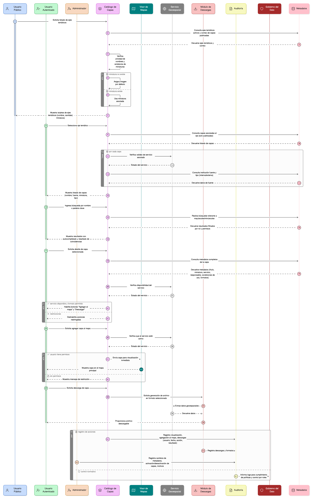

# Épica 011: Gestión y Consulta del Catálogo de Capas Geográficas

## 1. Descripción general

Esta épica define las funcionalidades de gestión y consulta del Catálogo de capas geográficas del módulo de restauración del Sistema Nacional de Información Forestal (SNIF). El catálogo constituye el punto central de descubrimiento de información geográfica del sistema, organizado por ejes temáticos.

El catálogo permite a los usuarios explorar, buscar, visualizar, agregar al mapa y descargar información geoespacial, garantizando claridad, trazabilidad, control por roles y cumplimiento de las políticas de uso de datos del IDEAM y entidades asociadas.

El Catálogo actúa como puente entre metadatos, servicios geoespaciales, visor de mapas, módulo de descargas, y auditoría y gobierno del dato, asegurando consistencia entre todos estos componentes.

---

## 2. Objetivo

Facilitar el **descubrimiento, comprensión y acceso a las capas geográficas disponibles** en el módulo de restauración del SNIF, garantizando:

- Descubrimiento intuitivo de capas por ejes temáticos.
- Búsqueda eficiente por nombre, palabras clave o institución.
- Consistencia entre metadatos, servicios y visualización.
- Integración fluida con el visor geográfico.
- Descargas controladas y trazables desde el catálogo.
- Control de acceso por roles y permisos.
- Cumplimiento normativo y políticas institucionales.
- Experiencia de usuario intuitiva y eficiente.

---

## 3. Historias de usuario asociadas

- [**HU-IDEAM-SNIF-REST-134:** Visualizar ejes temáticos del catálogo](/historias_usuario/EP-IDEAM-SNIF-REST-011/HU-IDEAM-SNIF-REST-134.md)
- [**HU-IDEAM-SNIF-REST-135:** Explorar capas por eje temático](/historias_usuario/EP-IDEAM-SNIF-REST-011/HU-IDEAM-SNIF-REST-135.md)
- [**HU-IDEAM-SNIF-REST-136:** Buscar capas en el catálogo](/historias_usuario/EP-IDEAM-SNIF-REST-011/HU-IDEAM-SNIF-REST-136.md)
- [**HU-IDEAM-SNIF-REST-137:** Visualizar detalle de una capa](/historias_usuario/EP-IDEAM-SNIF-REST-011/HU-IDEAM-SNIF-REST-137.md)
- [**HU-IDEAM-SNIF-REST-138:** Agregar capa al mapa](/historias_usuario/EP-IDEAM-SNIF-REST-011/HU-IDEAM-SNIF-REST-138.md)

---

## 4. Riesgos

- Inconsistencias entre metadatos del catálogo y servicios geoespaciales reales.
- Servicios no disponibles o con latencia alta al agregar capas al mapa.
- Ejes temáticos sin capas activas visibles para usuarios.
- Resultados de búsqueda sin coincidencias o con coincidencias irrelevantes.
- Falta de información clara sobre condiciones de uso y restricciones de capas.
- Acceso no autorizado a capas restringidas.
- Capas agregadas al mapa que no se visualizan correctamente.
- Falta de trazabilidad sobre qué capas son más consultadas o utilizadas.

---

## 5. Alcance funcional

### Navegación por ejes temáticos
- Visualización de ejes temáticos agrupados
- Información por eje: nombre, cantidad de capas, miniatura representativa
- Solo ejes activos con al menos una capa publicada
- Vista tipo tarjetas clicables

### Exploración de capas
- Listado detallado de capas por eje temático
- Información por capa: nombre, institución fuente, indicador de fuente (interna/externa), miniatura
- Ordenamiento: por nombre, institución, tipo de fuente
- Indicadores visuales claros (iconos para tipo de fuente)

### Búsqueda de capas
- Campo de búsqueda global visible desde cualquier vista
- Búsqueda por: nombre de capa, palabras clave (tags), institución
- Búsqueda tolerante a mayúsculas/minúsculas
- Autocompletado y resultados inmediatos
- Resaltado de coincidencias en resultados

### Detalle de capa
- Panel completo con: título, miniatura, servicio asociado, responsable, entidad, tipo de servicio, condiciones de uso
- Botón "Agregar al mapa" (habilitado si servicio disponible)
- Selector de formato de descarga (si aplica)
- Botón de descarga (habilitado según permisos)

### Integración con visor
- Agregar capa directamente al visor desde catálogo
- Transición fluida al visor con capa cargada
- Ajuste automático de vista al extent de la capa
- Sincronización entre catálogo y control de capas del visor

---

## 6. Control por roles

| Rol | Alcance en catálogo |
|-----|---------------------|
| **Usuario público / autenticado** | Consulta básica, visualización, descarga según capa |
| **Registrador** | Todo lo anterior + acceso a capas adicionales según permisos |
| **Administrador IDEAM** | Acceso completo + gestión de ejes, capas, metadatos y configuración |

**Gestión administrativa (solo Administradores):**
- Creación, edición y desactivación de ejes temáticos
- Edición de metadatos de capas
- Asignación de capas a ejes
- Gestión de palabras clave (tags)
- Configuración de condiciones de uso
- Publicación y despublicación de capas

---

## 7. Integridad referencial

El catálogo mantiene integridad entre múltiples componentes:

**Eje temático ↔ Capas (1:N)**
- Un eje puede tener múltiples capas
- Una capa pertenece a un eje temático
- Si se inactiva un eje, sus capas no se muestran en catálogo público

**Capa ↔ Servicio geoespacial (1:1 o 1:N)**
- Toda capa tiene al menos un servicio asociado
- El servicio debe estar activo y disponible

**Capa ↔ Institución responsable (N:1)**
- Toda capa tiene institución asignada
- Capas internas tienen responsable IDEAM definido
- Capas externas tienen entidad fuente explícita

**Capa ↔ Condiciones de uso (1:1)**
- Toda capa tiene condiciones de uso definidas
- Las condiciones determinan permisos de visualización y descarga

**Capas ↔ Palabras clave (N:M)**
- Una capa puede tener múltiples palabras clave
- Una palabra clave puede estar asociada a múltiples capas
- Las palabras clave están normalizadas y controladas

**Catálogo ↔ Visor ↔ Servicio**
- La capa agregada en visor corresponde a la seleccionada en catálogo
- El visor conecta con el servicio correcto asociado a la capa
- Los metadatos mostrados corresponden al servicio y capa correctos

---

## 8. Auditoría y trazabilidad

### Gestión de ejes y capas (solo administradores)
- Creación, edición o desactivación de ejes temáticos
- Cambios en metadatos de capas
- Publicación y despublicación de capas
- Modificación de condiciones de uso

Registro incluye: usuario, fecha/hora, tipo de acción, motivo, estado anterior y nuevo

### Uso del catálogo (todos los usuarios)
- Visualizaciones del detalle de capas
- Agregaciones de capas al mapa (con contexto de sesión)
- Descargas desde el catálogo
- Búsquedas realizadas (opcional: estadísticas de términos más buscados)

Registro permite análisis de:
- Capas más consultadas
- Capas más agregadas al mapa
- Capas más descargadas
- Patrones de uso por usuario

---

## 9. Unicidad

**A nivel de sistema:**
- **Nombre del eje temático:** Único en todo el sistema
- **Identificador interno de la capa:** Único en todo el sistema
- **Nombre de servicio asociado por capa:** Único por capa

**A nivel de eje temático:**
- **Nombre de capa:** Único dentro del mismo eje temático

---

## 10. Validaciones funcionales transversales

**Validación de estado activo:**
- Solo mostrar ejes activos con al menos una capa publicada
- Solo mostrar capas activas y publicadas
- Validar estado en tiempo real

**Validación de servicio:**
- Verificar que la capa tenga servicio geoespacial válido asociado
- Ejecutar health check antes de habilitar "Agregar al mapa"
- Validar disponibilidad del servicio

**Validación de búsqueda:**
- Normalizar entrada del usuario
- Aplicar búsqueda case-insensitive
- Buscar en múltiples campos (nombre, tags, institución)
- Filtrar resultados según permisos del usuario

**Validación de unicidad:**
- Verificar unicidad de nombres según nivel (sistema, eje)
- Rechazar duplicados con mensaje claro

---

## 11. Validaciones de negocio transversales

**Regla de existencia de capas:**
- Un eje sin capas activas no se muestra en catálogo público
- Aplicar esta regla en tiempo real

**Regla de fuentes:**
- Capas externas deben indicar entidad fuente explícita
- Capas internas deben tener responsable IDEAM definido

**Obligatoriedad de condiciones de uso:**
- Toda capa debe tener condiciones de uso definidas
- No se permite publicar capas sin condiciones de uso

**Control de permisos:**
- Validar rol antes de mostrar opciones (agregar al mapa, descargar)
- Aplicar restricciones según perfil
- Registrar intentos de acceso no autorizado

**Integridad catálogo–visor–servicio:**
- Garantizar correspondencia exacta entre componentes
- Validar consistencia de relaciones antes de operaciones

---

## 12. UX esperado

**Navegación:**
- Vista tipo tarjetas para ejes temáticos
- Miniaturas clicables y representativas
- Información clara y resumida

**Listados:**
- Ordenables y escaneables rápidamente
- Indicadores visuales para tipo de fuente (iconos)
- Separación visual clara entre elementos

**Búsqueda:**
- Campo visible y accesible
- Autocompletado con sugerencias
- Resultados inmediatos
- Coincidencias resaltadas

**Detalle:**
- Panel lateral o modal con información jerarquizada
- Acciones claras y visibles (agregar al mapa, descargar)
- Condiciones de uso accesibles

**Mensajes:**
- Confirmación de acciones exitosas
- Errores descriptivos con sugerencias
- Advertencias sobre restricciones o limitaciones

---

## 13. Diagrama de secuencia

---

## 14. Wireframes / mockups

_Pendiente de generación_
