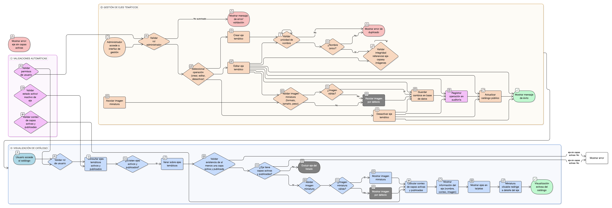

# HU-IDEAM-SNIF-REST-134

> **Identificador Historia de Usuario:** hu-ideam-snif-rest-134\
> **Nombre Historia de Usuario:** Visualizar ejes temáticos del catálogo

> **Sistema de información:** Sistema Nacional de Información Forestal\
> **Módulo / subsistema:** Módulo de restauración – SNIF (SIG)\
> **Validador temático(s):** Raymond Alexander Jiménez Arteaga

## DESCRIPCIÓN HISTORIA DE USUARIO

> **Como:** usuario del sistema.\
> **Quiero:** visualizar los ejes temáticos disponibles en el catálogo.\
> **Para:** entender rápidamente qué tipos de información geográfica están disponibles.

## CRITERIOS DE ACEPTACIÓN

1. **Listado de ejes temáticos agrupados**  
   1.1 El sistema muestra un listado completo de ejes temáticos organizados y agrupados.  
   1.2 Los ejes se presentan en orden lógico o alfabético configurable.  
   1.3 La visualización es clara y permite escanear rápidamente todos los ejes disponibles.  
   1.4 Solo se muestran ejes temáticos activos y publicados.

2. **Información por eje temático**  
   2.1 Cada eje temático muestra obligatoriamente:  
   - **Nombre del eje:** Título descriptivo y claro.  
   - **Cantidad de capas asociadas:** Conteo de capas activas y publicadas.  
   - **Imagen miniatura o mapa representativo:** Visual de referencia del contenido del eje.  
   2.2 La información se presenta de forma consistente para todos los ejes.  
   2.3 El conteo de capas se actualiza automáticamente según el estado de las capas.

3. **Visualización de capas activas**  
   3.1 Solo se muestran ejes temáticos que estén marcados como activos en el sistema.  
   3.2 Los ejes inactivos no son visibles para ningún usuario, incluidos administradores en la vista pública.  
   3.3 El estado activo/inactivo se valida en tiempo real al cargar el catálogo.

4. **Conteo de capas publicadas**  
   4.1 El conteo de capas asociadas considera únicamente capas publicadas y activas.  
   4.2 No se incluyen en el conteo:  
   - Capas en borrador.  
   - Capas inactivas.  
   - Capas con servicios no disponibles.  
   4.3 El conteo es exacto y refleja el número real de capas disponibles para el usuario.

5. **Existencia de al menos una capa activa**  
   5.1 Un eje temático no puede estar visible si no tiene al menos una capa asociada activa y publicada.  
   5.2 Si todas las capas de un eje se inactivan, el eje desaparece automáticamente del catálogo público.  
   5.3 El sistema valida esta regla antes de mostrar el listado de ejes.

6. **Gestión de imágenes miniatura**  
   6.1 Cada eje temático debe tener una imagen miniatura asociada.  
   6.2 Si la imagen no existe o no se puede cargar, se muestra una imagen por defecto institucional.  
   6.3 Las imágenes miniatura deben ser representativas del contenido del eje.  
   6.4 Las imágenes tienen dimensiones estandarizadas para consistencia visual.

7. **UX esperado**  
   7.1 Los ejes se presentan en vista tipo tarjetas (card layout).  
   7.2 Las miniaturas son clicables y redirigen al detalle del eje (listado de capas).  
   7.3 La información es clara, resumida y escaneable rápidamente.  
   7.4 El diseño es responsive y se adapta a diferentes tamaños de pantalla.  
   7.5 Se incluyen indicadores visuales claros de interactividad (hover, cursor pointer).

8. **Auditoría y trazabilidad**  
   8.1 Toda creación, edición o desactivación de ejes temáticos se registra en auditoría.  
   8.2 El registro incluye:  
   - Usuario que realizó la acción.  
   - Fecha y hora exacta.  
   - Tipo de acción (creación, edición, activación, desactivación).  
   - Motivo del cambio (si aplica).  
   - Estado anterior y estado nuevo.  
   8.3 Los registros son consultables por administradores.  
   8.4 El nombre del eje temático debe ser único en todo el sistema.

## ROLES

| Rol | Alcance |
|-----|---------|
| **Usuario público / autenticado** | Solo lectura del catálogo de ejes temáticos |
| **Administrador IDEAM** | Gestión completa (CRUD) desde interfaz de administración |

## RESTRICCIONES Y LÍMITES

- Los ejes temáticos tienen nombres únicos en todo el sistema.
- Un eje sin capas activas no se muestra en el catálogo público.
- Las imágenes miniatura deben cumplir con dimensiones y peso máximo definidos (ej. 500x300px, máx. 200KB).
- Solo administradores pueden crear, editar o desactivar ejes temáticos.
- La gestión de ejes se realiza desde una interfaz de administración separada.
- Los cambios en ejes se reflejan inmediatamente en el catálogo público.
- No se permite eliminar físicamente ejes, solo desactivarlos.

## VALIDACIONES FUNCIONALES

**Validación de estado activo:**
- Verificar que el eje esté marcado como activo antes de mostrarlo.
- Excluir automáticamente ejes inactivos del listado.
- Validar estado en tiempo real al cargar el catálogo.

**Validación de conteo de capas:**
- Contar únicamente capas publicadas y activas.
- Excluir capas en borrador, inactivas o con servicios no disponibles.
- Actualizar conteo dinámicamente según cambios en el estado de capas.
- Mostrar conteo exacto en la tarjeta del eje.

**Validación de imagen miniatura:**
- Verificar existencia del archivo de imagen.
- Validar formato de imagen (PNG, JPG, SVG).
- Aplicar imagen por defecto si no existe o falla la carga.
- Verificar dimensiones y peso de imagen dentro de límites permitidos.

**Validación de unicidad:**
- Verificar que el nombre del eje sea único antes de crearlo.
- Validar unicidad considerando variaciones de mayúsculas/minúsculas.
- Rechazar duplicados con mensaje claro.

## VALIDACIONES DE NEGOCIO

**Regla de existencia de capas:**
- Validar que el eje tenga al menos una capa activa antes de mostrarlo.
- Ocultar automáticamente ejes sin capas activas.
- Aplicar esta regla en tiempo real al cargar el catálogo.

**Integridad referencial:**
- Relación Eje temático ↔ Capas (1:N).
- Validar que la relación esté correctamente establecida en base de datos.
- Garantizar consistencia entre eje y sus capas asociadas.
- Si se inactiva un eje, sus capas no se muestran en el catálogo público.

**Control por roles:**
- Usuarios públicos y autenticados: solo visualización (READ).
- Administradores: gestión completa (CRUD) desde interfaz separada.
- Validar permisos antes de permitir cualquier operación de gestión.

**Auditoría obligatoria:**
- Registrar toda operación de creación, edición o desactivación.
- Incluir usuario, fecha, hora, tipo de acción y motivo.
- Garantizar persistencia e inmutabilidad de registros de auditoría.
- Permitir trazabilidad completa de cambios en ejes temáticos.

**CRUD específico:**
- **Read:** Consulta de ejes temáticos y conteo de capas (todos los usuarios).
- **Create / Update / Delete:** Solo para rol Administrador desde interfaz de administración separada.

## DIAGRAMA DE FLUJO DEL PROCESO

