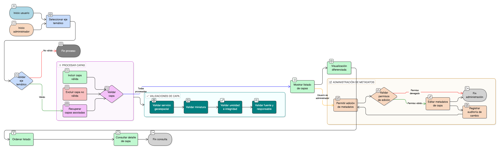

# HU-IDEAM-SNIF-REST-135

> **Identificador Historia de Usuario:** hu-ideam-snif-rest-135\
> **Nombre Historia de Usuario:** Explorar capas por eje temático

> **Sistema de información:** Sistema Nacional de Información Forestal\
> **Módulo / subsistema:** Módulo de restauración – SNIF (SIG)\
> **Validador temático(s):** Raymond Alexander Jiménez Arteaga

## DESCRIPCIÓN HISTORIA DE USUARIO

> **Como:** usuario.\
> **Quiero:** seleccionar un eje temático.\
> **Para:** visualizar el listado detallado de capas asociadas.

## CRITERIOS DE ACEPTACIÓN

1. **Visualización de capas por eje**  
   1.1 Al seleccionar un eje temático, el sistema despliega el listado completo de capas asociadas.  
   1.2 El listado se muestra en un formato claro y organizado.  
   1.3 La transición desde el eje hacia las capas es fluida y sin demora perceptible.  
   1.4 Se mantiene el contexto visual del eje seleccionado.

2. **Información detallada por capa**  
   2.1 Cada capa en el listado muestra obligatoriamente:  
   - **Nombre:** Título descriptivo y completo de la capa.  
   - **Institución fuente:** Organización responsable de los datos.  
   - **Indicador de fuente:** Identificación visual de si es fuente interna (IDEAM) o externa.  
   - **Miniatura de referencia:** Imagen representativa de la capa o vista previa del mapa.  
   2.2 La información se presenta de forma consistente para todas las capas.  
   2.3 Los indicadores visuales (iconos, etiquetas) son claros y diferenciables.

3. **Validación de servicio geoespacial**  
   3.1 Solo se muestran capas que tengan un servicio geoespacial válido asociado.  
   3.2 El sistema valida que el servicio esté:  
   - Correctamente configurado.  
   - Disponible y respondiendo.  
   - Asociado correctamente a la capa.  
   3.3 Capas sin servicio válido no aparecen en el listado.

4. **Validación de miniaturas**  
   4.1 Las miniaturas deben corresponder exactamente a la capa que representan.  
   4.2 No se permite mostrar miniaturas genéricas o de otras capas.  
   4.3 Si la miniatura no existe o no se puede cargar, se muestra una imagen por defecto identificable.  
   4.4 Las miniaturas tienen dimensiones estandarizadas para consistencia visual.

5. **Diferenciación de fuentes**  
   5.1 Las capas externas deben indicar explícitamente su entidad fuente (nombre completo de la organización).  
   5.2 Las capas internas (IDEAM) deben tener responsable interno definido e identificable.  
   5.3 El sistema valida que toda capa tenga:  
   - Institución fuente asignada.  
   - Indicador de tipo (interna/externa).  
   - Responsable definido según tipo de fuente.

6. **Integridad referencial**  
   6.1 Se garantiza la integridad entre:  
   - **Capa ↔ Servicio geoespacial:** Toda capa tiene un servicio válido asociado.  
   - **Capa ↔ Institución responsable:** Toda capa tiene institución asignada.  
   6.2 Las relaciones son consistentes y verificables en base de datos.  
   6.3 No se permiten capas huérfanas (sin servicio o institución).

7. **UX esperado**  
   7.1 El listado es ordenable por:  
   - Nombre (A-Z, Z-A).  
   - Institución.  
   - Tipo de fuente (interna/externa).  
   7.2 El listado es escaneable rápidamente con separación visual clara entre capas.  
   7.3 Se incluyen indicadores visuales (iconos) para tipo de fuente:  
   - Icono distintivo para capas internas (IDEAM).  
   - Icono distintivo para capas externas.  
   7.4 El diseño es responsive y se adapta a diferentes tamaños de pantalla.  
   7.5 Cada capa es clicable para acceder al detalle completo.

8. **Auditoría**  
   8.1 Todos los cambios en metadatos de capas quedan registrados obligatoriamente.  
   8.2 El registro incluye:  
   - Usuario que realizó el cambio.  
   - Fecha y hora exacta.  
   - Campo modificado.  
   - Valor anterior y valor nuevo.  
   - Motivo del cambio (si aplica).  
   8.3 Solo administradores pueden modificar metadatos de capas.  
   8.4 Los registros son consultables y auditables.

## ROLES

| Rol | Alcance |
|-----|---------|
| **Usuario (público/autenticado)** | Solo consulta del listado de capas |
| **Administrador IDEAM** | Edición de metadatos de capas desde interfaz de administración |

## RESTRICCIONES Y LÍMITES

- Solo se muestran capas con servicio geoespacial válido y disponible.
- El identificador interno de la capa debe ser único en todo el sistema.
- El nombre de la capa debe ser único dentro del mismo eje temático.
- Las miniaturas deben cumplir con dimensiones y peso máximo definidos.
- Solo administradores pueden editar metadatos de capas.
- Los cambios en metadatos se reflejan inmediatamente en el catálogo.
- No se permite eliminar físicamente capas, solo desactivarlas.

## VALIDACIONES FUNCIONALES

**Validación de servicio geoespacial:**
- Verificar que la capa tenga servicio asociado.
- Validar que el servicio esté activo y disponible.
- Verificar conectividad y respuesta del servicio.
- Excluir capas con servicios no válidos o no disponibles.

**Validación de miniaturas:**
- Verificar que la miniatura corresponda a la capa correcta.
- Validar existencia del archivo de imagen.
- Aplicar imagen por defecto si no existe o falla la carga.
- Verificar dimensiones y formato de imagen.

**Validación de ordenamiento:**
- Implementar ordenamiento funcional por nombre (alfabético).
- Implementar ordenamiento por institución.
- Implementar ordenamiento por tipo de fuente.
- Mantener orden consistente durante la sesión.

**Validación de unicidad:**
- Verificar que el identificador interno sea único en el sistema.
- Verificar que el nombre sea único dentro del mismo eje temático.
- Rechazar duplicados con mensaje claro.

## VALIDACIONES DE NEGOCIO

**Regla de fuentes:**
- Validar que toda capa externa tenga entidad fuente explícita.
- Validar que toda capa interna tenga responsable IDEAM definido.
- Rechazar capas sin institución o responsable asignado.
- Garantizar claridad en la identificación de fuentes.

**Integridad referencial:**
- **Capa ↔ Servicio geoespacial:** Relación obligatoria 1:1 o 1:N.
- **Capa ↔ Institución responsable:** Relación obligatoria N:1.
- Validar consistencia de relaciones en base de datos.
- Impedir capas huérfanas sin relaciones válidas.

**Control por roles:**
- Usuarios: solo consulta (READ).
- Administradores: edición de metadatos (UPDATE) desde interfaz separada.
- Validar permisos antes de permitir modificaciones.
- Registrar intentos de acceso no autorizado.

**Auditoría obligatoria:**
- Registrar toda modificación de metadatos de capas.
- Incluir usuario, fecha, hora, campo modificado y valores (anterior/nuevo).
- Garantizar trazabilidad completa de cambios.
- Permitir consulta de historial de cambios por administradores.

**CRUD específico:**
- **Read:** Consulta de listado de capas (todos los usuarios).
- **Update:** Edición de metadatos solo por Administrador desde interfaz de administración.

## DIAGRAMA DE FLUJO DEL PROCESO

