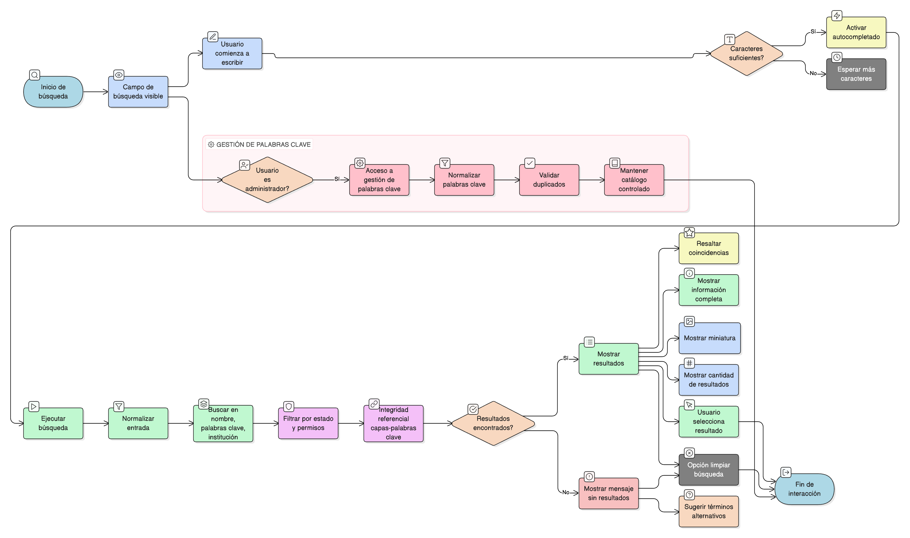

# HU-IDEAM-SNIF-REST-136

> **Identificador Historia de Usuario:** hu-ideam-snif-rest-136\
> **Nombre Historia de Usuario:** Buscar capas en el catálogo

> **Sistema de información:** Sistema Nacional de Información Forestal\
> **Módulo / subsistema:** Módulo de restauración – SNIF (SIG)\
> **Validador temático(s):** Raymond Alexander Jiménez Arteaga

## DESCRIPCIÓN HISTORIA DE USUARIO

> **Como:** usuario.\
> **Quiero:** buscar capas por nombre o palabras clave.\
> **Para:** encontrarlas rápidamente sin navegar todo el catálogo.

## CRITERIOS DE ACEPTACIÓN

1. **Campo de búsqueda global**  
   1.1 El sistema proporciona un campo de búsqueda visible y accesible desde cualquier vista del catálogo.  
   1.2 El campo de búsqueda está ubicado en una posición prominente (ej. encabezado del catálogo).  
   1.3 El campo incluye un placeholder descriptivo (ej. "Buscar capas por nombre, palabra clave o institución...").  
   1.4 La búsqueda se ejecuta en tiempo real o con mínima latencia perceptible.

2. **Criterios de búsqueda múltiples**  
   2.1 El sistema permite buscar capas por:  
   - **Nombre de la capa:** Coincidencia parcial o total.  
   - **Palabras clave (tags):** Términos descriptivos asociados a la capa.  
   - **Institución:** Nombre de la entidad responsable.  
   2.2 La búsqueda puede combinar múltiples criterios simultáneamente.  
   2.3 El sistema busca en todos los campos especificados en una sola operación.

3. **Búsqueda tolerante a mayúsculas/minúsculas**  
   3.1 La búsqueda es case-insensitive (no distingue mayúsculas de minúsculas).  
   3.2 "Restauración", "restauración" y "RESTAURACIÓN" producen los mismos resultados.  
   3.3 El sistema normaliza la entrada del usuario antes de ejecutar la búsqueda.

4. **Filtrado de resultados según rol**  
   4.1 Los resultados muestran únicamente capas visibles según el rol y permisos del usuario.  
   4.2 No se muestran capas:  
   - Inactivas.  
   - Sin publicar.  
   - Restringidas para el rol del usuario.  
   4.3 El filtrado por permisos se aplica automáticamente antes de mostrar resultados.

5. **Normalización de palabras clave**  
   5.1 Las palabras clave (tags) deben estar previamente normalizadas en el sistema.  
   5.2 La normalización incluye:  
   - Eliminación de acentos para búsqueda.  
   - Conversión a minúsculas.  
   - Estandarización de términos similares.  
   5.3 El sistema mantiene un catálogo de palabras clave controlado.  
   5.4 Los administradores gestionan las palabras clave desde interfaz de administración.

6. **Integridad referencial**  
   6.1 Se garantiza la relación **Capas ↔ Palabras clave (N:M)**.  
   6.2 Una capa puede tener múltiples palabras clave asociadas.  
   6.3 Una palabra clave puede estar asociada a múltiples capas.  
   6.4 Las relaciones son consistentes y verificables en base de datos.  
   6.5 No se permiten relaciones huérfanas.

7. **UX esperado**  
   7.1 **Autocompletado:** El sistema sugiere términos mientras el usuario escribe.  
   7.2 **Resultados inmediatos:** Los resultados se muestran en tiempo real conforme se escribe (búsqueda incremental).  
   7.3 **Resaltado de coincidencias:** Los términos buscados se resaltan en los resultados.  
   7.4 **Información clara por resultado:**  
   - Nombre de la capa (con coincidencia resaltada).  
   - Eje temático al que pertenece.  
   - Institución responsable.  
   - Miniatura de referencia.  
   7.5 **Indicador de cantidad de resultados:** "X resultados encontrados".  
   7.6 **Mensaje cuando no hay resultados:** Texto claro y sugerencias alternativas.  
   7.7 **Opción de limpiar búsqueda:** Botón para borrar el texto y reiniciar.

8. **Control por roles y auditoría**  
   8.1 Los resultados de búsqueda se filtran automáticamente según los permisos del usuario.  
   8.2 No se requiere auditoría de búsquedas individuales (operación de lectura sin impacto).  
   8.3 Opcionalmente, se puede registrar estadística de términos más buscados para análisis de uso.

## ROLES

| Rol | Alcance |
|-----|---------|
| **Usuario público / autenticado** | Búsqueda de capas según permisos asignados |
| **Administrador IDEAM** | Búsqueda de todas las capas + gestión de palabras clave |

## RESTRICCIONES Y LÍMITES

- La búsqueda es case-insensitive y normalizada.
- Las palabras clave deben estar previamente normalizadas y controladas.
- Los resultados se limitan a capas activas y publicadas según rol del usuario.
- La búsqueda no incluye capas inactivas o no publicadas para usuarios regulares.
- El autocompletado se limita a un número máximo de sugerencias (ej. 10).
- La búsqueda incremental se ejecuta después de un mínimo de caracteres ingresados (ej. 3).
- Se implementa debouncing para evitar sobrecarga de consultas en tiempo real.

## VALIDACIONES FUNCIONALES

**Validación de búsqueda:**
- Normalizar entrada del usuario (eliminar espacios extra, convertir a minúsculas para comparación).
- Ejecutar búsqueda en múltiples campos simultáneamente (nombre, palabras clave, institución).
- Aplicar coincidencia parcial (LIKE '%término%' o similar).
- Implementar tolerancia a mayúsculas/minúsculas.

**Validación de autocompletado:**
- Activar autocompletado después de mínimo de caracteres (ej. 3).
- Limitar sugerencias a número máximo (ej. 10).
- Priorizar coincidencias por relevancia (nombre completo > palabras clave > institución).
- Implementar debouncing (ej. 300ms) para evitar múltiples consultas.

**Validación de resultados:**
- Filtrar capas según estado (solo activas y publicadas).
- Aplicar filtrado por permisos según rol del usuario.
- Excluir capas restringidas o no autorizadas.
- Ordenar resultados por relevancia o criterio definido.

**Validación de visualización:**
- Resaltar términos coincidentes en los resultados.
- Mostrar información completa por resultado.
- Incluir miniatura o imagen de referencia.
- Proporcionar enlace directo al detalle de la capa.

## VALIDACIONES DE NEGOCIO

**Normalización de palabras clave:**
- Validar que las palabras clave estén normalizadas antes de asociarlas a capas.
- Mantener catálogo controlado de palabras clave.
- Impedir duplicados de palabras clave (considerando normalización).
- Permitir gestión de palabras clave solo por administradores.

**Integridad referencial:**
- **Capas ↔ Palabras clave (N:M):** Validar relación correcta en base de datos.
- Permitir múltiples palabras clave por capa.
- Permitir múltiples capas por palabra clave.
- Impedir relaciones huérfanas.

**Control por roles:**
- Filtrar resultados según permisos del usuario automáticamente.
- No mostrar capas no autorizadas para el rol.
- Aplicar control de acceso antes de mostrar resultados.
- Garantizar que usuarios no puedan acceder a capas restringidas mediante búsqueda.

**Experiencia de búsqueda:**
- Proporcionar retroalimentación inmediata mientras el usuario escribe.
- Mostrar mensaje claro cuando no hay resultados.
- Sugerir términos alternativos o correcciones cuando sea posible.
- Facilitar exploración de resultados con información contextual (eje temático, institución).

**CRUD específico:**
- **Read:** Consulta y búsqueda de capas (todos los usuarios según permisos).

## DIAGRAMA DE FLUJO DEL PROCESO

