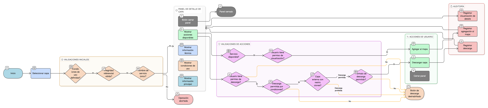

# HU-IDEAM-SNIF-REST-137

> **Identificador Historia de Usuario:** hu-ideam-snif-rest-137\
> **Nombre Historia de Usuario:** Visualizar detalle de una capa

> **Sistema de información:** Sistema Nacional de Información Forestal\
> **Módulo / subsistema:** Módulo de restauración – SNIF (SIG)\
> **Validador temático(s):** Raymond Alexander Jiménez Arteaga

## DESCRIPCIÓN HISTORIA DE USUARIO

> **Como:** usuario.\
> **Quiero:** consultar el detalle completo de una capa.\
> **Para:** decidir si la visualizo en el mapa o la descargo.

## CRITERIOS DE ACEPTACIÓN

1. **Panel de detalle completo**  
   1.1 Al seleccionar una capa, el sistema muestra un panel de detalle con toda la información relevante.  
   1.2 El panel incluye obligatoriamente:  
   - **Título completo:** Nombre descriptivo de la capa.  
   - **Miniatura del mapa:** Vista previa visual de la capa.  
   - **Servicio asociado:** URL y tipo de servicio geoespacial.  
   - **Responsable interno:** Persona o área responsable en IDEAM (para capas internas).  
   - **Entidad responsable:** Organización fuente de los datos (IDEAM u organización externa).  
   - **Tipo de servicio:** Especificación técnica (WMS, WFS, WCS, WMTS, etc.).  
   - **Condiciones de uso:** Términos, restricciones y licencia aplicable.  
   - **Botón "Agregar al mapa":** Acción principal de visualización.  
   - **Selector de formato de descarga:** Opciones de formato (si la descarga está permitida).  
   - **Botón de descarga:** Acción de descarga (si aplica).  
   1.3 La información se presenta de forma jerarquizada y clara.

2. **Habilitación condicional del botón de descarga**  
   2.1 El botón de descarga solo se habilita si:  
   - La capa permite descarga según sus condiciones de uso.  
   - El usuario tiene permisos de descarga según su rol.  
   - El formato seleccionado está permitido para la capa.  
   2.2 Si la descarga no está permitida, el botón se muestra deshabilitado con tooltip explicativo.  
   2.3 Capas externas pueden tener restricciones específicas de descarga.

3. **Habilitación condicional del botón "Agregar al mapa"**  
   3.1 El botón "Agregar al mapa" solo se habilita si:  
   - El servicio geoespacial está disponible y respondiendo.  
   - El usuario tiene permisos de visualización.  
   - La capa está activa y publicada.  
   3.2 Si el servicio no está disponible, el botón se muestra deshabilitado con tooltip explicativo.  
   3.3 Se valida la disponibilidad del servicio antes de mostrar el detalle.

4. **Condiciones de uso obligatorias**  
   4.1 Toda capa debe tener condiciones de uso definidas y visibles.  
   4.2 Las condiciones de uso incluyen:  
   - Términos de licencia (ej. Creative Commons, uso libre, restringido).  
   - Restricciones de uso (ej. solo consulta, prohibida descarga).  
   - Atribución requerida.  
   - Contacto para solicitudes especiales.  
   4.3 El sistema no permite publicar capas sin condiciones de uso definidas.  
   4.4 Las condiciones de uso se muestran de forma clara y accesible en el panel de detalle.

5. **Restricciones de capas externas**  
   5.1 Las capas externas pueden tener restricciones adicionales:  
   - Prohibición de descarga.  
   - Requisitos de atribución específicos.  
   - Limitaciones de uso comercial.  
   5.2 Las restricciones se muestran claramente en las condiciones de uso.  
   5.3 El botón de descarga se deshabilita automáticamente si la capa externa no permite descarga.

6. **Integridad referencial**  
   6.1 Se garantiza la integridad entre:  
   - **Capa ↔ Condiciones de uso:** Relación obligatoria 1:1.  
   - **Capa ↔ Servicios:** Relación obligatoria, puede ser 1:1 o 1:N según tipo.  
   - **Capa ↔ Formatos de descarga:** Relación N:M, define formatos permitidos.  
   6.2 Las relaciones son consistentes y verificables en base de datos.  
   6.3 No se permiten capas sin condiciones de uso o sin servicio asociado.

7. **UX esperado**  
   7.1 El panel de detalle se muestra en:  
   - Panel lateral deslizante, o  
   - Modal centrado con overlay.  
   7.2 La información está jerarquizada:  
   - Información principal (título, miniatura) en la parte superior.  
   - Información técnica (servicio, tipo) en sección intermedia.  
   - Condiciones de uso claramente separadas.  
   - Acciones (agregar al mapa, descargar) en la parte inferior o destacadas.  
   7.3 Las acciones son claramente visibles y diferenciables:  
   - Botón primario: "Agregar al mapa" (acción principal).  
   - Botón secundario: "Descargar" (acción alternativa).  
   7.4 El diseño es responsive y se adapta a diferentes tamaños de pantalla.  
   7.5 Se incluye botón de cerrar panel claramente visible.

8. **Auditoría**  
   8.1 El sistema registra obligatoriamente:  
   - **Visualizaciones del detalle:** Usuario, fecha/hora, capa visualizada.  
   - **Agregaciones al mapa:** Usuario, fecha/hora, capa agregada, contexto de uso.  
   - **Descargas:** Usuario, fecha/hora, capa descargada, formato seleccionado, cantidad de registros.  
   8.2 Los registros permiten análisis de:  
   - Capas más consultadas.  
   - Capas más agregadas al mapa.  
   - Capas más descargadas.  
   - Patrones de uso por usuario.  
   8.3 Los registros son consultables por administradores.  
   8.4 El nombre del servicio asociado debe ser único por capa.

## ROLES

| Rol | Alcance |
|-----|---------|
| **Usuario general** | Consulta de detalle y visualización en mapa |
| **Usuario con permisos** | Consulta, visualización y descarga (según condiciones de la capa) |
| **Administrador IDEAM** | Consulta, visualización, descarga y edición de metadatos |

## RESTRICCIONES Y LÍMITES

- Toda capa debe tener condiciones de uso definidas antes de ser publicada.
- El botón de descarga solo se habilita si la capa y el rol lo permiten.
- El botón "Agregar al mapa" solo se habilita si el servicio está disponible.
- El nombre del servicio asociado debe ser único por capa.
- Las capas externas pueden tener restricciones adicionales que limiten funcionalidades.
- Solo administradores pueden editar metadatos y condiciones de uso.
- Los formatos de descarga disponibles dependen de la configuración de la capa.

## VALIDACIONES FUNCIONALES

**Validación de disponibilidad del servicio:**
- Verificar que el servicio geoespacial esté activo y respondiendo.
- Ejecutar health check del servicio antes de habilitar "Agregar al mapa".
- Mostrar tooltip explicativo si el servicio no está disponible.
- Deshabilitar botón si la validación falla.

**Validación de permisos de descarga:**
- Verificar condiciones de uso de la capa.
- Validar permisos del rol del usuario.
- Verificar que el formato seleccionado esté permitido.
- Habilitar/deshabilitar botón de descarga según validaciones.

**Validación de formato de descarga:**
- Verificar que los formatos disponibles sean compatibles con la capa.
- Mostrar solo formatos permitidos en el selector.
- Validar compatibilidad entre formato y tipo de geometría.
- Aplicar restricciones específicas de capas externas.

**Validación de unicidad:**
- Verificar que el nombre del servicio sea único por capa.
- Rechazar duplicados con mensaje claro.
- Validar unicidad en operaciones de creación y edición.

## VALIDACIONES DE NEGOCIO

**Obligatoriedad de condiciones de uso:**
- Validar que toda capa tenga condiciones de uso definidas.
- Impedir publicación de capas sin condiciones de uso.
- Mostrar condiciones de uso de forma clara y accesible.
- Garantizar que el usuario las visualice antes de descargar.

**Restricciones de capas externas:**
- Aplicar restricciones específicas de capas externas automáticamente.
- Deshabilitar descarga si la capa externa no lo permite.
- Mostrar requisitos de atribución claramente.
- Informar limitaciones de uso comercial cuando apliquen.

**Integridad referencial:**
- **Capa ↔ Condiciones de uso (1:1):** Obligatorio.
- **Capa ↔ Servicios (1:1 o 1:N):** Obligatorio.
- **Capa ↔ Formatos de descarga (N:M):** Define formatos permitidos.
- Validar consistencia de todas las relaciones.
- Impedir capas huérfanas sin relaciones válidas.

**Control por roles:**
- Usuario general: consulta y visualización (READ).
- Usuario con permisos: consulta, visualización y descarga según condiciones.
- Administrador: consulta, visualización, descarga y edición (UPDATE).
- Validar permisos antes de habilitar acciones.

**Auditoría obligatoria:**
- Registrar visualizaciones del detalle de capas.
- Registrar agregaciones al mapa con contexto completo.
- Registrar descargas con información detallada (formato, cantidad registros).
- Permitir análisis de patrones de uso.
- Garantizar trazabilidad completa de interacciones con capas.

**CRUD específico:**
- **Read:** Consulta del detalle de la capa (todos los usuarios).
- **Update:** Edición de metadatos solo por Administrador desde interfaz de administración.

## DIAGRAMA DE FLUJO DEL PROCESO

