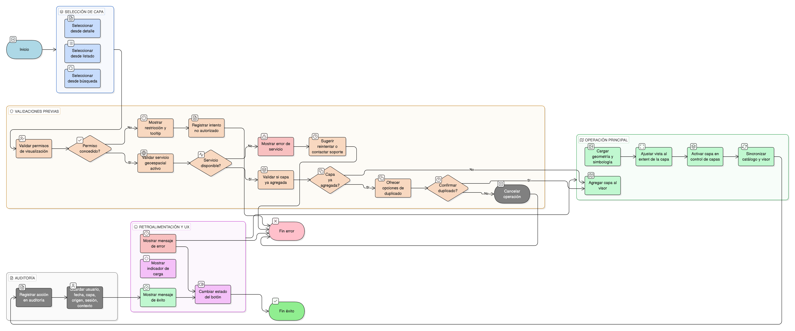

# HU-IDEAM-SNIF-REST-138

> **Identificador Historia de Usuario:** hu-ideam-snif-rest-138\
> **Nombre Historia de Usuario:** Agregar capa al mapa

> **Sistema de información:** Sistema Nacional de Información Forestal\
> **Módulo / subsistema:** Módulo de restauración – SNIF (SIG)\
> **Validador temático(s):** Raymond Alexander Jiménez Arteaga

## DESCRIPCIÓN HISTORIA DE USUARIO

> **Como:** usuario.\
> **Quiero:** agregar una capa directamente desde el catálogo.\
> **Para:** visualizarla inmediatamente en el visor principal.

## CRITERIOS DE ACEPTACIÓN

1. **Acción de agregar capa desde catálogo**  
   1.1 El usuario puede agregar una capa al mapa desde:  
   - El detalle de la capa (botón "Agregar al mapa").  
   - El listado de capas por eje temático (acción rápida).  
   - Los resultados de búsqueda (acción contextual).  
   1.2 La acción es inmediata y sin pasos adicionales innecesarios.  
   1.3 El sistema proporciona retroalimentación visual clara de la acción.

2. **Validación de servicio activo**  
   2.1 El sistema valida que el servicio geoespacial esté activo antes de agregar la capa.  
   2.2 Se ejecuta un health check del servicio antes de la operación.  
   2.3 Si el servicio no está disponible:  
   - Se muestra un mensaje de error claro.  
   - Se indica el motivo (servicio caído, timeout, error de configuración).  
   - Se sugiere reintentar más tarde o contactar soporte.  
   2.4 No se agrega la capa al mapa si el servicio no está disponible.

3. **Validación de permisos de visualización**  
   3.1 El sistema valida que el usuario tenga permisos de visualización según su rol.  
   3.2 Se verifica:  
   - Permisos del rol sobre la capa específica.  
   - Estado de la capa (activa, publicada).  
   - Restricciones de visualización de la capa.  
   3.3 Si el usuario no tiene permisos:  
   - La opción de agregar al mapa no está disponible.  
   - Se muestra tooltip explicativo sobre restricciones.  
   3.4 Los intentos de agregar capas no autorizadas se rechazan y registran.

4. **Transición al visor de mapas**  
   4.1 Al agregar la capa, el sistema:  
   - Carga la capa en el visor geográfico principal.  
   - Ajusta la vista del mapa al extent de la capa (zoom y centro).  
   - Activa la capa en el control de capas (panel de capas).  
   - Aplica la simbología predeterminada de la capa.  
   4.2 Si el usuario estaba en otra vista, se redirige automáticamente al visor.  
   4.3 Si ya estaba en el visor, la capa se agrega sin cambiar de contexto.  
   4.4 La transición es fluida y sin demora perceptible.

5. **Integridad entre catálogo, visor y servicio**  
   5.1 Se garantiza la integridad referencial entre:  
   - **Catálogo ↔ Visor:** La capa agregada en el visor corresponde exactamente a la seleccionada en el catálogo.  
   - **Visor ↔ Servicio geoespacial:** El visor conecta con el servicio correcto asociado a la capa.  
   - **Servicio ↔ Metadatos:** Los metadatos mostrados corresponden al servicio y capa correctos.  
   5.2 No se permite inconsistencia entre lo mostrado en catálogo y lo visualizado en mapa.  
   5.3 Los parámetros del servicio (URL, capas, estilos) se transfieren correctamente al visor.

6. **Gestión de capas ya agregadas**  
   6.1 Si la capa ya está agregada al mapa:  
   - El sistema informa al usuario con un mensaje claro.  
   - Se ofrece opción de:  
     - Enfocar la capa existente (zoom y centro).  
     - Duplicar la capa (si tiene sentido funcional).  
     - Cancelar la operación.  
   6.2 Se evita agregar capas duplicadas sin intención del usuario.  
   6.3 El control de capas del visor refleja todas las capas agregadas.

7. **Retroalimentación visual y UX**  
   7.1 Al agregar la capa, el sistema muestra:  
   - Mensaje de confirmación: "Capa [nombre] agregada al mapa".  
   - Indicador de carga mientras se carga la capa (spinner, barra de progreso).  
   - Notificación de éxito cuando la capa está visible.  
   7.2 Si ocurre un error:  
   - Mensaje de error claro y descriptivo.  
   - Código de error técnico (para reporte).  
   - Sugerencias de acción (reintentar, contactar soporte).  
   7.3 El botón "Agregar al mapa" cambia su estado durante la operación:  
   - Estado normal: "Agregar al mapa".  
   - Estado cargando: "Agregando..." (deshabilitado).  
   - Estado éxito: "Agregado ✓" (temporal, luego vuelve a normal).

8. **Auditoría**  
   8.1 Todas las capas agregadas al mapa se registran obligatoriamente en auditoría.  
   8.2 El registro incluye:  
   - Usuario que agregó la capa.  
   - Fecha y hora exacta.  
   - Capa agregada (identificador y nombre).  
   - Origen de la acción (detalle de capa, listado, búsqueda).  
   - Sesión del usuario (session ID).  
   - Contexto de uso (proyecto, análisis, consulta).  
   8.3 Se registra por sesión, permitiendo análisis de:  
   - Capas más utilizadas.  
   - Patrones de uso por usuario.  
   - Combinaciones frecuentes de capas.  
   8.4 Los registros son consultables por administradores.

## ROLES

| Rol | Alcance |
|-----|---------|
| **Usuario público / autenticado** | Puede agregar capas permitidas al visor según permisos |
| **Administrador IDEAM** | Puede agregar cualquier capa al visor |

## RESTRICCIONES Y LÍMITES

- Solo se pueden agregar capas con servicio geoespacial activo y disponible.
- El usuario debe tener permisos de visualización sobre la capa.
- Se valida disponibilidad del servicio antes de agregar la capa.
- El sistema puede limitar el número de capas simultáneas en el visor (ej. máx. 10-15).
- Las capas duplicadas requieren confirmación explícita del usuario.
- La operación requiere conectividad con el servidor de servicios geoespaciales.
- El visor debe ser compatible con el tipo de servicio de la capa (WMS, WFS, etc.).

## VALIDACIONES FUNCIONALES

**Validación de servicio:**
- Ejecutar health check del servicio geoespacial antes de agregar.
- Verificar disponibilidad y tiempo de respuesta.
- Validar que el tipo de servicio sea soportado por el visor.
- Rechazar operación si el servicio no está disponible.

**Validación de permisos:**
- Verificar permisos del rol del usuario sobre la capa.
- Validar estado de la capa (activa, publicada).
- Verificar restricciones de visualización específicas de la capa.
- Registrar intentos de acceso no autorizado.

**Validación de duplicados:**
- Verificar si la capa ya está agregada al mapa.
- Informar al usuario si existe duplicado.
- Ofrecer opciones (enfocar, duplicar, cancelar).
- Evitar duplicados no intencionados.

**Validación de carga:**
- Verificar que la capa se cargue correctamente en el visor.
- Validar que las geometrías se rendericen correctamente.
- Confirmar que la simbología se aplique adecuadamente.
- Manejar errores de carga con mensajes claros.

## VALIDACIONES DE NEGOCIO

**Integridad catálogo–visor–servicio:**
- **Catálogo ↔ Visor:** Garantizar correspondencia exacta entre capa seleccionada y capa visualizada.
- **Visor ↔ Servicio:** Asegurar conexión correcta con el servicio geoespacial asociado.
- **Servicio ↔ Metadatos:** Validar consistencia entre metadatos y servicio real.
- Impedir inconsistencias entre componentes del sistema.

**Experiencia de transición:**
- Proporcionar transición fluida al visor de mapas.
- Ajustar vista del mapa al extent de la capa automáticamente.
- Activar capa en control de capas del visor.
- Aplicar simbología predeterminada correctamente.
- Mantener contexto del usuario si ya está en el visor.

**Gestión de estado:**
- Controlar estado de capas agregadas en la sesión.
- Permitir gestión de capas desde el control de capas del visor.
- Sincronizar estado entre catálogo y visor.
- Persistir capas agregadas durante la sesión (opcional: entre sesiones).

**Auditoría obligatoria:**
- Registrar todas las agregaciones de capas al mapa.
- Incluir contexto completo (usuario, fecha, origen, sesión).
- Permitir análisis de patrones de uso.
- Identificar capas más utilizadas y combinaciones frecuentes.
- Garantizar trazabilidad de interacciones con el visor.

**Retroalimentación al usuario:**
- Proporcionar mensajes claros de éxito o error.
- Mostrar indicadores de carga durante la operación.
- Informar sobre restricciones o limitaciones cuando apliquen.
- Sugerir acciones correctivas en caso de error.

## DIAGRAMA DE FLUJO DEL PROCESO

