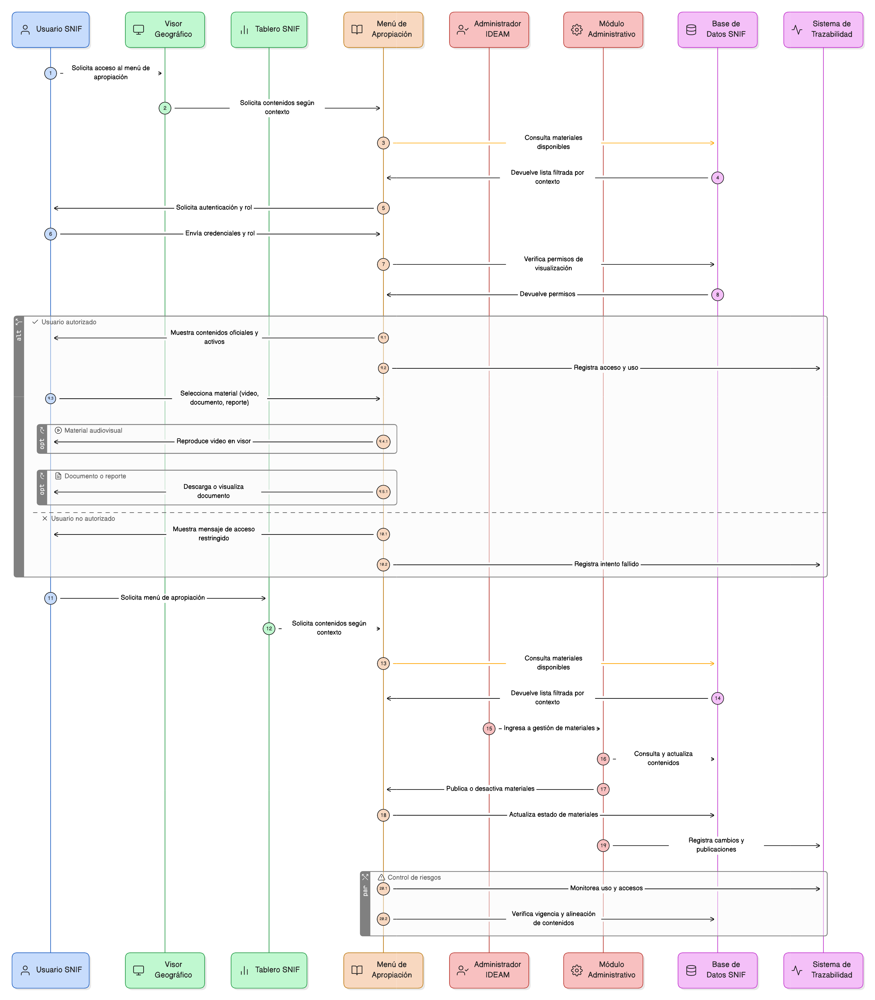

# Épica 12: Menú de Apropiación y Capacitación (Visor SNIF)

## 1. Descripción general

Esta épica define la implementación de un menú de apropiación y capacitación accesible desde el visor geográfico y los tableros del SNIF, cuyo propósito es centralizar documentos, reportes y materiales audiovisuales organizados por temática, rol y contexto funcional, con el fin de apoyar el aprendizaje, reforzar capacidades y mejorar el uso adecuado de la plataforma.

El menú de apropiación es un módulo transversal de apoyo al usuario, visible para todos los perfiles, pero administrado exclusivamente por el Administrador IDEAM desde la aplicación administrativa, sin permitir edición directa desde el visor.

Esta épica garantiza:

- Acceso contextual según el módulo donde se encuentre el usuario.
- Control de visualización de contenidos por roles.
- Trazabilidad mediante registros de uso.
- Alineación con las políticas institucionales del IDEAM.
- Visualización exclusiva de contenidos oficiales, publicados y activos.

## 2. Objetivo

Disponer de un módulo transversal de apropiación y capacitación que permita:

- Facilitar la apropiación funcional del SNIF por parte de todos los usuarios.
- Reducir errores operativos mediante guías y materiales contextualizados.
- Centralizar el conocimiento oficial del sistema.
- Medir el uso y la adopción de los contenidos de capacitación.
- Garantizar el control institucional del material publicado.

Con ello, el sistema fortalece la calidad en el uso de la plataforma, mejora la experiencia de los usuarios y asegura la coherencia con los lineamientos del IDEAM.

## 3. Historias de usuario asociadas

- [**HU-IDEAM-SNIF-REST-139:** Acceso al menú de apropiación](EP-IDEAM-SNIF-REST-012/HU-IDEAM-SNIF-REST-139.md)
- [**HU-IDEAM-SNIF-REST-140:** Visualizar videos de uso](EP-IDEAM-SNIF-REST-012/HU-IDEAM-SNIF-REST-140.md)
- [**HU-IDEAM-SNIF-REST-141:** Visualizar contenido según rol](EP-IDEAM-SNIF-REST-012/HU-IDEAM-SNIF-REST-141.md)
- [**HU-IDEAM-SNIF-REST-142:** Acceso contextual desde visor y tableros](EP-IDEAM-SNIF-REST-012/HU-IDEAM-SNIF-REST-142.md)

## 4. Riesgos

- Publicación de contenidos desactualizados o no alineados con las políticas institucionales.
- Visualización de contenidos no autorizados para determinados roles.
- Inconsistencias entre los contenidos mostrados en el visor/tableros y los gestionados en el módulo administrativo.
- Pérdida de trazabilidad sobre el uso de los materiales de capacitación.
- Baja adopción del menú de apropiación por problemas de usabilidad o acceso contextual.
- Dependencia de enlaces externos no disponibles o con URLs inválidas.

## 5. Diagrama de secuencia

## 6. Wireframes / mockups

