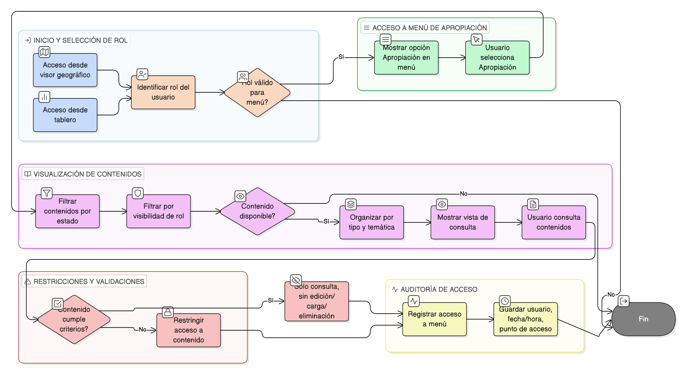

# HU-IDEAM-SNIF-REST-139

> **Identificador Historia de Usuario:** hu-ideam-snif-rest-139\
> **Nombre Historia de Usuario:** Acceso al menú de apropiación

> **Sistema de información:** Sistema Nacional de Información Forestal\
> **Módulo / subsistema:** Módulo de restauración\
> **Validador temático(s):** Raymond Alexander Jiménez Arteaga

## DESCRIPCIÓN HISTORIA DE USUARIO

> **Como:** usuario del sistema.\
> **Quiero:** acceder a un menú de apropiación y capacitación desde el visor geográfico y los tableros.\
> **Para:** consultar materiales oficiales que me ayuden a usar correctamente la plataforma.

## CRITERIOS DE ACEPTACIÓN

1. **Disponibilidad del acceso al menú**\
    1.1 El sistema debe mostrar una opción visible **“Apropiación”** en:
    
    - El menú del visor geográfico.
    - Los tableros (dashboards).
    
    1.2 La opción debe estar disponible para los siguientes roles:
    
    - Administrador IDEAM.
    - Registrador.
    - Usuario Consulta.

2. **Vista de contenidos de apropiación**\
    2.1 Al seleccionar la opción **“Apropiación”**, el sistema debe abrir una vista dedicada con los contenidos organizados por:
    
    - Tipo de contenido (documentos, videos, guías).
    - Agrupación temática.
    
    2.2 La vista debe ser exclusivamente de consulta, sin opciones de edición o carga de contenidos.

3. **Disponibilidad de contenidos**\
    3.1 El sistema solo debe mostrar contenidos que se encuentren:
    
    - Publicados.
    - Activos.
    - Autorizados según el rol del usuario.
    
    3.2 No se deben mostrar contenidos inactivos, en borrador o no aprobados.

4. **Validaciones de negocio**\
    4.1 Todo contenido visible en el menú debe estar:
    
    - Aprobado.
    - Publicado por el Administrador IDEAM.
    
    4.2 No se debe permitir el acceso a contenidos administrativos restringidos a usuarios no autorizados.

5. **Integridad referencial**\
    5.1 El sistema debe garantizar la integridad entre:
    
    - El menú de apropiación.
    - Los contenidos administrados desde el módulo administrativo.
    
    5.2 El origen de los contenidos debe ser único y corresponder al módulo de administración de reportes y contenidos de apropiación.

6. **Control por roles**\
    6.1 El acceso al menú debe respetar las reglas de visibilidad por rol definidas en el sistema.\
    6.2 Los contenidos administrativos solo deben ser visibles para el rol **Administrador IDEAM**.\
    6.3 El **Registrador** y el **Usuario Consulta** solo pueden acceder a contenidos que no sean administrativos.

7. **Auditoría de acceso**\
    7.1 El sistema debe registrar cada acceso al menú de apropiación, almacenando como mínimo:
    
    - Usuario.
    - Fecha y hora.
    - Punto de acceso (visor o tablero).

## ROLES

- **Administrador IDEAM**: Puede acceder al menú de apropiación y visualizar todos los contenidos según las reglas de visibilidad definidas.
- **Registrador**: Puede acceder al menú de apropiación en modo consulta y visualizar únicamente contenidos no administrativos autorizados.
- **Usuario Consulta**: Puede acceder al menú de apropiación en modo consulta y visualizar únicamente contenidos públicos y autorizados.

## RESTRICCIONES Y LÍMITES

- No se permite la creación, edición ni eliminación de contenidos desde el visor geográfico ni desde los tableros.
- El menú de apropiación es exclusivamente de consulta para todos los roles.
- La administración de contenidos se realiza únicamente desde el módulo administrativo correspondiente.
- No se permite el acceso a contenidos en estado inactivo, no aprobado o no publicado.
- La gestión de repositorios externos (YouTube, Drive, etc.) se limita a la referenciación de contenidos.
- El acceso a contenidos debe respetar estrictamente las reglas de visibilidad por rol.

## DIAGRAMA DE FLUJO DEL PROCESO

