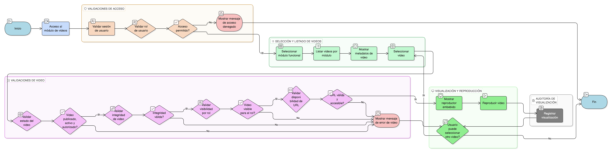

# HU-IDEAM-SNIF-REST-140

> **Identificador Historia de Usuario:** hu-ideam-snif-rest-140\
> **Nombre Historia de Usuario:** Visualizar videos de uso

> **Sistema de información:** Sistema Nacional de Información Forestal\
> **Módulo / subsistema:** Módulo de restauración\
> **Validador temático(s):** Raymond Alexander Jiménez Arteaga

## DESCRIPCIÓN HISTORIA DE USUARIO

> **Como:** usuario del sistema.\
> **Quiero:** visualizar videos tutoriales organizados por módulo funcional.\
> **Para:** aprender paso a paso el uso de la plataforma de forma guiada y oficial.

## CRITERIOS DE ACEPTACIÓN

1. **Listado de videos por módulo**\
    1.1 El sistema debe mostrar un listado de videos agrupados por módulo funcional.\
    1.2 Cada video debe presentar como mínimo los siguientes metadatos:
    
    - Nombre.
    - Descripción.
    - Fecha de última actualización.

2. **Reproductor embebido**\
    2.1 El sistema debe permitir la reproducción de los videos mediante un reproductor embebido (por ejemplo, YouTube).\
    2.2 La reproducción debe realizarse dentro del visor o la vista de apropiación, sin interrumpir la sesión del usuario.

3. **Disponibilidad y validez de los enlaces**\
    3.1 Cada video debe tener una URL válida y accesible.\
    3.2 Si la URL no es válida o el recurso no está disponible, el sistema debe mostrar un mensaje de error claro al usuario.

4. **Validaciones de negocio**\
    4.1 Cada video debe pertenecer al menos a una agrupación temática principal.\
    4.2 Cada video debe estar clasificado como contenido de tipo **audiovisual**.\
    4.3 Solo se deben mostrar videos que se encuentren:
    
    - Publicados.
    - Activos.
    - Autorizados según el rol del usuario.

5. **Control por roles**\
    5.1 El sistema debe permitir el acceso a la visualización de videos a los siguientes roles:
    
    - Administrador IDEAM.
    - Registrador.
    - Usuario Consulta.
    
    5.2 Los contenidos administrativos solo deben ser visibles para el rol **Administrador IDEAM**.\
    5.3 El **Registrador** y el **Usuario Consulta** solo pueden visualizar videos no administrativos autorizados.

6. **Integridad de la información**\
    6.1 El sistema debe garantizar la integridad entre:
    
    - El video.
    - Su agrupación temática.
    - Su tipo de contenido (audiovisual).
    
    6.2 El origen de los videos debe corresponder exclusivamente al módulo administrativo de gestión de contenidos.

7. **Auditoría de uso**\
    7.1 El sistema debe registrar cada visualización de un video, almacenando como mínimo:
    
    - Usuario.
    - Fecha y hora.
    - Video consultado.
    - Módulo desde el cual se accedió.

## ROLES

- **Administrador IDEAM**: Puede visualizar todos los videos, incluidos los de carácter administrativo, según las reglas de visibilidad.
- **Registrador**: Puede visualizar videos en modo consulta, excepto aquellos marcados como administrativos.
- **Usuario Consulta**: Puede visualizar únicamente videos públicos y autorizados, en modo consulta.

## RESTRICCIONES Y LÍMITES

- No se permite la carga, edición ni eliminación de videos desde el visor o los tableros.
- La administración de videos se realiza exclusivamente desde el módulo administrativo correspondiente.
- No se deben mostrar videos inactivos, no aprobados o no publicados.
- La visualización de videos está sujeta a las reglas de visibilidad por rol.
- La reproducción de los videos depende de la disponibilidad del servicio externo (por ejemplo, YouTube).

## DIAGRAMA DE FLUJO DEL PROCESO

