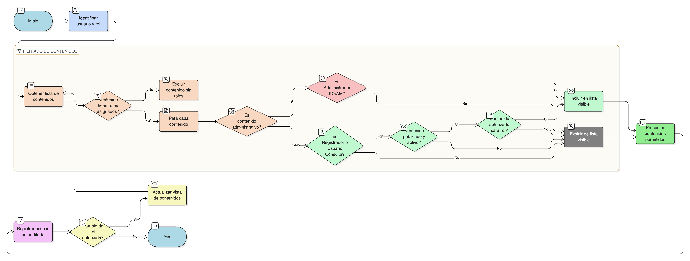

# HU-IDEAM-SNIF-REST-141

> **Identificador Historia de Usuario:** hu-ideam-snif-rest-141\
> **Nombre Historia de Usuario:** Visualizar contenido según rol

> **Sistema de información:** Sistema Nacional de Información Forestal\
> **Módulo / subsistema:** Módulo de restauración\
> **Validador temático(s):** Raymond Alexander Jiménez Arteaga

## DESCRIPCIÓN HISTORIA DE USUARIO

> **Como:** sistema.\
> **Quiero:** mostrar únicamente contenidos acordes a los roles de los usuarios.\
> **Para:** asegurar que cada usuario reciba guías y materiales relevantes a sus responsabilidades y permisos.

## CRITERIOS DE ACEPTACIÓN

1. **Filtrado automático por rol**\
    1.1 El sistema debe filtrar automáticamente los contenidos visibles según el rol del usuario autenticado:
    
    - Administrador IDEAM.
    - Registrador.
    - Usuario Consulta.
    
    1.2 Un mismo contenido puede estar asociado a uno o varios roles.

2. **Asignación mínima de roles a contenidos**\
    2.1 Todo contenido debe tener al menos un rol asignado para ser publicado.\
    2.2 Si un contenido no tiene roles asignados, no debe ser visible para ningún usuario.

3. **Reglas de visibilidad por tipo de contenido**\
    3.1 Los contenidos administrativos solo deben ser visibles para el rol **Administrador IDEAM**.\
    3.2 El **Registrador** y el **Usuario Consulta** solo pueden visualizar contenidos no administrativos que estén:
    
    - Publicados.
    - Activos.
    - Autorizados para su rol.

4. **Consistencia de la vista de contenidos**\
    4.1 La lista de contenidos mostrada debe corresponder exactamente a los permisos del rol del usuario.\
    4.2 No se deben mostrar opciones, enlaces o accesos a contenidos no autorizados.

5. **Cambios de rol y efecto inmediato**\
    5.1 Si el rol de un usuario cambia, el sistema debe aplicar inmediatamente las nuevas reglas de visibilidad en la vista de contenidos.\
    5.2 No debe existir caché o persistencia de vistas que expongan contenidos no autorizados.

6. **Integridad referencial**\
    6.1 El sistema debe garantizar la integridad entre:
    
    - Contenido.
    - Roles asociados.
    - Estado de publicación del contenido.
    
    6.2 El origen de los contenidos debe corresponder exclusivamente al módulo administrativo de gestión de contenidos.

7. **Auditoría de acceso a contenidos**\
    7.1 El sistema debe registrar los accesos a contenidos, almacenando como mínimo:
    
    - Usuario.
    - Rol activo.
    - Fecha y hora.
    - Contenido consultado.

## ROLES

- **Administrador IDEAM**: Puede visualizar todos los contenidos, incluidos los de carácter administrativo.
- **Registrador**: Puede visualizar únicamente contenidos no administrativos que estén publicados y autorizados para su rol.
- **Usuario Consulta**: Puede visualizar únicamente contenidos públicos y autorizados, en modo consulta.

## RESTRICCIONES Y LÍMITES

- No se permite el acceso a contenidos que no estén publicados, activos o autorizados para el rol del usuario.
- No se permite mostrar contenidos administrativos a usuarios que no tengan el rol **Administrador IDEAM**.
- La administración de roles y visibilidad de contenidos se realiza únicamente desde el módulo administrativo.
- No debe existir ninguna forma de forzar la visualización de contenidos no autorizados mediante URL directa o navegación manual.
- La visualización de contenidos está sujeta estrictamente a las reglas de control de acceso por rol.

## DIAGRAMA DE FLUJO DEL PROCESO

