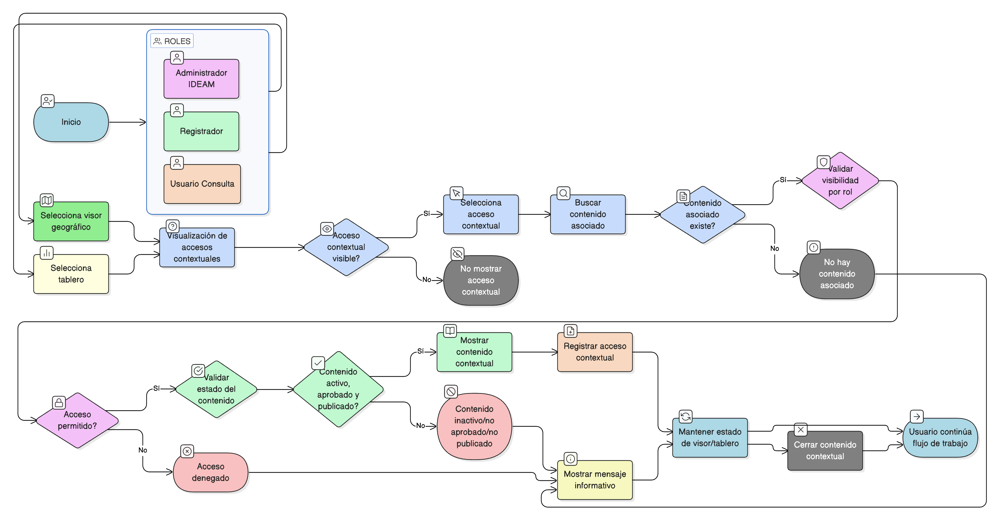

# HU-IDEAM-SNIF-REST-142

> **Identificador Historia de Usuario:** hu-ideam-snif-rest-142\
> **Nombre Historia de Usuario:** Acceso contextual desde visor y tableros

> **Sistema de información:** Sistema Nacional de Información Forestal\
> **Módulo / subsistema:** Módulo de restauración\
> **Validador temático(s):** Raymond Alexander Jiménez Arteaga

## DESCRIPCIÓN HISTORIA DE USUARIO

> **Como:** usuario del sistema.\
> **Quiero:** acceder a contenidos de apropiación y capacitación desde el visor geográfico o los tableros.\
> **Para:** recibir ayuda contextual sin salir de mi flujo de trabajo.

## CRITERIOS DE ACEPTACIÓN

1. **Disponibilidad de accesos contextuales**\
    1.1 El sistema debe mostrar íconos u opciones de ayuda contextual en:
    
    - El visor geográfico.
    - Los tableros (dashboards).
    
    1.2 Los accesos deben estar disponibles para los roles:
    
    - Administrador IDEAM.
    - Registrador.
    - Usuario Consulta.

2. **Apertura de contenido contextual**\
    2.1 Al seleccionar un acceso contextual, el sistema debe abrir directamente el contenido asociado al módulo o vista activa.\
    2.2 El sistema no debe obligar al usuario a navegar manualmente por el menú de apropiación para encontrar el contenido.

3. **Asociación contenido–módulo**\
    3.1 Todo contenido mostrado de forma contextual debe estar previamente asociado al módulo o funcionalidad desde la cual se accede.\
    3.2 Si no existe contenido asociado, el sistema debe mostrar un mensaje informativo indicando que no hay ayuda disponible para ese contexto.

4. **Persistencia del estado de trabajo**\
    4.1 Al abrir y cerrar el contenido contextual, el sistema debe conservar el estado del visor o del tablero (filtros, selección, vista actual).\
    4.2 No se debe recargar ni reiniciar la vista de trabajo del usuario.

5. **Control por roles**\
    5.1 El sistema debe aplicar las mismas reglas de visibilidad por rol que en el menú de apropiación.\
    5.2 Los contenidos administrativos solo deben ser visibles para el rol **Administrador IDEAM**.\
    5.3 El **Registrador** y el **Usuario Consulta** solo pueden acceder a contenidos no administrativos autorizados.

6. **Integridad referencial**\
    6.1 El sistema debe garantizar la integridad entre:
    
    - El módulo o vista activa.
    - El contenido contextual asociado.
    
    6.2 El origen del contenido debe corresponder exclusivamente al módulo administrativo de gestión de contenidos.

7. **Auditoría de acceso contextual**\
    7.1 El sistema debe registrar cada acceso a contenido contextual, almacenando como mínimo:
    
    - Usuario.
    - Rol activo.
    - Módulo de origen.
    - Contenido consultado.
    - Fecha y hora.

## ROLES

- **Administrador IDEAM**: Puede acceder a todos los contenidos contextuales, incluidos los de carácter administrativo.
- **Registrador**: Puede acceder a contenidos contextuales no administrativos que estén publicados y autorizados.
- **Usuario Consulta**: Puede acceder únicamente a contenidos contextuales públicos y autorizados, en modo consulta.

## RESTRICCIONES Y LÍMITES

- No se permite la creación, edición ni eliminación de contenidos desde el visor o los tableros.
- El acceso contextual está limitado a contenidos previamente asociados al módulo correspondiente.
- No se debe permitir el acceso a contenidos inactivos, no aprobados o no publicados.
- El acceso a contenidos contextuales debe respetar estrictamente las reglas de visibilidad por rol.
- La gestión de asociaciones entre módulos y contenidos se realiza únicamente desde el módulo administrativo.

## DIAGRAMA DE FLUJO DEL PROCESO

