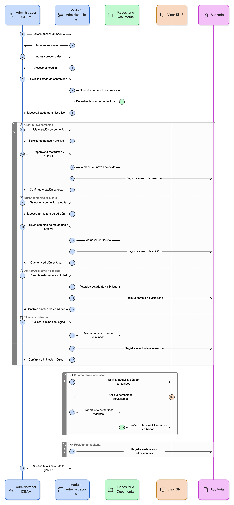

# Épica 13: Administración de Reportes y Contenidos de Apropiación

## 1. Descripción general

Esta épica define el módulo de Administración de Reportes y Contenidos de Apropiación, el cual permite al Administrador IDEAM gestionar de forma centralizada los materiales documentales y audiovisuales que alimentan la pestaña de Apropiación y Capacitación visible en el visor del SNIF.

Este módulo garantiza que los contenidos publicados:

- Estén correctamente clasificados y versionados.
- Sean visibles únicamente bajo criterios definidos.
- Mantengan integridad con las agrupaciones temáticas.
- Sean trazables desde su creación hasta su consumo.

El módulo es exclusivamente administrativo y no es accesible desde el visor geográfico ni por usuarios finales.

## 2. Objetivo

Disponer de un módulo administrativo que permita:

- Crear, editar, activar, desactivar y eliminar lógicamente contenidos de apropiación.
- Clasificar los contenidos por tipo, agrupación y criterios de visibilidad.
- Garantizar la trazabilidad completa de los cambios realizados sobre los contenidos.
- Asegurar la integridad entre los contenidos administrados y el módulo de Apropiación del visor.
- Mantener un control institucional sobre los materiales publicados.

Con ello, el sistema asegura la calidad, coherencia y gobernanza de los contenidos oficiales de capacitación y apoyo al usuario.

## 3. Historias de usuario asociadas

- [**HU-IDEAM-SNIF-REST-143:** Crear reporte o material de apropiación](/historias_usuario/EP-IDEAM-SNIF-REST-013/HU-IDEAM-SNIF-REST-143)
- [**HU-IDEAM-SNIF-REST-144:** Editar reporte o material existente](/historias_usuario/EP-IDEAM-SNIF-REST-013/HU-IDEAM-SNIF-REST-144)
- [**HU-IDEAM-SNIF-REST-145:** Activar o desactivar visibilidad de reportes](/historias_usuario/EP-IDEAM-SNIF-REST-013/HU-IDEAM-SNIF-REST-145)
- [**HU-IDEAM-SNIF-REST-146:** Eliminar reporte o material de apropiación](/historias_usuario/EP-IDEAM-SNIF-REST-013/HU-IDEAM-SNIF-REST-146)
- [**HU-IDEAM-SNIF-REST-147:** Visualizar listado administrativo de reportes](/historias_usuario/EP-IDEAM-SNIF-REST-013/HU-IDEAM-SNIF-REST-147)

## 4. Riesgos

- Publicación de contenidos sin clasificación o con metadatos incompletos.
- Inconsistencias entre los contenidos administrados y los visibles en el módulo de Apropiación.
- Pérdida de trazabilidad sobre cambios realizados a los contenidos.
- Eliminación accidental de materiales aún vigentes o en uso institucional.
- Exposición de contenidos no autorizados por una mala gestión de visibilidad.
- Dependencia de enlaces externos no disponibles o con URLs inválidas.

## 5. Diagrama de secuencia

## 6. Wireframes / mockups
