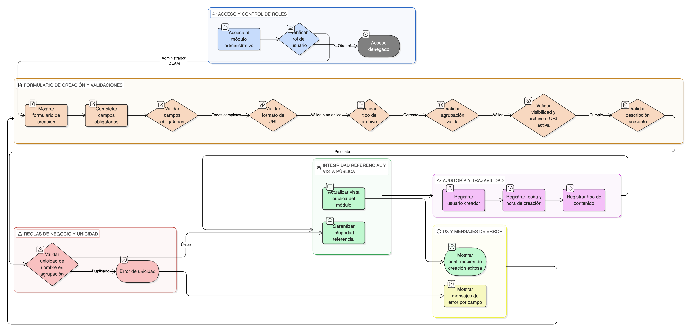

# HU-IDEAM-SNIF-REST-143

> **Identificador Historia de Usuario:** hu-ideam-snif-rest-143\
> **Nombre Historia de Usuario:** Crear reporte o material de apropiación

> **Sistema de información:** Sistema Nacional de Información Forestal\
> **Módulo / subsistema:** Módulo de restauración\
> **Validador temático(s):** Raymond Alexander Jiménez Arteaga

## DESCRIPCIÓN HISTORIA DE USUARIO

> **Como:** Administrador IDEAM.\
> **Quiero:** registrar un nuevo reporte o material de apropiación.\
> **Para:** publicarlo posteriormente en el módulo de Apropiación y Capacitación del visor del SNIF.

## CRITERIOS DE ACEPTACIÓN

1. **Acceso a la creación de contenidos**\
    1.1 El sistema debe permitir el acceso a la funcionalidad de creación de reportes o materiales de apropiación únicamente al rol **Administrador IDEAM**.\
    1.2 Los roles **Registrador** y **Usuario Consulta** no deben tener acceso a esta funcionalidad.

2. **Formulario de creación**\
    2.1 El sistema debe mostrar un formulario de creación con los siguientes campos obligatorios:
    
    - Tipo de documentación (Documento / Apoyo audiovisual).
    - Nombre.
    - Descripción.
    - Agrupación (General, Navegación, Administración, Consulta, Procesos, Reportes, Apropiación u otras definidas por el sistema).
    - URL o archivo asociado.
    - Indicador de visibilidad.
    
    2.2 El botón **Guardar** solo debe habilitarse cuando el formulario sea válido.

3. **Validaciones funcionales**\
    3.1 Todos los campos obligatorios deben estar diligenciados.\
    3.2 El campo URL debe cumplir con un formato válido (http/https) cuando aplique.\
    3.3 El tipo de archivo cargado debe corresponder al tipo de documentación seleccionado.

4. **Validaciones de negocio**\
    4.1 Todo reporte o material debe pertenecer a una agrupación válida.\
    4.2 Los contenidos marcados como visibles deben tener una URL o archivo activo.\
    4.3 No se debe permitir publicar contenido sin descripción.

5. **Integridad referencial**\
    5.1 El sistema debe garantizar la integridad entre:
    
    - Reporte o material.
    - Agrupación.
    - Tipo de documentación.
    
    5.2 Los datos creados deben alimentar directamente la vista pública del módulo de Apropiación y Capacitación del visor.

6. **Control por roles**\
    6.1 Solo el rol **Administrador IDEAM** puede crear reportes o materiales de apropiación.\
    6.2 Los roles **Registrador** y **Usuario Consulta** no deben poder crear, editar ni eliminar contenidos.

7. **Experiencia de usuario (UX)**\
    7.1 El formulario debe presentarse en una vista limpia y de una sola columna.\
    7.2 El sistema debe mostrar mensajes claros de error por campo cuando existan validaciones fallidas.\
    7.3 Al guardar correctamente, el sistema debe mostrar una confirmación visual de creación exitosa.

8. **Auditoría y trazabilidad**\
    8.1 El sistema debe registrar como mínimo:
    
    - Usuario creador.
    - Fecha y hora de creación.
    - Tipo de contenido creado.

9. **Regla de unicidad**\
    9.1 El nombre del reporte o material debe ser único dentro de la misma agrupación.\
    9.2 Si ya existe un contenido con el mismo nombre en la misma agrupación, el sistema debe impedir el guardado y mostrar un mensaje de error.

## ROLES

- **Administrador IDEAM**: Puede crear reportes o materiales de apropiación y gestionar su información desde el módulo administrativo.
- **Registrador**: No puede crear, editar ni eliminar contenidos de apropiación.
- **Usuario Consulta**: No puede crear, editar ni eliminar contenidos de apropiación.

## RESTRICCIONES Y LÍMITES

- La creación de contenidos solo está disponible en el módulo administrativo.
- No se permite la creación de contenidos desde el visor geográfico ni desde los tableros.
- Todo contenido debe cumplir las validaciones funcionales y de negocio antes de ser guardado.
- No se permite publicar contenidos sin descripción o sin una agrupación válida.
- La visibilidad del contenido está sujeta a las reglas definidas por el Administrador IDEAM.

## DIAGRAMA DE FLUJO DEL PROCESO

