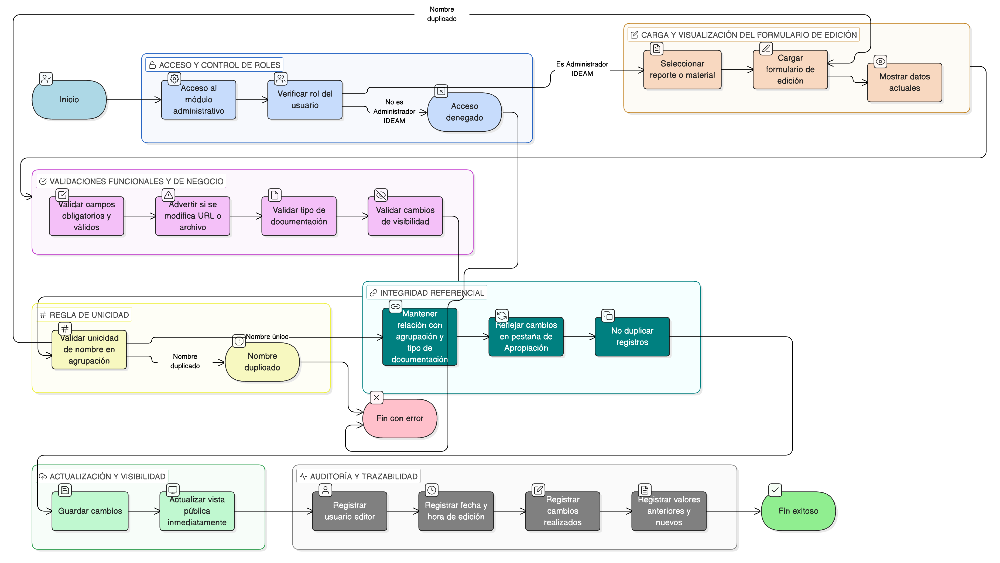

# HU-IDEAM-SNIF-REST-144

> **Identificador Historia de Usuario:** hu-ideam-snif-rest-144\
> **Nombre Historia de Usuario:** Editar reporte o material existente

> **Sistema de información:** Sistema Nacional de Información Forestal\
> **Módulo / subsistema:** Módulo de restauración\
> **Validador temático(s):** Raymond Alexander Jiménez Arteaga

## DESCRIPCIÓN HISTORIA DE USUARIO

> **Como:** Administrador IDEAM.\
> **Quiero:** editar un reporte o material de apropiación existente.\
> **Para:** actualizar su información o corregir errores, manteniendo la coherencia con el módulo de Apropiación y Capacitación del visor del SNIF.

## CRITERIOS DE ACEPTACIÓN

1. **Acceso a la edición de contenidos**\
    1.1 El sistema debe permitir el acceso a la funcionalidad de edición únicamente al rol **Administrador IDEAM**.\
    1.2 Los roles **Registrador** y **Usuario Consulta** no deben tener acceso a esta funcionalidad.

2. **Formulario de edición**\
    2.1 El sistema debe mostrar un formulario de edición con los mismos campos definidos en la creación del contenido.\
    2.2 El formulario debe cargarse con los valores actuales del reporte o material seleccionado.

3. **Validaciones funcionales**\
    3.1 No se debe permitir guardar cambios si existen campos inválidos u obligatorios sin diligenciar.\
    3.2 El sistema debe advertir al usuario si se modifica la URL o el archivo asociado al contenido.

4. **Validaciones de negocio**\
    4.1 No se debe permitir cambiar el tipo de documentación si el contenido ya tiene consumo público activo, según las reglas definidas por el sistema.\
    4.2 Los cambios en el indicador de visibilidad deben impactar inmediatamente la vista pública del módulo de Apropiación y Capacitación.

5. **Integridad referencial**\
    5.1 El sistema debe mantener la relación entre:
    
    - Reporte o material.
    - Agrupación.
    - Tipo de documentación.
    
    5.2 El cambio debe reflejarse en la pestaña de Apropiación sin duplicar registros.

6. **Control por roles**\
    6.1 Solo el rol **Administrador IDEAM** puede editar reportes o materiales de apropiación.\
    6.2 Los roles **Registrador** y **Usuario Consulta** no deben poder editar contenidos.

7. **Auditoría y trazabilidad**\
    7.1 El sistema debe registrar como mínimo:
    
    - Usuario editor.
    - Fecha y hora de edición.
    - Cambios realizados.
    - Valores anteriores y nuevos.

8. **Regla de unicidad**\
    8.1 El sistema debe validar que el nombre del reporte o material siga siendo único dentro de la misma agrupación.\
    8.2 Si se intenta guardar un nombre duplicado en la misma agrupación, el sistema debe impedir el guardado y mostrar un mensaje de error.

## ROLES

- **Administrador IDEAM**: Puede editar reportes o materiales de apropiación desde el módulo administrativo.
- **Registrador**: No puede editar contenidos de apropiación.
- **Usuario Consulta**: No puede editar contenidos de apropiación.

## RESTRICCIONES Y LÍMITES

- La edición de contenidos solo está disponible en el módulo administrativo.
- No se permite la edición de contenidos desde el visor geográfico ni desde los tableros.
- No se deben permitir cambios que rompan la integridad referencial del contenido.
- Los cambios de visibilidad impactan inmediatamente la vista pública del módulo de Apropiación y Capacitación.
- Toda edición debe quedar registrada en la auditoría del sistema.

## DIAGRAMA DE FLUJO DEL PROCESO

