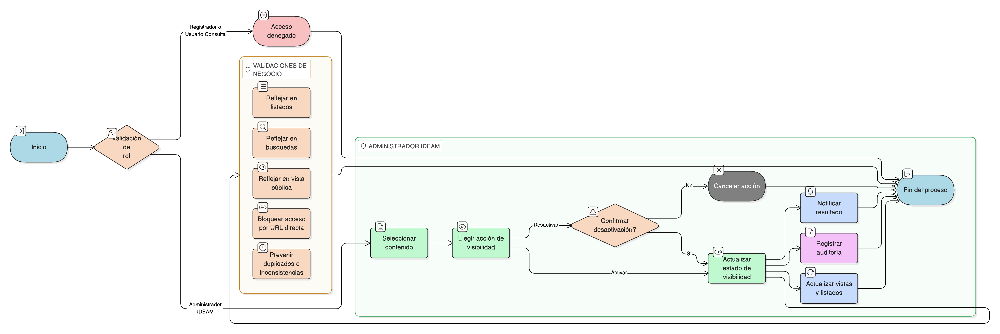

# HU-IDEAM-SNIF-REST-145

> **Identificador Historia de Usuario:** hu-ideam-snif-rest-145\
> **Nombre Historia de Usuario:** Activar o desactivar visibilidad de reportes

> **Sistema de información:** Sistema Nacional de Información Forestal\
> **Módulo / subsistema:** Módulo de restauración\
> **Validador temático(s):** Raymond Alexander Jiménez Arteaga

## DESCRIPCIÓN HISTORIA DE USUARIO

> **Como:** Administrador IDEAM.\
> **Quiero:** controlar la visibilidad de los reportes o materiales de apropiación.\
> **Para:** definir cuáles contenidos se muestran al usuario final según las reglas institucionales.

## CRITERIOS DE ACEPTACIÓN

1. **Acceso al control de visibilidad**\
    1.1 El sistema debe permitir el cambio de visibilidad de reportes o materiales únicamente al rol **Administrador IDEAM**.\
    1.2 Los roles **Registrador** y **Usuario Consulta** no deben tener acceso a esta funcionalidad.

2. **Cambio de estado de visibilidad**\
    2.1 El sistema debe permitir cambiar el estado de un contenido entre **visible** y **no visible**.\
    2.2 El cambio de estado debe reflejarse de forma inmediata en la vista pública del módulo de Apropiación y Capacitación.

3. **Confirmación de acciones**\
    3.1 Al intentar desactivar un contenido visible, el sistema debe solicitar confirmación previa al usuario.\
    3.2 Al confirmar la acción, el sistema debe actualizar el estado del contenido y notificar el resultado de la operación.

4. **Validaciones de negocio**\
    4.1 Un contenido marcado como **no visible** no debe aparecer en el módulo de Apropiación y Capacitación.\
    4.2 Un contenido **no visible** no debe ser accesible mediante URL directa desde la interfaz de usuario.

5. **Integridad referencial**\
    5.1 El cambio de visibilidad debe impactar coherentemente en:
    
    - Listados por agrupación.
    - Resultados de búsqueda.
    - Vista pública de contenidos.
    
    5.2 No se deben generar duplicados ni inconsistencias por cambios de visibilidad.

6. **Control por roles**\
    6.1 Solo el rol **Administrador IDEAM** puede activar o desactivar la visibilidad de contenidos.\
    6.2 Los roles **Registrador** y **Usuario Consulta** solo pueden visualizar contenidos según las reglas de visibilidad definidas.

7. **Auditoría y trazabilidad**\
    7.1 El sistema debe registrar cada cambio de visibilidad, almacenando como mínimo:
    
    - Usuario que realizó el cambio.
    - Fecha y hora.
    - Estado anterior y nuevo estado del contenido.

## ROLES

- **Administrador IDEAM**: Puede activar o desactivar la visibilidad de reportes o materiales de apropiación.
- **Registrador**: No puede modificar la visibilidad de contenidos.
- **Usuario Consulta**: No puede modificar la visibilidad de contenidos.

## RESTRICCIONES Y LÍMITES

- La gestión de visibilidad solo está disponible en el módulo administrativo.
- No se permite modificar la visibilidad desde el visor geográfico ni desde los tableros.
- No se debe permitir el acceso a contenidos marcados como no visibles por ningún medio de navegación.
- Todo cambio de visibilidad debe quedar registrado en la auditoría del sistema.
- La visibilidad de los contenidos debe respetar estrictamente las reglas de acceso por rol.

## DIAGRAMA DE FLUJO DEL PROCESO

